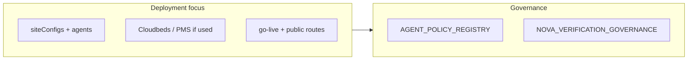

# Backlog notes + Boardwalk / ID verification pivot

## 1. Future backlog (notes only — do not implement now)

These items came from the Stripe “Agentic Commerce” / payment-gate discussion. They are **architecturally compatible** with the platform but **out of scope** until product defines billing rules and route lists.

- **Separate transparency from entitlement:** Keep `[verification_gate_passage_events](shared/schema.ts)` and related docs (`[VERIFICATION_GATE_TRANSPARENCY.md](docs-governance/VERIFICATION_GATE_TRANSPARENCY.md)`, `[VOICE_SESSION_TRANSPARENCY.md](docs-governance/VOICE_SESSION_TRANSPARENCY.md)`) as **audit / abuse / statistics**. A future **payment or usage gate** should use **Stripe subscription state + optional metered usage** (or a dedicated `billing_entitlements` / usage rollup table), not passage-event counts as the sole source of truth for blocking.
- **HTTP-first enforcement:** Any **402 Payment Required** + Checkout / Customer Portal flow belongs on **control-plane HTTP routes** (e.g. chat API) before LLM spend — consistent with `[modular-routing](.cursor/rules/modular-routing.mdc)` (new routers under `server/routes/`, not `routes.ts` bulk).
- **Voice / execution plane:** Per `[EXECUTION_PLANE_BOUNDARY_SPEC.md](docs-governance/EXECUTION_PLANE_BOUNDARY_SPEC.md)`, avoid synchronous DB or Stripe calls on the audio path; pre-session entitlement or async metering only.
- **Stripe LLM metering preview:** Treat as optional future integration; requires explicit governance review before coupling billing to Gemini execution.

**Suggested single backlog doc location (when you add it):** e.g. `docs-governance/BILLING_ENTITLEMENT_GATE_BACKLOG.md` — one page linking to `[NOVA_VERIFICATION_GOVERNANCE.md](docs-governance/NOVA_VERIFICATION_GOVERNANCE.md)` for identity vs commerce boundaries.

---

## 2. Refocus: Boardwalk Suites Lafayette

**Current governance:** `[AGENT_POLICY_REGISTRY.md](docs-governance/AGENT_POLICY_REGISTRY.md)` describes Boardwalk as a **flagship hospitality demo** with a **single primary multitask agent** (not a full six-agent swarm), tool allowlists under **SALES** / hospitality modes, and refusal rules for account-specific PII without verification. Supporting notes: `[VOICE_BOARDWALK_DEMO_NOTE.md](docs-governance/VOICE_BOARDWALK_DEMO_NOTE.md)`.

**Decision to confirm before “swarm deployment” work:**

- If **“swarm”** means **full `provisionAgentsForBusiness` six-agent team** for the Boardwalk site: that is a **provisioning + policy** change (which roles, which tools per agent, Concierge as `assignedAgentId`). Update the registry section so “demo” vs “production swarm” is explicit.
- If **“swarm”** means **operational rollout** (site config, Cloudbeds, go-live, QR/deeplink): treat as **deployment runbook** without changing the single-agent story.

**Likely touchpoints (research when executing):**

- Provisioning: `[server/services/agentProvisioning.ts](server/services/agentProvisioning.ts)`, `POST /api/intelligence/provision` (see [teams-agents matrix](.cursor/rules/teams-agents-provisioning-matrix.mdc)).
- Demo script reference: `npm run demo:boardwalk-agent` → `[scripts/demo-agent-boardwalk.ts](scripts/demo-agent-boardwalk.ts)`.

---

## 3. ID verification: agents + customer records (caller ID + OTP)

**Intent:** When an agent can access **customer records** (PMS / guest journey), access must be **governed**: identity anchored to **OTP-verified guest session** (and/or explicit policy), not **caller ID alone**.

**Grounding docs:**

- `[NOVA_VERIFICATION_GOVERNANCE.md](docs-governance/NOVA_VERIFICATION_GOVERNANCE.md)` — guest OTP via Twilio Verify, `guest_verification_sessions`, routes under `/api/nova/guest/verify/*`, transparency gate on verification HTTP.
- **Verification Agent** / **Customer Support** posture in `[AGENT_POLICY_REGISTRY.md](docs-governance/AGENT_POLICY_REGISTRY.md)` — retrieval only after verified identity for protected data.
- **Tool plane:** Hospitality tools (e.g. `pms_lookup_guest_journey`, `guest_phone_verification`) should remain **server-side** with checks tied to verification state, not prompt-only assurances.

**Relationship to Section 5 (caller ID skill):** Twilio **Caller ID / CNAM** data is a **convenience signal** for greeting and CRM pre-fill; it does **not** replace OTP for protected guest data. Product copy and agent policies should state this explicitly.

**Principle to enforce in future implementation work:**

- **Caller ID (Twilio)** = weak signal + optional paid feature on the business number; **OTP completion** = gate for **reading or mutating** guest-specific records.
- Document **explicit refusal** when verification is missing or expired; align **Safe Mode** / policy registry if you add new tools or data scopes.

---

## 4. Customer intake: owner-configurable fields (canvas + skill)

**Product ask:** Site owner can **turn on or off** a defined set of parameters for **new customers**: first name, last name, cell phone, email, and address.

**Existing anchors (extend, do not duplicate blindly):**

- **Intake policy** already models per-field governance in `[server/services/intakePolicyService.ts](server/services/intakePolicyService.ts)` (`fields` map with categories and write modes). **Platform Settings** already loads/patches intake policy: `[client/src/pages/admin/PlatformSettingsPage.tsx](client/src/pages/admin/PlatformSettingsPage.tsx)` (`/api/site-configs/:id/intake-policy`).
- **Concierge shell** already knows `intake-view` as an embedded view id in `[client/src/components/chat/ConciergePanel.tsx](client/src/components/chat/ConciergePanel.tsx)`.

**Planned work (when executing):**

1. **Schema / config:** Add a clear **`newCustomerIntakeFields`** (or extend `intakePolicy` with a `requiredForNewCustomer: string[]` / per-field `{ enabled: boolean, required: boolean }` for the five primitives). Persist on `siteConfigs` (likely under `agentConfig.intakePolicy` or adjacent JSON) with Zod validation.
2. **Owner UI:** A **canvas or settings panel** (Bot Builder / Platform Settings) with **checkboxes** per field — which fields the agent must collect for net-new customers.
3. **Skill registry:** Register a skill in `[docs-governance/SKILL_REGISTRY.md](docs-governance/SKILL_REGISTRY.md)` (e.g. `customer_intake` or extend an existing intake skill) so activation is explicit and preflight can verify configuration.
4. **Runtime:** Agent tools / `intake_form` / `show_canvas` flows should read the configured field set so the model does not collect disabled fields. Align with `[VIEW_REGISTRY.md](docs-governance/VIEW_REGISTRY.md)` if a new view id is introduced.

---

## 5. Caller ID skill (Twilio)

**Product ask:** Agents can obtain **caller ID information** from **Twilio** for inbound voice, but **only if the feature is active** on the business’s phone number. **Cost:** treat as **per-call** add-on; stakeholder note **~$0.01 per call** — **re-verify Twilio’s published rate for Caller Name / CNAM (or equivalent) at implementation time** and surface it in owner-facing copy.

**Existing code to leverage:**

- Telephony area already includes caller-id concepts: e.g. `[server/routes/telephonyRoutes.ts](server/routes/telephonyRoutes.ts)` (`PATCH /api/telephony/caller-id`, webhook payloads with `CallerName`).
- CRM-oriented tool `search_crm` in `[server/config/geminiToolDeclarations.ts](server/config/geminiToolDeclarations.ts)` uses a `caller_id` string — distinguish **CLI from PSTN** vs **Twilio Caller Name** in tool design.

**Planned work (when executing):**

1. **Skill:** Add e.g. `caller_id_lookup` (or `twilio_caller_name`) to `[docs-governance/SKILL_REGISTRY.md](docs-governance/SKILL_REGISTRY.md)` with **preflight**: Twilio number must have the relevant **product/feature enabled** (query Twilio API or config flags stored on `[telephonyConfigs](shared/schema.ts)` / site telephony state).
2. **Tool:** New governed tool (declaration + handler in `[server/services/toolHandler.ts](server/services/toolHandler.ts)` or telephony service) that returns **only** what Twilio provides for the **current call** (no arbitrary number lookup unless product demands and compliance allows). **Sovereign voice lockdown:** do not modify `[server/geminiVoice.ts](server/geminiVoice.ts)` / `[server/voiceGemini.ts](server/voiceGemini.ts)` beyond an approved bridge; prefer **session-scoped** data already available on the PSTN leg (`CallSid`, `From`, `CallerName` from Twilio webhook/session).
3. **Governance:** Document in `[AGENT_POLICY_REGISTRY.md](docs-governance/AGENT_POLICY_REGISTRY.md)` that caller name is **not** identity proof; OTP / verification flows remain required for sensitive CRM/PMS reads (ties to Section 3).
4. **Economics:** Optional meter or warning in admin UI when skill is on (per-call cost disclosure).

---

## 6. Suggested next steps (when you exit plan mode and resume execution)

1. **Clarify Boardwalk scope:** single multitask demo vs full six-agent swarm + registry update.
2. **Deployment checklist:** site config ID, PMS linkage, agent operational mode, public entry routes / QR if applicable.
3. **Verification matrix:** map “caller ID present” vs “OTP verified” to allowed PMS tools and agent roles; update `[AGENT_POLICY_REGISTRY.md](docs-governance/AGENT_POLICY_REGISTRY.md)` and, if needed, `[NOVA_VERIFICATION_GOVERNANCE.md](docs-governance/NOVA_VERIFICATION_GOVERNANCE.md)` with a short **hospitality guest access** subsection.
4. **Intake field toggles:** implement owner UI + persisted config + agent/canvas behavior per Section 4.
5. **Caller ID skill:** implement skill gate + tool + Twilio eligibility checks + pricing disclosure per Section 5.

No code changes are part of this plan iteration; the document records direction and file anchors for the next sprint.
