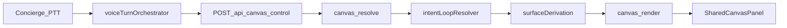
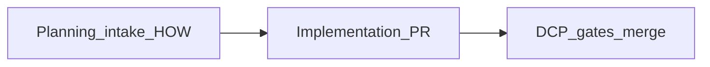

# Governed dev pipeline + intent loop + first-customer Concierge

## Principles (from your discussion)

- **Finish what we start internally:** the dev pipeline must be a **closed loop** (intake artifact → gates → evidence → merge), even if v1 is thin.
- **Product can “start strong” first;** deep verticals (e.g. Cloudbeds) stay **sequenced after** distribution and a legible assistant story.
- **Do not bury the team:** no Temporal, no Backstage, no standalone DCP microservice in this phase.
- **Phase 0 is non-negotiable:** the stack **does not work** for real use without **governed UI MCP + indexed surfaces** and **working Google Workspace MCP** for agents. Those land in **two PRs first** ([UI plan](.cursor/plans/phase0_ui_mcp_shadcn_integration.plan.md), [Workspace plan](.cursor/plans/phase0_google_workspace_mcp.plan.md)); **then** DCP-lite, intent loop, dogfood, and the rest.
- **Canvas = OS tool only:** voice → `[POST /api/canvas-control](server/routes/canvasControlRoutes.ts)` → `canvas.resolve` → resolver + `[deriveSurfacesFromResolution](server/services/surfaceDerivationService.ts)` → `canvas.render` — aligned with `[VOICE_FIRST_INTERFACE_PIPELINE_V1.md](docs-governance/canonical/VOICE_FIRST_INTERFACE_PIPELINE_V1.md)` and `[CANVAS_OS_TOOL_MANDATE_V1.md](docs-governance/canonical/CANVAS_OS_TOOL_MANDATE_V1.md)`.

---

## Phase 0 (blocking) — two PRs before all other tracks

**Decision:** UI integration and Google Workspace integration are **prerequisites** — install, run, **index capabilities in detail**, and **attach to planning intake (Track 1b)** before new agents, swarms, or downstream workflows.

| PR           | Sub-plan                                                                                             | Owns                                                                                                                                                                       |
| ------------ | ---------------------------------------------------------------------------------------------------- | -------------------------------------------------------------------------------------------------------------------------------------------------------------------------- |
| **Phase 0A** | `[phase0_ui_mcp_shadcn_integration.plan.md](.cursor/plans/phase0_ui_mcp_shadcn_integration.plan.md)` | shadcn.io HTTP MCP, SerpApi via `mcp:generate`, `SHADCN_IO_OPERATOR_INTEGRATION_V1`, skill↔component matrix, registry cross-links, `MCP_SETUP.md`, draft sanitization      |
| **Phase 0B** | `[phase0_google_workspace_mcp.plan.md](.cursor/plans/phase0_google_workspace_mcp.plan.md)`           | `WORKSPACE_MCP_SERVER_CHOICE_V1`, **taylorwilsdon/google_workspace_mcp** (or documented choice), OAuth/runbook, tool-tier index for planning HOW, vendored path resolution |

**After Phase 0A + 0B are merged and verified:** continue with **Phase 1** below (formerly “Track 1 start” through Track 6 remainder). **Do not** parallelize heavy intent-loop or dogfood work **before** Phase 0 completes unless explicitly scoped to docs-only with no dependency on MCP.

---

## Track 1 — Thin Development Control Plane (DCP-lite)

**Goal:** Repeatable process you can benchmark, without a heavy product.

| Deliverable                                                                                 | Purpose                                                                                                                                                                                                                                                                                                                                              |
| ------------------------------------------------------------------------------------------- | ---------------------------------------------------------------------------------------------------------------------------------------------------------------------------------------------------------------------------------------------------------------------------------------------------------------------------------------------------- |
| **Runbook** (single canonical doc under `docs-governance/` or `docs-governance/artifacts/`) | Defines: work classification (runtime vs platform vs vertical), risk tier, required validators (`npm run validate:`* matrix), and **Definition of Done** (which scripts must pass before merge).                                                                                                                                                     |
| **Work-item template** (markdown)                                                           | Short intake: plane touched, registries touched, **HOW** (tools/actions/views/registry deltas per **Track 1b**), implicit-capability note, tests to run. Mirrors the discussion, not enterprise PM software.                                                                                                                                         |
| **CI / local glue**                                                                         | **One** aggregated script or npm script (e.g. `governance:dcp-gate` or extend `[scripts/sovereign-gate-governance.ts](scripts/sovereign-gate-governance.ts)`) that runs **existing** Sovereign Guard + key validators in a fixed order and exits non-zero on failure. Optional: **advisory-only** mode first (warn), then required for `main`/`dev`. |
| **Branch protection alignment**                                                             | Document which GitHub required checks map to which gates (`[.github/workflows/sovereign-guard.yml](.github/workflows/sovereign-guard.yml)` already runs multiple validators).                                                                                                                                                                        |

**Explicit non-goals:** OPA/Rego server, Temporal, DCP REST API, separate DCP database.

### Track 1b — Planning before enforcement (merged from `ui-control_plane.md` review)

**Source draft:** `[user_uploads/governance_docs_3_29/ui-control_plane.md](user_uploads/governance_docs_3_29/ui-control_plane.md)` — long-form DCP blueprint (OPA, Temporal/Backstage options, SLSA, typed `WorkIntake` sketches). **Review verdict:** strong **merge/release enforcement** story; **under-specifies upstream planning** (WHO/WHAT/WHY/WHEN/WHERE/**HOW**).

**Problem:** Work intake that skips **HOW**—declared **tools**, **integration capabilities**, **actions**, **views/surfaces** that manifest those capabilities—forces implementers to improvise and feels like “gates without a plan.” Surfaces are **not** arbitrary; they **back** what the agent is allowed to do.

**Merge requirement — Planning intake (prerequisite to implementation PR):**

| Field                     | Purpose                                                                                                                                                                                                                                                              |
| ------------------------- | -------------------------------------------------------------------------------------------------------------------------------------------------------------------------------------------------------------------------------------------------------------------- |
| **HOW (tools)**           | Gemini-visible tool names / integration capability IDs — align with `[geminiToolDeclarations](server/config/geminiToolDeclarations.ts)` and `registry-yaml/integration-capabilities/`.                                                                               |
| **HOW (actions + views)** | Which `[ACTION_REGISTRY](docs-governance/canonical/ACTION_REGISTRY.md)` / `[VIEW_REGISTRY](docs-governance/canonical/VIEW_REGISTRY.md)` rows change; which `CanvasViewId`s apply; how they connect to tools.                                                         |
| **UI resource review**    | Pointer to approved UI catalog: `[UI_COMPONENT_APPROVAL_REGISTRY_V1](docs-governance/canonical/UI_COMPONENT_APPROVAL_REGISTRY_V1.md)`, planned **skill ↔ shadcn.io matrix** (Track 6C)—not “search MCP every time.”                                                  |
| **Agent/swarm builder**   | Human or automation **reads** registries + matrix **before** coding; optional later: reflect in templates/DB (`[provisionAgentsForBusiness](server/services/agentProvisioning.ts)` does not bind per-agent UI today—runtime remains intent loop + registered views). |

**Order of operations:**

**What the draft already gets right:** DCP governs **promotion**, not voice/canvas runtime (`[SHADCN_MCP_PLANE_BOUNDARY_V1](docs-governance/canonical/SHADCN_MCP_PLANE_BOUNDARY_V1.md)`); Phases A–D for *work* mirror intent-loop thinking; DCP-lite phased rollout (contracts → gate → policy → evidence) fits this repo’s “thin” bar.

**Markdown cleanup (todo `sanitize-ui-control-plane-md`):** Remove `cite` / `image_group` / `turn0search` placeholders; add real bibliography or links; one-line note that **filename `ui-control_plane`** vs title “Development Control Plane” — **DCP = merge authority**; **UI planning** = capability-backed HOW + registry review.

---

## Track 2 — Complete the intent loop spine (Phase B → Phase C)

**Current truth:** `[canvasControlRoutes.ts](server/routes/canvasControlRoutes.ts)` already wires `resolveSiteRuntime`, `routeCanvasIntent`, `resolveIntentLoopState` / merge, `deriveSurfacesFromResolution`, and audit. Governance still lists **schema/service/route partial** in `[INTENT_LOOP_GOVERNANCE_V1.md](docs-governance/canonical/INTENT_LOOP_GOVERNANCE_V1.md)`.

**Work:**

1. **Merge-gate alignment** — Follow `[VOICE_FIRST_INTERFACE_PIPELINE_V1.md](docs-governance/canonical/VOICE_FIRST_INTERFACE_PIPELINE_V1.md)` § Phase B output table: ensure `[IntentLoopResolution](shared/intentLoopContract.ts)` + `[intentLoopResolutionSchema](shared/intentLoopResolutionSchema.ts)` (if present) match what `[surfaceDerivationService.ts](server/services/surfaceDerivationService.ts)` consumes; **fail-closed** when `allowedCanvasViewIds` is empty (registry-approved fallback + `auditNotes`).
2. **Tests as contract** — Keep/extend existing tests: `[tests/test-intent-loop-*.ts](tests/)`, `[tests/test-canvas-control-resolve-authority.ts](tests/test-canvas-control-resolve-authority.ts)`, `[tests/test-surface-derivation.ts](tests/test-surface-derivation.ts)`, `[scripts/demo0-canvas-governed-proof.ts](scripts/demo0-canvas-governed-proof.ts)`.
3. **Documentation sweep** — Update `INTENT_LOOP_GOVERNANCE_V1.md` frontmatter `backed_by` / `last_verified` when the partial → complete threshold is met (honest status).
4. **Voice lockdown** — No edits to frozen voice files per `[.cursor/rules/sovereign-voice-lockdown.mdc](.cursor/rules/sovereign-voice-lockdown.mdc)`; changes stay in canvas-control, resolver, orchestrator client glue only.

**Reference sequence:** `[.cursor/plans/intent_loop_phase_b_c_subagent_prompts.md](.cursor/plans/intent_loop_phase_b_c_subagent_prompts.md)` (sub-agent order) for splitting work if using agents.

---

## Track 3 — Canvas discipline (ensure “the way it should be”)

1. **Concierge path audit** — Confirm `[ConciergePanel.tsx](client/src/components/chat/ConciergePanel.tsx)` does not pin canvas from raw tool metadata (comments already mark governance); all governed mutations go through `[voiceTurnOrchestrator.ts](client/src/services/voiceTurnOrchestrator.ts)`.
2. **No new artboard** — New UI only via registered `CanvasViewId`, validator allowlists, and SDK/tokens per canvas mandate; run `npm run governance:visual-integrity` on touched client files.
3. **Operator trace** — Use existing `?canvasTrace=1` / operator trace hooks documented in `[COMMAND_CENTER_SURFACE_SPEC_V1.md](docs-governance/canonical/COMMAND_CENTER_SURFACE_SPEC_V1.md)` for debugging your own sessions.

---

## Track 4 — You as first customer (dogfood via AI OS)

**Goal:** Use ClearVoice + canvas to run **intent-first planning** (“what do you want to do today?”) on **your** site, without shipping Cloudbeds-first.

**Approach:**

1. **Actor channel** — Use **operator** intent path where applicable: envelope already supports `[intentLoopActorChannel: public | operator](server/routes/canvasControlRoutes.ts)`; ensure `[voiceTurnOrchestrator](client/src/services/voiceTurnOrchestrator.ts)` sets this for owner/admin sessions when you define the rule (e.g. staff/admin cookie or site role).
2. **Surface** — Prefer `**command_center`** as the planning / ops canvas host (`[canvasIntentRouter](server/services/canvasIntentRouter.ts)` already routes `open_command_center`; `[surfaceDerivationService](server/services/surfaceDerivationService.ts)` has command-center slot plans). Extend **typed payload** only via registry + renderer contracts—not ad-hoc JSX.
3. **Site config** — Configure your dogfood `siteConfigId` prompts via existing handover (`GET/PUT /api/site-configs`) so the **voice persona** reflects “planning assistant,” not hospitality PMS workflows.
4. **Security** — Operator-grade behavior must respect **resolved security from visitor session** (validator already warns client hints are non-authoritative). Do not expose admin actions on public sessions.

**Non-goals for this phase:** Google Workspace integration (next wave per your roadmap), Cloudbeds onboarding flows as the primary demo.

---

## Track 5 — Repository knowledge: audit first, single source of truth map (no default new vector KB)

**Question this answers:** Are we creating a **new** knowledge library / vectored KB as part of this task?

**Default answer for this plan: No.** Standing up a **new** embeddings-backed library or parallel “single source of truth” would duplicate authority already spread across `**docs-governance/canonical/`**, `**docs-governance/artifacts/`**, `**registry-yaml/**`, `**.cursor/plans/**`, `**user_uploads/**`, and (where used) runtime knowledge flows tied to the **audit plane** (see governance references to knowledge certification / structured certification—not ad-hoc vectors as policy).

**Instead, do a “repo librarian” pass** (governance function, not a new microservice):

**Mandatory artifact (filename is normative):** `[docs-governance/artifacts/REPO_KNOWLEDGE_INVENTORY_V1.md](docs-governance/artifacts/REPO_KNOWLEDGE_INVENTORY_V1.md)` — same pattern as `[INTEGRATION_GOVERNANCE_INVENTORY_V1.md](docs-governance/artifacts/INTEGRATION_GOVERNANCE_INVENTORY_V1.md)`. Do not invent alternate names for the primary inventory in this phase.

**First-pass scope (minimum):** The first version of that file **must** include dedicated inventory subsections (tables or structured lists) for:

- `**registry-yaml/`** — integration capabilities, agent/policy YAML, UI component registry, swarm schematics, etc.; note validators (`npm run validate:integration-registry`, `validate:agent-classification`, …) and drift risk.
- `**.cursor/skills/`** — each skill folder’s `SKILL.md`: purpose, when-to-use, overlap with rules/docs, gaps.
- `**docs-governance/canonical/`** — authority map (pointer to existing indexes where helpful).
- `**docs-governance/artifacts/`** — inventories and worklog-style artifacts; avoid duplicating `[INTEGRATION_GOVERNANCE_INVENTORY_V1.md](docs-governance/artifacts/INTEGRATION_GOVERNANCE_INVENTORY_V1.md)`; **link** or merge rows.
- `**.cursor/plans/`** — active vs stale plans (high level).
- `**user_uploads/`** — high-churn / draft material; classify asset vs debt vs promote-next.

Later passes may deepen `user_uploads/` and plans; **skills + registry-yaml are not optional** in v1 of the file.

| Step                        | Action                                                                                                                                                 |
| --------------------------- | ------------------------------------------------------------------------------------------------------------------------------------------------------ |
| **Inventory**               | Populate `**REPO_KNOWLEDGE_INVENTORY_V1.md`** per first-pass scope above; classify **canonical** / **WIP** / **quarantine** / **orphaned high-value**. |
| **Gap map**                 | Short table: “promote to canonical / merge into existing / archive / implement in code next” — **no** open-ended full-repo embedding.                  |
| **Technical debt vs asset** | Explicit rows for large folders so “beneficial vs debt” is **decided**, not left fuzzy.                                                                |
| **DCP linkage**             | DCP-lite work-item template references **which doc family** and whether `**registry-yaml/`** or `**.cursor/skills/`** changed.                         |

**Optional later (explicit ADR only):** If after the inventory you still want **semantic search** over the repo, add a **separate** decision: provider, scope (canonical-only vs whole repo), retention, and how it **does not** override `docs-governance/canonical/` for runtime truth. That is **out of scope** for the thin DCP + intent-loop delivery unless you expand the plan.

**Role:** “Repo librarian” = **process + inventory artifact + classification rules** in the runbook; can be executed by a lead human or a **read-only** governance pass (aligns with `governance-linter` / review skills philosophy: structure first, automation second).

---

## Track 6 — MCP: operator runbook (post–Phase 0 consolidation)

**Note:** Primary MCP deliverables moved to **Phase 0** (`[phase0_ui_mcp_shadcn_integration.plan.md](.cursor/plans/phase0_ui_mcp_shadcn_integration.plan.md)`, `[phase0_google_workspace_mcp.plan.md](.cursor/plans/phase0_google_workspace_mcp.plan.md)`). This section remains as **reference** for what those PRs must cover; optional follow-up: single `MCP_OPERATOR_RUNBOOK_V1.md` if docs need merging.

### 6A — Unblock Cursor immediately (SerpApi, shadcn, docs)

**Problem:** MCP servers show **broken** when SerpApi still has `YOUR_SERP_API_KEY`, `npx` fails, or the **google-workspace** entry points at **missing** `[dist/index.js](mcp-servers/google-workspace/workspace-server/package.json)` (vendored [Gemini CLI workspace extension](mcp-servers/google-workspace/README.md) / Node `workspace-server`).

**Deliverables:**

| Item                                                                                                                        | Action                                                                                                                                                                                                                                                                                                                                                                                                                                                                             |
| --------------------------------------------------------------------------------------------------------------------------- | ---------------------------------------------------------------------------------------------------------------------------------------------------------------------------------------------------------------------------------------------------------------------------------------------------------------------------------------------------------------------------------------------------------------------------------------------------------------------------------- |
| **Extend** `[.cursor/MCP_SETUP.md](.cursor/MCP_SETUP.md)`                                                                   | **“Runbook: green MCP after clone”**: (1) Node/npm on PATH, (2) **SerpApi** — `doppler run -- npm run mcp:generate`, (3) **Shadcn.io MCP** — HTTP `url` per [shadcn.io MCP for Cursor](https://www.shadcn.io/mcp/cursor) (**6C**), not legacy `npx @shadcn-ui/mcp-server`, (4) **Google Workspace** — **6B**, (5) **Reload Window**. Cross-link [WORKSPACE_MCP_PLANE_BOUNDARY_V1.md](docs-governance/canonical/WORKSPACE_MCP_PLANE_BOUNDARY_V1.md) and **6C** governance artifact. |
| **Optional** `[docs-governance/artifacts/MCP_OPERATOR_RUNBOOK_V1.md](docs-governance/artifacts/MCP_OPERATOR_RUNBOOK_V1.md)` | Checklist + links to `MCP_SETUP.md`.                                                                                                                                                                                                                                                                                                                                                                                                                                               |

### 6B — High priority: evaluate replacing vendored Workspace MCP with [taylorwilsdon/google_workspace_mcp](https://github.com/taylorwilsdon/google_workspace_mcp)

**Why:** The upstream project is **more complete and operationally mature** than our vendored path: **selective tool loading**, **read-only mode**, **granular permissions**, **tool tiers** (core / extended / complete), **Docker**, **CLI**, and broad coverage (**gmail, drive, calendar, docs, sheets, forms, tasks, contacts, chat, search**) per [their README](https://github.com/taylorwilsdon/google_workspace_mcp). Our tree is a **Gemini CLI extension** fork with a Node `workspace-server` that often **never gets built**—a poor fit for “plans, approvals, and operator proficiency” workflows you described.

**Governance unchanged:** [WORKSPACE_MCP_PLANE_BOUNDARY_V1.md](docs-governance/canonical/WORKSPACE_MCP_PLANE_BOUNDARY_V1.md) — Workspace MCP remains **operator/developer tooling**, not voice or customer runtime. Prompt-injection / untrusted-mail risks in [their security section](https://github.com/taylorwilsdon/google_workspace_mcp) apply; prefer `**--read-only`** and `**--tool-tier core`** until policy expands.

**Evaluation deliverables (can be same PR as 6A or follow immediately):**

| Deliverable                                                                                    | Purpose                                                                                                                                                                                                                                                                                                     |
| ---------------------------------------------------------------------------------------------- | ----------------------------------------------------------------------------------------------------------------------------------------------------------------------------------------------------------------------------------------------------------------------------------------------------------- |
| **ADR or short artifact** (e.g. `docs-governance/artifacts/WORKSPACE_MCP_SERVER_CHOICE_V1.md`) | Side-by-side: vendored Node build vs `**uvx workspace-mcp`** / `uv run main.py`; OAuth env vars (`GOOGLE_OAUTH_CLIENT_ID`, `GOOGLE_OAUTH_CLIENT_SECRET`); recommended **stdio** Cursor config vs HTTP `--transport streamable-http` per upstream docs; **default**: read-only + core tier for internal use. |
| **Update** `[.cursor/mcp.example.json](.cursor/mcp.example.json)`                              | Add commented example for `uvx workspace-mcp` (or `npx`+`mcp-remote` to local HTTP if used); keep Twilio/SerpApi blocks.                                                                                                                                                                                    |
| **Operator `.cursor/mcp.json` (gitignored)**                                                   | Point `google-workspace` at the **chosen** launch command; remove dependency on missing `dist/index.js` once validated.                                                                                                                                                                                     |
| **Vendored folder** `[mcp-servers/google-workspace/](mcp-servers/google-workspace)`            | After adoption: either **archive** with pointer in ADR, or retain only if a product requirement still needs the Gemini CLI extension—**do not** leave two competing “sources of truth” without documentation.                                                                                               |

**Prerequisites called out in upstream:** Python **3.10+**, **uv/uvx**, Google Cloud **OAuth desktop** client, APIs enabled per service—document in runbook.

**Explicit non-goals:** Wiring this MCP into **Gemini voice** or **customer canvas** without a governed proxy; CI that calls live Google APIs on every PR.

**PR description should note:** Fixes broken MCP config + documents **recommended** Workspace MCP server; may **replace** local Node workspace entry.

### 6C — **Adopted:** [shadcn.io](https://www.shadcn.io) as governed **design-time** UI MCP (operator / `ui_agent`)

**Strategic decision (this plan):** Use **shadcn.io’s MCP** for Cursor and internal agents—not the broken `npx @shadcn-ui/mcp-server@latest` entry in `[.cursor/mcp.json](.cursor/mcp.json)`. Per [Shadcn MCP for Cursor](https://www.shadcn.io/mcp/cursor), configure `**url`: `https://www.shadcn.io/api/mcp`** (remote HTTP MCP). **shadcn.io states it is not affiliated with official [shadcn/ui](https://github.com/shadcn-ui/ui)**; treat it as a **deliberate platform choice** for **operator tooling**, documented in governance.

**What [shadcnio/react-shadcn-components](https://github.com/shadcnio/react-shadcn-components) is:** A **catalog / index** (README links to shadcn.io component families: AI chat blocks, buttons, hooks, text)—**not** a separate MCP binary. Use it as the **human-readable map** of what the ecosystem offers; **MCP runtime** is still the shadcn.io API endpoint + Cursor client.

**Governance (must ship with adoption):**

| Rule                | Detail                                                                                                                                                                                                                                                                                  |
| ------------------- | --------------------------------------------------------------------------------------------------------------------------------------------------------------------------------------------------------------------------------------------------------------------------------------- |
| **Plane**           | Unchanged from [SHADCN_MCP_PLANE_BOUNDARY_V1.md](docs-governance/canonical/SHADCN_MCP_PLANE_BOUNDARY_V1.md): **design-time / Cursor / ui_agent** only—**no** voice hot path, **no** customer runtime calling MCP per turn.                                                              |
| **Promotion**       | AI blocks (Actions, Conversation, Tool, etc.) remain **discovery → review → Sovereign / `@/ui-core` / canvas-sdk**—never raw drop-in to production paths without registry + visual-integrity.                                                                                           |
| **Prompt system**   | Add artifact `**docs-governance/artifacts/SHADCN_IO_OPERATOR_INTEGRATION_V1.md`** (or canonical sibling): how operators prompt (“use shadcn to list…”, “implement color picker…”), **default workflows**, and link to [shadcn-ui-agent skill](.cursor/skills/shadcn-ui-agent/SKILL.md). |
| **Vectoring / RAG** | **Optional phase:** index shadcn.io or approved snippets **only** if needed; **not** a blocker for switching MCP URL. Do not let embeddings override canonical contracts.                                                                                                               |

**Config work:** Update `[.cursor/mcp.example.json](.cursor/mcp.example.json)` with a `**shadcn` or `shadcn-io`** block using the **HTTP `url`** pattern; remove or comment legacy `**@shadcn-ui/mcp-server**` to avoid confusion.

#### [React AI Canvas](https://www.shadcn.io/ai/canvas): **component shown in the canvas**, not a second canvas

There is **one** Concierge canvas zone (`[SharedCanvasPanel](client/src/components/voice/tools/SharedCanvasPanel.tsx)`, registered `CanvasViewId`s, `canvas.*` syscalls, intent loop → surface derivation). **[React AI Canvas](https://www.shadcn.io/ai/canvas)** is a **shadcn.io component** (ReactFlow-based workflow editor; install via their `canvas.json` recipe) that can **render inside that zone** when a view/renderer contract carries it—e.g. collaborating on agent- or operator-generated workflows. Same **promotion path** as other AI blocks (MCP/design-time discovery → `@/ui-core` / registry-approved renderer → live zone). **No parallel “second canvas product.”**

#### Library audit + **skill ↔ component matrix** (reduces custom UI time)

shadcn.io publishes a large **AI** catalog (dozens of components: Conversation, Tool, Reasoning, Plan, **Canvas**, Web Preview, etc.—see [AI section](https://www.shadcn.io/ai/canvas) nav). **Deliverable (v1 table, can live inside `SHADCN_IO_OPERATOR_INTEGRATION_V1` or `docs-governance/artifacts/SHADCN_IO_SKILL_COMPONENT_MATRIX_V1.md`):**

1. **Audit** the published AI (and adjacent) components relevant to operator work—not a one-time copy of every page, but a **curated map**: e.g. planning flows → Plan / Task / Tool; chat affordances → Conversation / Message / Prompt Input; workflow diagrams **in the canvas** → React AI Canvas + Node / Edge / Controls (as promoted in-view components).
2. **Map** each major `**.cursor/skills/`** (or skill *category*) to **recommended shadcn.io building blocks** so new skills don’t reinvent lists, loaders, or workflow chrome.
3. **Cross-link** [REPO_KNOWLEDGE_INVENTORY_V1](docs-governance/artifacts/REPO_KNOWLEDGE_INVENTORY_V1.md) skills section—inventory lists skills; the matrix says **which UI kit applies** when extending that skill.

**Non-goal:** Mandating that every skill ships a React surface—only that **when** UI is needed, the matrix points to approved patterns and shortens discovery.

---

## Suggested implementation order (minimize thrash)

**Phase 0 (blocking)**

0A. **UI MCP PR** — `[phase0_ui_mcp_shadcn_integration.plan.md](.cursor/plans/phase0_ui_mcp_shadcn_integration.plan.md)` (dedicated sub-agent).

0B. **Google Workspace MCP PR** — `[phase0_google_workspace_mcp.plan.md](.cursor/plans/phase0_google_workspace_mcp.plan.md)` (dedicated sub-agent; may run **parallel** with 0A if two people; else sequential).

0c. **Gate** — Both PRs merged; MCP green per `MCP_SETUP.md`; planning intake can reference UI matrix + Workspace capability index.

**Phase 1 (after Phase 0)**

1. **Track 1b residue + Track 5 (light) + Track 1 start** — Planning intake template if not fully closed in 0A; short inventory + runbook template.
2. **Track 2 tests + merge-gate** — Intent loop Phase B→C complete in code.
3. **Track 1 finish** — Aggregated `governance:dcp-gate` + branch-protection doc.
4. **Track 4 dogfood** — Operator channel + command_center.
5. **Track 3 audit** — Canvas discipline after dogfood.
6. **Track 5 (finish)** — Expand `REPO_KNOWLEDGE_INVENTORY_V1.md` for `user_uploads` / `.cursor/plans` as needed; **skills + `registry-yaml/`** covered from first pass.

---

## Success criteria (exit)

- **Phase 0:** **Phase 0A** and **Phase 0B** sub-plans complete — shadcn.io + SerpApi MCP operational; Workspace MCP operational with indexed tool-tier / planning linkage; no reliance on missing `dist/index.js` for Workspace.
- **DCP-lite:** A new contributor can follow the runbook and run one command to hit all mandatory gates; you can record “time to green merge” as a benchmark.
- **Planning intake:** Work-item template and/or docs require **HOW** (tools, actions, views, registry deltas) before merge; `**user_uploads/ui-control_plane.md`** sanitized or superseded by canonical artifact; cross-links to VIEW/ACTION/UI registries and skill matrix (todos `planning-how-intake`, `crosslink-registries-matrix`).
- **Intent loop:** Governance doc reflects **complete** (or honestly scoped) runtime; Phase B→C tests and `demo0:canvas-proof` pass.
- **Canvas:** No new unregistered views; governed path only.
- **Dogfood:** You can complete a session: PTT → intent resolution → `command_center` (or derived surface) → narrated plan, on your site config.
- **Knowledge:** `[docs-governance/artifacts/REPO_KNOWLEDGE_INVENTORY_V1.md](docs-governance/artifacts/REPO_KNOWLEDGE_INVENTORY_V1.md)` exists; **first pass** includes `**.cursor/skills/`** and `**registry-yaml/`** plus the other required areas; no new vector KB required unless separately decided.
- **MCP:** `[MCP_SETUP.md](.cursor/MCP_SETUP.md)` + runbook; **SerpApi** healthy; **shadcn.io** HTTP MCP configured per **6C** + `**SHADCN_IO_OPERATOR_INTEGRATION_V1`**; **Google Workspace** follows **6B** (recommended **[taylorwilsdon/google_workspace_mcp](https://github.com/taylorwilsdon/google_workspace_mcp)** or documented interim)—no silent reliance on missing `dist/index.js`.
- **Shadcn.io integration + matrix:** `**SHADCN_IO_OPERATOR_INTEGRATION_V1`** states **[React AI Canvas](https://www.shadcn.io/ai/canvas)** as **in-canvas component content** (not a second surface); **v1 skill ↔ component matrix** exists and links from inventory/skills—cuts ad hoc UI research per new skill.

