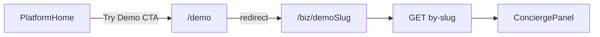

# Business contract first, then demo/telemetry, then sovereign-flow-diagramming

## Separate gaps (keep them separate)

1. **Skill gap** — No dedicated skill yet for **Mermaid route maps**, **workflow/state diagrams**, **wireframe-ish screen flows**, or **node-level required parameters** as a repeatable governed output.

2. **Runtime / UI gap (more urgent)** — [`PublicBusinessPage`](client/src/pages/public/PublicBusinessPage.tsx) and [`AgentPage`](client/src/pages/agents/AgentPage.tsx) do **not** pass the same **`business` object shape** into [`ConciergePanel`](client/src/components/chat/ConciergePanel.tsx). Same slug can yield **different shell behavior** (claim banner, `platformMarketingDemo`, `workspaceState`, place enrichment). Any diagram skill applied before this fix would **formalize inconsistency**.

3. **Canvas productization gap** — Governance ([`VIEW_REGISTRY.md`](docs-governance/canonical/VIEW_REGISTRY.md)), runtime ([`SharedCanvasPanel.tsx`](client/src/components/voice/tools/SharedCanvasPanel.tsx) + [`ToolRouter.tsx`](client/src/components/voice/tools/ToolRouter.tsx)), and skills ([`intent-driven-canvas`](.cursor/skills/intent-driven-canvas/SKILL.md)) exist, but there is **no canonical developer-facing Canvas API contract**. Without it, reuse drifts (e.g. Concierge vs [`os-core`](os-core/src/shell/SharedCanvasProvider.tsx) `SharedCanvasProvider` are **separate runtimes**).

**Lock-in:** *First unify the business object contract, then stabilize canvas contract docs, then visualize the flow.*

---

## Phase 1 — Contract alignment (highest priority)

**Goal:** One shared truth for Concierge: **required fields**, **optional enrichment**, **demo / marketing flags**, **shell-affecting props** — then **mode-specific presentation** only at the page layer (e.g. AgentPage owner QR chrome), not divergent `business` shapes.

**Deliverables**

1. **Type + builder** (e.g. `client/src/lib/conciergeBusinessContext.ts`):
   - **Minimum identity** — align with server/readiness thinking (`id`, `name`, address/place-derived fields as today on AgentPage).
   - **Readiness** — optional passthrough if ever needed in UI later; keep stripping `readiness_gate_v1` from raw `siteData` before building context (server JSON may include it).
   - **Demo / marketing flags** — `platformMarketingDemo` from `metadata` or canonical demo slug list / env.
   - **Shell inputs** — `workspaceState`, `claimStatus`, `ownerId`, `plan`, and any other fields `ConciergePanel` reads from `business` today (audit `business.` usages).
   - **Optional enrichments** — rating, hero image, lat/lng, types, hours, phone, etc.

2. **Consumers** — [`PublicBusinessPage`](client/src/pages/public/PublicBusinessPage.tsx) and [`AgentPage`](client/src/pages/agents/AgentPage.tsx) both call the **same** builder with `(siteData, slug)`; pages only differ in **layout props** (`idleContent`, `showOwnerControls`, `autoGreetOnConnect`, etc.), not in omitted shell-critical fields.

3. **Short contract doc** — e.g. `docs/product/CONCIERGE_BUSINESS_CONTEXT_V1.md` or a section in [`DEMO_SURFACE_V1_SLICE.md`](docs/product/DEMO_SURFACE_V1_SLICE.md): table of fields → required? → affects shell mode? → source (`site_configs` / place).

4. **Strip readiness** on both entry pages from persisted React state (already on public; add on agent if needed).

---

## Phase 1b — Readiness telemetry + `demo_surface_v1` (after contract; same priority band as product unblock)

Run **after Phase 1** so demo traffic exercises **one** `business` contract.

- **Telemetry:** In-memory aggregates + modular admin API + thin `@/ui-core` admin page (hook at `logReadinessGateV1Event` / `by-slug` handler; auth like [`adminAnalyticsRoutes.ts`](server/routes/adminAnalyticsRoutes.ts); mount only in [`server/routes.ts`](server/routes.ts)).
- **Demo routing:** CTAs → `/biz/…`; `/demo` → redirect to canonical demo slug (**biz canonical + `/demo` redirect**).
- **First-response UI** in Concierge (connecting / responding affordance).
- **Gate reasoning** on marketing demo surfaces.
- **Slice doc** [`docs/product/DEMO_SURFACE_V1_SLICE.md`](docs/product/DEMO_SURFACE_V1_SLICE.md).

**Agent Lab** (optional): thin tab on readiness page with deep links — defer if scope grows.

---

## Phase 1c — `shared_canvas_sdk_v1` (mandatory — doc-only Canvas API contract)

**Not a new canvas system.** Single canonical doc that describes **how to use what already exists**. **No** component rewrites, **no** new abstractions, **no** merging `os-core` and Concierge, **no** new `canvas_type` values beyond what [`SharedCanvasPanel`](client/src/components/voice/tools/SharedCanvasPanel.tsx) already accepts.

**Deliverable:** [`docs/sdk/SHARED_CANVAS_V1.md`](docs/sdk/SHARED_CANVAS_V1.md)

### Doc structure (do not overcomplicate)

1. **Core concept** — What the shared canvas is; **when** to use it vs voice vs plain chat transcript; which **runtime(s)** apply (**primary:** Concierge / voice `ToolRouter` path; **separate:** `os-core` `SharedCanvasProvider` — call out explicitly so readers do not confuse stacks).

2. **Canonical types (from code)** — Authoritative union for `metadata.canvas_type` (must match TypeScript today): `service_menu` | `schedule` | `pricing_table` | `faq_list` | `intake_checklist` | `business_summary` | `custom_card`. Document `CanvasItem`-shaped `items[]` and header/CTA fields as implemented (`title`, `subtitle`, `cta_label`, `cta_action`, `accent_color` — align field names with [`SharedCanvasPanel.tsx`](client/src/components/voice/tools/SharedCanvasPanel.tsx), not hypothetical `ctas[]` unless code changes later).

3. **Per `canvas_type` (7 sections)** — For each type: **A.** Purpose / when to use **B.** Required fields **C.** Optional fields **D.** Example JSON payload (valid for `show_canvas` / `shared_canvas` tool path) **E.** Render behavior (which branch in `SharedCanvasPanel`, visual pattern, CTA behavior via `onTriggerSpeech` / `onContextUpdate`).

4. **Mapping layer (bridge table)** — Single table tying:
   - **Governance** — [`VIEW_REGISTRY.md`](docs-governance/canonical/VIEW_REGISTRY.md) (`shared_form_canvas`, related views)
   - **Runtime** — `SharedCanvasPanel`
   - **Tool routing** — `ToolRouter` case `shared_canvas`
   - **Agent skill / tool** — `show_canvas` ([`geminiToolDeclarations.ts`](server/config/geminiToolDeclarations.ts) / server tool handler)

5. **Rules (product + UX)** — Examples aligned with demo/onboarding work: canvas **must not** show internal reasoning; content **should** match conversational intent; avoid empty shells; prefer **actionable** `cta_label` / `cta_action` when appropriate; marketing demo surfaces follow [`DEMO_SURFACE_V1_SLICE.md`](docs/product/DEMO_SURFACE_V1_SLICE.md) constraints.

6. **Relation to readiness** — Short tie-in: `customer_ready_v1` → response path; shared canvas → **quality / structure** of what the user sees (complementary guarantees).

**Milestone:** Ship in the **same delivery wave as Phase 1b** where possible so demo and onboarding refactors reference one doc.

**Diagram skill tie-in:** [`sovereign-flow-diagramming`](.cursor/skills/sovereign-flow-diagramming/SKILL.md) (Phase 2) must treat `SHARED_CANVAS_V1.md` as an input so outputs can include **route → `canvas_type` → required params** where applicable.

---

## Phase 2 — `sovereign-flow-diagramming` skill (one skill, not two)

**Artifacts**

- [`.cursor/skills/sovereign-flow-diagramming/SKILL.md`](.cursor/skills/sovereign-flow-diagramming/SKILL.md)
- [`docs/sdk/SOVEREIGN_FLOW_DIAGRAMMING_SKILL.md`](docs/sdk/SOVEREIGN_FLOW_DIAGRAMMING_SKILL.md)

**Inputs (must be cited from repo)**

- Logical route contract — [`docs-governance/canonical/LOGICAL_ROUTE_REGISTRY.md`](docs-governance/canonical/LOGICAL_ROUTE_REGISTRY.md)
- View registry — [`docs-governance/canonical/VIEW_REGISTRY.md`](docs-governance/canonical/VIEW_REGISTRY.md)
- Canvas API contract — [`docs/sdk/SHARED_CANVAS_V1.md`](docs/sdk/SHARED_CANVAS_V1.md) (after Phase 1c)
- State machines / product transitions where relevant — e.g. [`ONBOARDING_GO_LIVE_TRANSITIONS_V1.md`](docs/product/ONBOARDING_GO_LIVE_TRANSITIONS_V1.md), [`CUSTOMER_READY_V1.md`](docs/product/CUSTOMER_READY_V1.md)
- Code anchors for browser adapters — `App.tsx` routes, `by-slug` handler

**Required outputs per run**

- Logical route tree (Mermaid)
- Workflow/state map where applicable (Mermaid)
- Screen / path outline (wireframe-ish text or diagram)
- **Node-by-node required parameters** (context keys, query params, flags)
- **Transition conditions**
- **Missing contract warnings** (undeclared route, missing VIEW_REGISTRY entry)
- **Shell / view parity warnings** (e.g. two pages building different `business` shapes — should go to **zero** after Phase 1)

**Hard rule — do not invent architecture**

The skill **must not** make product decisions, silently normalize missing fields, or add routes/views not in registry. It **reads** contracts, **renders** structure, and **flags** mismatches between docs and code.

---

## Phase 3 — First usage of the skill (validation)

Apply `sovereign-flow-diagramming` to:

- Demo route path (`/`, `/demo`, `/biz/:slug`)
- `/agent/:slug` (owner vs customer presentation differences **without** divergent `business` contract)
- Readiness signal → `public_url_live` (per [`ONBOARDING_GO_LIVE_TRANSITIONS_V1.md`](docs/product/ONBOARDING_GO_LIVE_TRANSITIONS_V1.md))

Output lives in governed docs (e.g. `docs/product/` or `docs/architecture/`) as PR artifacts.

---

## Mermaid — public demo flow (illustrative only)

---

## Risks / constraints

- **Voice lockdown:** No handshake changes in [`server/geminiVoice.ts`](server/geminiVoice.ts); UI-only affordances for latency messaging.
- **Modular routing:** New APIs only in `server/routes/*.ts` + mount in `routes.ts`.
- **Onboarding** remains a separate track; note dependencies in slice docs only.
