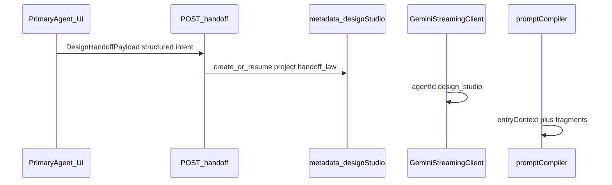

# Design Studio — handoff, versioning, execution gating

## Shipped — control plane (this subsystem is real)

- **Lawful creation:** `POST .../design-studio/handoff` only creates `projects[id]`; **PATCH** rejects new ids (`NEW_PROJECT_VIA_PATCH_FORBIDDEN`).
- **Structured intent:** `intentSummary` with **`confidence` ∈ [0, 1]** (fixed convention).
- **Lifecycle vs workflow:** `project_status` separate from `stepKey` / `stepIndex`.
- **Publish gating:** `PublishBlocker { code, message }`, `POST .../design-studio/publish` + **`design_studio.publish`**; **published** projects return **no** publish blockers (no post-success nag).
- **Read model:** `getDesignStudioEntryContext`; compiler uses thin handoff + publish lines only.
- **Client hook:** [`client/src/lib/designStudioHandoff.ts`](client/src/lib/designStudioHandoff.ts) `postDesignStudioHandoff`.

Still accurate: `[shared/designStudioState.ts](shared/designStudioState.ts)`, routes in `[server/routes/siteConfigRoutes.ts](server/routes/siteConfigRoutes.ts)`, fragments in `[server/services/designStudioPromptFragments.ts](server/services/designStudioPromptFragments.ts)`, `[server/services/promptCompiler.ts](server/services/promptCompiler.ts)` for `roleType === 'design_studio'`, `[server/utils/siteScopedAccess.ts](server/utils/siteScopedAccess.ts)`.

Architecture invariant (keep): **voice = transport** (`[server/geminiVoice.ts](server/geminiVoice.ts)` unchanged); **design state = persistence**; **interpretation = prompt compiler**.

---

## 1. `designStudioStateVersion` (mandatory for merge-safe evolution)

- Add `**designStudioStateVersion: 1`** on `metadata.designStudio` (explicit contract for clients + compiler).
- Zod + parse normalization: legacy rows with only `version` map forward.
- All writes emit `designStudioStateVersion`.
- One-line note in `[AI_DESIGN_STUDIO_GOVERNED_SPEC_V1.md](docs-governance/canonical/AI_DESIGN_STUDIO_GOVERNED_SPEC_V1.md)` persistence section.

---

## 2. Handoff law — single source of truth for **new** projects

**Rule:** `POST .../design-studio/handoff` is the **only** product entry that may **create** a new `projects[projectId]` row (new UUID).

- `**PATCH .../design-studio`**: allow **merge updates only to projects that already exist**; reject attempts to introduce **new** project IDs via PATCH (403 or 400 with clear error). Engineering exceptions (e.g. superadmin script) stay out of product routes or use a separate internal path.
- Prevents drift: UI + PATCH cannot silently fork “second creation paths.”

Document as `**handoff_law`** in the governed spec (short YAML or prose block).

---

## 3. `POST /api/site-configs/:id/design-studio/handoff`

- Zod-validated body; `siteConfigId` must match route param.
- Auth: `design_studio.access` (until publish split).
- Resolve `designProjectId` (client-supplied or `randomUUID()`); set `activeProjectId`; create or **resume** project stub.
- Persist handoff metadata on the project for compiler/UI (see structured intent below).
- Register route in `[scripts/check-google-key-permissions.ts](scripts/check-google-key-permissions.ts)`.

**Client:** after success, switch entry agent to `design_studio` (`[client/src/services/voice/GeminiStreamingClient.ts](client/src/services/voice/GeminiStreamingClient.ts)` `sessionContext` pattern).

---

## 4. Structured `intentSummary` (not a plain string)

Replace weak `string`-only intent with a **typed object** (Zod), e.g.:

```ts
intentSummary: {
  raw: string;
  classified_intent: string;
  project_type: "view" | "app";
  confidence: number; // 0..1 inclusive (fixed convention)
}
```

- Update `[shared/designStudioHandoff.ts](shared/designStudioHandoff.ts)` types + `isDesignHandoffPayload` (or move validation entirely to Zod and re-export types).
- Persist on `DesignStudioProject` (dedicated field, not only `phaseOutputs`).
- Enables: compiler reasoning, analytics, routing, debugging.

---

## 5. Lifecycle vs phases (two axes)

- **Phase** (`stepKey` / `stepIndex`): workflow step inside the 8-phase engine.
- **`project_status`**: lifecycle — `draft` → `planning` → `building` → `testing` → `ready` → `published`.

Add **`project_status`** to `DesignStudioProject` with Zod enum; transition rules can start minimal (e.g. handoff creates `draft` or `planning`; advance via actions later).

---

## 6. Publish / execution gating — **coded** blockers (not `string[]`)

Treat this as **control-plane logic**, not a throwaway helper.

- Return `**PublishBlocker[]`**: `{ code: string; message: string }` (e.g. `MISSING_THEME`, `DATA_MAPPING_INCOMPLETE`).
- `**isDesignStudioReadyForPublish**`: `getDesignStudioPublishBlockers.length === 0`.
- Stable `**code**` values power UI, analytics, and deterministic policy.

---

## 7. `getDesignStudioEntryContext(project)` — single read model

One function (shared) that returns a **derived** snapshot, e.g.:

- Entry reason / handoff summary (from persisted structured intent)
- Original intent (`raw` / `classified_intent`)
- Current phase (`stepKey`, `stepIndex`)
- Publish blockers (coded)
- `project_status`

Use everywhere: **prompt fragments**, **future design studio UI**, **debug endpoints** — avoid duplicating ad hoc field reads.

---

## 8. Compiler / Chad intro — **handoff-aware, minimal**

- At most **one sentence** referencing why the owner arrived (from `getDesignStudioEntryContext` / structured intent).
- Context-aware, **no repetition** with playbook or VIEW1 blocks.
- Optional: **one short** publish posture line when blockers exist (codes optional in prompt; human text from `message`).

---

## 9. Later: publish route split + policy

- Draft mutations: `design_studio.access`.
- Publish / promotion: `design_studio.publish` **and** `isDesignStudioReadyForPublish` (coded gate).

---

## Execution order (refined)

1. `**designStudioStateVersion`** + parse normalization
2. `**POST .../handoff**` + **client wiring**
3. **Structured `intentSummary`** (Zod + handoff payload + persistence)
4. **Publish blockers with codes** + `isDesignStudioReadyForPublish` (execution gating)
5. **Fragment tweak** — handoff-aware one-sentence intro + minimal publish posture
6. `**project_status`** lifecycle on `DesignStudioProject`
7. `**getDesignStudioEntryContext**` (consumes intent + phase + blockers + status)
8. **PATCH restriction** — handoff law (no new project IDs via PATCH)
9. **Publish-only path** + `design_studio.publish` + gate enforcement

---

## Next execution pass — product wiring (not more schema)

**Trigger (surgical):** `implement product wiring for Design Studio handoff` — or tighter: **wire Concierge → `postDesignStudioHandoff` → `design_studio` agent**.

**Goal:** connect existing circuits only — **no new state paths, no prompt bloat, no UI creativity**. This pass should feel almost boring.

### Invariants (guardrails)

- **No new state paths** — only **`POST .../design-studio/handoff`** for project creation; no side-channel project creation.
- **No prompt expansion** — Chad stays thin; no extra “helpful” verbosity in fragments or Concierge.
- **No UI creativity** — **placeholder views only**; no layout experimentation.
- **No theme drift** — **tokens or nothing**; no temporary colors; theme bundles are a **later** pass, not mixed in here.
- **No routing shortcuts** — flow stays **Concierge → handoff → agent** (and existing voice connect).

Respect **sovereign-chat** / **ConciergePanel** lockdown: minimal, purposeful edits only.

### Acceptance — pass succeeds if all are true

1. User can say something like **“Open Design Studio”** (or equivalent governed intent).
2. System: **`postDesignStudioHandoff`**, persist project + intent, **`entryPointAgentId` = `design_studio`**, voice connects.
3. **Chad:** one clean intro, correct phase (**intake**), awareness of why the user arrived (from persisted handoff — already in compiler).
4. **UI:** shows a **placeholder** Design Studio view (**not** `NotFoundView`), bound to **real** state / view id + registry sync (`views.yaml` as applicable).

### Traps (do not)

- “While we’re here, let’s improve the UI”
- “Just one more field on state”
- “Tweak chat behavior slightly”
- “Experiment with themes now”

**Mental model:** switches and circuits already exist — you are **wiring the control panel**, not designing new circuits.

### Sequencing after the surgical pass

1. **Policy depth** for **`design_studio.publish`** — wire platform policy truth (route + allowlist already exist).
2. **Theme token bundles** — code-level packs as product truth.

These are **separate** passes so scope does not creep into the wiring pass.

---

## Historical — first implementation pass (done)

1. Zod: `designStudioStateVersion`, structured intent, `project_status`, coded blockers, `getDesignStudioEntryContext`, PATCH handoff law, handoff + publish routes.
2. Prompt fragment: handoff-aware intro ≤1 sentence + minimal publish line from `getDesignStudioEntryContext`.




