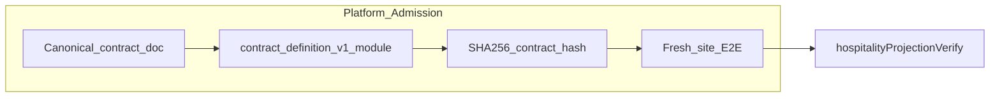

# Platform Admission Protocol — onboarding contract hardening

## Strategic frame (not “a feature”)

This work defines **platform admission**: who may enter, what counts as a valid business, what must be created, what is forbidden, and how correctness is enforced—analogous to control-plane contracts at AWS (account + infra), Stripe (merchant onboarding), or Twilio (A2P gating). The E2E test is an executable **law**, not a convenience script.

## Context (already in repo)

- Verify service: [`server/services/hospitalityProjectionVerify.ts`](server/services/hospitalityProjectionVerify.ts)
- Happy path: [`tests/onboarding-e2e-new-business-hospitality.ts`](tests/onboarding-e2e-new-business-hospitality.ts)
- Testing notes: [`docs/testing/ONBOARDING_E2E_NEW_BUSINESS_HOSPITALITY.md`](docs/testing/ONBOARDING_E2E_NEW_BUSINESS_HOSPITALITY.md)
- CI validators only: [`.github/workflows/sovereign-guard.yml`](.github/workflows/sovereign-guard.yml) — DB-backed E2E not yet gated

## Critical addition — contract checksum (anti-drift)

**Requirement:** Every Phase 1 onboarding knowledge artifact MUST include in `artifactMetadata`:

- `contract_hash`: **SHA-256** hex digest of a **canonical, versioned** `contract_definition_v1` object (deterministic serialization — e.g. fixed key order or `JSON.stringify` of a sorted-keys object).

**Source of truth for hashing:**

- The **same** object (or string) documented in the canonical onboarding contract doc and imported by runtime/test code from a single module (e.g. [`shared/onboardingPhase1AdmissionContract.ts`](shared/onboardingPhase1AdmissionContract.ts) — name TBD).

**Why:**

| Benefit | Mechanism |
|--------|-----------|
| No silent drift between docs, tests, and runtime | One module + hash assertion |
| Detect artifacts created under an old contract | Compare stored `contract_hash` to current `EXPECTED_CONTRACT_HASH` |
| Enable migrations | Bump `onboarding_phase1_schema_version` + new definition → new hash; readers can branch |
| Future approval / merge pipelines | Gate on hash + schema version |

**E2E assertion:** After insert, reload artifact and `assert(row.artifactMetadata.contract_hash === computeContractHash(CONTRACT_DEFINITION_V1))`.

**Validator (optional later):** `npm run validate:onboarding-contract-hash` that prints expected hash for CI logs (or fails if doc and code diverge).

## Phase A — Canonical contract document

Add [`docs-governance/canonical/ONBOARDING_CONTRACT_HOSPITALITY_PHASE1_V1.md`](docs-governance/canonical/ONBOARDING_CONTRACT_HOSPITALITY_PHASE1_V1.md) including:

- **Boardwalk rule (explicit):** Boardwalk Suites is a **legacy fixture** for regression and migration only. It is **not** the architectural reference tenant, onboarding authority, or schema design center. **All** onboarding behavior MUST be validated against a **clean, newly created business** (as in the fresh-site E2E).
- Required Phase 1 inputs, forbidden pre-state (agents, `swarm_role_contract`, Cloudbeds PMS unless scenario adds it).
- Expected outputs (schematic key, six roles, verify service success criteria).
- **Knowledge foundation:** `onboarding_phase1_schema_version`, `source`, normalized facts fields, and **`contract_hash`** semantics (what is hashed, how recomputed).
- Link to [`AGENT_CLASSIFICATION_AND_SWARM_LIMITS_V1.md`](docs-governance/canonical/AGENT_CLASSIFICATION_AND_SWARM_LIMITS_V1.md) and testing doc.

## Phase B — Shared module + rich E2E assertions

- Single module: contract definition constant(s), `computeContractHash()`, `ONBOARDING_PHASE1_SCHEMA_VERSION`.
- E2E: use module for insert metadata; re-query artifact; assert title, content substrings, `siteConfigId`, scope/visibility, trustWeight, metadata fields, **`contract_hash` match**.

## Phase C — Negative-path tests

[`tests/onboarding-e2e-hospitality-negative.ts`](tests/onboarding-e2e-hospitality-negative.ts): one broken invariant per case (wrong industry path, duplicate slug, pre-seeded PMS, pre-seeded agent, etc.), same cleanup discipline as happy path.

## Release gate (CI)

Postgres service job + `DATABASE_URL` + migrate + `seed-industry-templates` (or hospitality-minimal seed) + `test:guardrails` + `test:onboarding-e2e-hospitality`. Optional `paths:` filter for admission-touching files. If org blocks DB in CI initially, document **mandatory local gate** until workflow lands.

## Deferred forks (sequencing after Phase 1)

**Follow-on (canonical):** [`docs-governance/canonical/CONTROL_PLANE_UNIFICATION_PLAN_V1.md`](../../docs-governance/canonical/CONTROL_PLANE_UNIFICATION_PLAN_V1.md) — Router + **Contract Engine**, registry alignment, system-wide `contract_hash`. Peer synthesis folded into that doc.

**Product preference (next implementation slice):** Map admission into **AI OS orchestration** — evaluate requests against contract hash / schema version before heavy work. Onboarding remains the first persisted hashed contract.

- **Phase 2 (content plane, later):** Scraper enrichment + approval + KB merge/versioning — governed extension; separate test id when implemented.
- **Phase 3+:** Marketplace agents, billing, multi-industry admission contracts — out of scope for this plan.

## Implementation order

1. Phase A doc + contract definition module + `computeContractHash` + wire E2E metadata and assertions.
2. Phase C negatives (3–5 cases).
3. CI job when infra allows.
