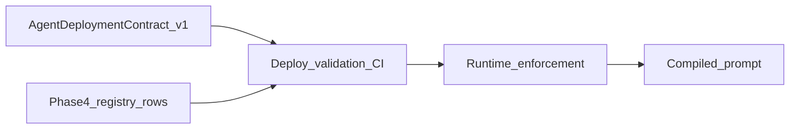

# Governance plan review + Agent Deployment Contract v1 (peer-reviewed)

## 0. Peer review — what to lock in (not repeat)

**Correct diagnosis (keep):** The platform can be **technically operational** and **epistemically untrustworthy** when there is **no enforced link** between runtime and **certified knowledge authority**. Bypass surfaces (paths that skip provisioning + KB + compiler) behave like “dumb agents” because **they are not agents under the OS**.

**Failure mode to avoid:** Another round of **descriptive** gap analysis without **prescriptive** decisions. The next deliverable is **not** “more explanation of subsystems”—it is **one contract** that the system **validates and enforces**.

**Unified model (single sentence):** At deploy time and runtime, **every customer-facing agent** is defined by **one validated deployment contract**; behavior is **Contract → validation → runtime enforcement → compiled prompt / tool allowlist**, not **Agent row → prompt → vibes**.

**Singular knowledge authority (normative):** The contract MUST name **exactly which source classes** may ground each **claim class** (e.g. address → `structured_fields` / Places sync; pricing → named API tool). If a field is **not** bound to a source in the contract, the agent is **not permitted to state it** (enforced via tool/mode/refusal policy—not intro prose).

---

## 1. Canonical execution order ([GOVERNANCE_EXECUTION_PLAN_V1.md](docs-governance/canonical/GOVERNANCE_EXECUTION_PLAN_V1.md))

Unchanged: Phase **3** closes on **human voice QA**; **Runtime Trust Parity** remains **A → 10a (done) → B**; Phase **4** = structural alignment (single-source IDs, skill alignment, routes); Phase **5** = enforcement loop + CI.

**Change to sequencing of *deliverables* within that order:** The **Agent Deployment Contract v1** is authored under **doctrine / Phase 2** as soon as parallel with Phase 3 QA prep—**before** widening implementation—so Phase 4–5 work **implements and validates against the contract**, not the other way around.

---

## 2. Prescriptive artifact: `AGENT_DEPLOYMENT_CONTRACT_V1.md`

**Location:** [docs-governance/canonical/AGENT_DEPLOYMENT_CONTRACT_V1.md](docs-governance/canonical/AGENT_DEPLOYMENT_CONTRACT_V1.md) (new).

**Authority:** Declares **mandatory** sections; references [REGISTRY_AUTHORITY_CHARTER.md](docs-governance/canonical/REGISTRY_AUTHORITY_CHARTER.md), [KNOWLEDGE_PLAN_ORCHESTRATOR.md](docs-governance/canonical/KNOWLEDGE_PLAN_ORCHESTRATOR.md), [SAFE_MODE_CONTRACT.md](docs-governance/canonical/SAFE_MODE_CONTRACT.md) Phase 5B, [AGENT_POLICY_REGISTRY.md](docs-governance/canonical/AGENT_POLICY_REGISTRY.md), [PROMPT_RUNTIME_GOVERNANCE.md](docs-governance/canonical/PROMPT_RUNTIME_GOVERNANCE.md). **Subordinate** to charter for registry SOT; **supersedes** ad hoc per-route knowledge stories for **deployed** agents.

**Normative sections (v1 — must be present for “deployed” status):**

1. **Identity** — `agent_id`, `site_config_id`, `role_type`, `operational_mode` (and linkage to `assignedAgentId` / roster rules).
2. **Knowledge authority (mandatory)** — Enumerate `knowledge_sources` (e.g. `structured_fields`, `knowledge_library`, `external_api` with named integration). **Authoritative fields / claim classes:** each maps to **one or more allowed source types**; absence = **no claim** (runtime: refuse / handoff / tool-only path per policy).
3. **Skills / tools** — `allowed_tools` MUST be a subset of [geminiToolDeclarations](server/config/geminiToolDeclarations.ts) keys intersected with [operationalModes](server/config/operationalModes.ts) for the declared mode. **Tool requirements:** declarative rows such as `pricing → inventory_lookup` (or refuse) — enforced at validation + runtime (not prompt text).
4. **Fallback rules** — `missing_knowledge`, `tool_failure`, `unverified_claim` → enumerated actions (`refuse`, `degrade_mode`, `safe_mode`, `human_route`, `retry`) aligned with Safe Mode / policy registry vocabulary.
5. **Proficiency tests (mandatory for deploy)** — Golden probes: question → **expected_source** or **expected_tool**; **pass policy** stated (e.g. 100% on blocking set v1). Failure = **contract invalid** → agent not deployable / flagged degraded per contract.
6. **Runtime enforcement flags** — e.g. `block_unverified_claims`, `require_tool_for_fields`, `safe_mode_on_certification_gap` — implemented as **compiler inputs + tool gating + optional post-generation checks**, not as “be careful” strings.

**Explicit non-goals in v1 doc:** The contract file does not replace individual registry files; it **binds** them. It does not authorize editing compiled prompts by hand.

---

## 3. Repo alignment map (appendix of the contract — no big-bang rewrite)

| Contract section | Today (anchor) | Gap to close |
|------------------|----------------|--------------|
| Identity | `agents`, `site_configs.assignedAgentId`, provisioning | Bypass routes enumerated; provisioning wire |
| Knowledge sources | `site_configs` fields, `knowledgeLibrary`, placeData, certification inputs | Single contract row drives compiler + snap inputs |
| Tools | `operationalModes.allowedToolNames`, `geminiVoice` filtering, `SITE_ANCHORED_TOOLS` | Derive allowlist from contract + mode |
| Proficiency | `agentAptitudeService`, `test:voice-concierge-aptitude` (shape-only today) | Replace/extend with **source/tool** probes per contract |
| Readiness | `readinessGateV1` | Split **customer_ready** vs **contract_valid** / **knowledge_deploy_ready** |
| Validation | scattered | One **deploy validator** + CI entry (Phase 5) |

**Bypass inventory (contract appendix):** Any browser path, embed, or demo that starts a model **without** resolving a full agent + site contract row must be labeled **non-deployed** or brought under the contract. **Enumerate concretely** (e.g. industry funnel pages, `/buy`-style flows, embed widget) so “not a real agent under the OS” is a **named** exception, not tribal knowledge.

---

## 4. Execution steps (within governance plan)

| Step | Action |
|------|--------|
| 4a | **Write** `AGENT_DEPLOYMENT_CONTRACT_V1.md` with sections above + appendix mapping + bypass list pattern. |
| 4b | **Amend** [GOVERNANCE_EXECUTION_PLAN_V1.md](docs-governance/canonical/GOVERNANCE_EXECUTION_PLAN_V1.md) “Related” and Phase **5** to require contract validation in the enforcement loop. |
| 4c | **Amend** [REGISTRY_AUTHORITY_CHARTER.md](docs-governance/canonical/REGISTRY_AUTHORITY_CHARTER.md) one row: customer-facing **deployed agent** must satisfy deployment contract (pointer, not duplicate prose). |
| 4d | Phase **3** human QA — unchanged. |
| 4e | Phase **4** — registry rows are **inputs** to contract validation. |
| 4f | Phase **5** — implement minimal **validator** (schema + JSON/YAML or DB-stored contract slice) + **one** CI golden file proving “no deploy without pass”; extend to voice/chat gates incrementally. |
| 4g | **B** PSTN parity after QA — contract applies equally where tools run. |

---

## 5. Out of scope

- Prompt-band-aid fixes, anti-hallucination copy, concierge intro-only changes.
- Replacing [AGENT_CAPABILITY_SPEC_V0.md](docs-governance/canonical/AGENT_CAPABILITY_SPEC_V0.md) (internal workers); **cross-reference** only until a merged spec is deliberate.

---

## 6. Success criteria

- `AGENT_DEPLOYMENT_CONTRACT_V1.md` exists and is linked from charter + execution plan. (**Done.**)
- **At least one** enforceable rule: “deploy blocked” or “degraded class” when contract section missing or proficiency set fails. (**Next:** §7.)
- No claim that **readiness** or **aptitude score** equals **knowledge authority** unless contract says so.
- Phase 3 / 4 / 5 / Trust Parity B items still completed per canonical plan.

---

## 7. Phase 5 enforcement design — `validate:agent-deployment` + CI probes (unified)

**User selection:** implement **both** in one coherent story, with explicit **merge vs publish** ordering.

### 7.1 Two gates (ordering)

| Gate | When it runs | Purpose | Failure effect |
|------|----------------|---------|----------------|
| **Merge gate (CI)** | Every PR touching agent/knowledge/tool/registry/deploy paths | Fast, deterministic, **no production DB required** | Block merge |
| **Publish gate** | “Go live” / promote site or agent (admin API, job, or release step) | Full **contract instance** for `(site_config_id, agent_id)` + **blocking probes** | Block publish **or** set `deployed=false` / degraded tier |

**Rule:** Merge gate proves **repo + schema integrity** of contract machinery; publish gate proves **this business** is allowed to be called **deployed** per [AGENT_DEPLOYMENT_CONTRACT_V1.md](docs-governance/canonical/AGENT_DEPLOYMENT_CONTRACT_V1.md).

### 7.2 `npm run validate:agent-deployment` — exact check layers

**v1 minimal (merge-safe):**

1. **Tool/mode alignment** — For each `operational_mode` in [operationalModes.ts](server/config/operationalModes.ts), every `allowedToolNames` entry exists in [geminiToolDeclarations.ts](server/config/geminiToolDeclarations.ts) keys (static import or generated list). *Already pattern-aligned with `validate:skill-identity`.*
2. **Blocking probe file integrity** — `registry-yaml` or `tests/fixtures/agent-deployment-blocking-probes.v1.yaml` (path TBD): each probe has `claim_class`, `stimulus`, `expect: answer_from_source | refuse | tool_success`, optional `expected_tool`. Parser validates shape; **no LLM in CI for v1** — structure-only until probe runner exists.
3. **Bypass registry (optional v1.1)** — Declared list of route ids / logical paths marked `non_deployed: true` must not appear in “deployed smoke” configs without exception flag.

**v2 publish-time (needs DB or export snapshot):**

4. **Identity** — `site_configs.assignedAgentId` non-null; agent row exists; `operational_mode` valid enum.
5. **Knowledge authority slice** — Stored contract or derived view: every **claim class** required for that industry/template has ≥1 `knowledge_source_class` (until then: **certification dimensions** from existing audit payload if present).
6. **Tool allowlist ⊆ intersection** — Effective tools for session ⊆ `operationalModes[mode].allowedToolNames` ∩ declarations; matches snap logic in [geminiVoice.ts](server/geminiVoice.ts) conceptually.
7. **Fallback enums** — Non-empty policy mapping for `missing_knowledge` / `tool_failure` / `unverified_claim` (stored JSON or defaults from contract template).
8. **Blocking probes** — Runner: for each probe, **golden** expected outcome (regex/refusal token/tool-call record). **Pass = correct answer from bound source OR correct refusal OR correct tool path** — not “sounds good.”

### 7.3 Proficiency / probes (CI)

- **Merge:** YAML/Zod validation + **fixture golden transcripts** (optional) — no live Gemini.
- **Publish:** Batch job or script with **recorded** tool mocks: deterministic **OR** capped LLM-as-judge **only** if outputs are structured pass/fail (defer if costly).
- **Readiness split:** Keep [readinessGateV1](server/services/readinessGateV1.ts) as **customer_ready** (identity/path). Add **separate** `knowledge_deploy_ready` or `contract_valid` flag **only** when publish gate passes — do **not** overload one boolean.

### 7.4 Runtime enforcement hooks (post-publish, incremental)

| Location | Enforcement |
|----------|-------------|
| [promptCompiler.ts](server/services/promptCompiler.ts) | Inject **refusal / restricted dimensions** from certification + contract **inputs** (expand beyond current fragment). |
| [operationalModes.ts](server/config/operationalModes.ts) | Remains **source of mode default allowlists**; contract may **narrow** further, never widen without registry change. |
| [toolHandler.ts](server/services/toolHandler.ts) | Hard deny unknown tools; site-anchored tools already bounded — extend with **claim-class → tool** audit logging on failure. |
| [geminiVoice.ts](server/geminiVoice.ts) | Snap applies **effective allowlist** = contract ∩ mode ∩ plan; **voice governance task** for any change. |

### 7.5 Implementation sequence (suggested)

1. Add `scripts/validate-agent-deployment.ts` + `package.json` script — layers **7.2 v1** only.
2. Add blocking probe YAML + Zod schema + CI in `npm run check` or dedicated job.
3. Add publish-time validator function (storage layer) + wire to **one** admin “publish” or “mark deployed” path (or feature flag).
4. Split readiness / add `contract_valid` telemetry.
5. Deepen runtime narrowing (compiler + snap) under governed voice tasks.

### 7.6 Doc touch after implementation

- Amend [GOVERNANCE_EXECUTION_PLAN_V1.md](docs-governance/canonical/GOVERNANCE_EXECUTION_PLAN_V1.md) Phase 5 with **exact** script names once merged.
- Optional: short `docs/deployment/AGENT_DEPLOYMENT_VALIDATION.md` runbook (operator-facing).
