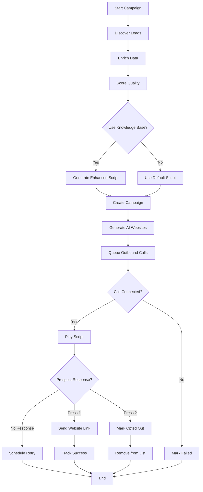

# Outbound Campaign Workflow - VLM (Voice Lead Machine)

## Overview

The Outbound Campaign Manager (VLM - Voice Lead Machine) is an automated system built for the Julio voice integration that automatically builds lists of customers to call, generates scripts for outbound calling, and manages follow-up processes. This system is now enhanced with **Knowledge Base Integration** for intelligent, context-aware script generation.

## System Architecture

```
┌─────────────────────────────────────────────────────────────────┐
│                   VLM Outbound Campaign System                   │
├─────────────────────────────────────────────────────────────────┤
│                                                                   │
│  ┌─────────────┐    ┌──────────────┐    ┌──────────────────┐   │
│  │  Discovery  │───▶│  Enrichment  │───▶│  Qualification   │   │
│  │   Engine    │    │   Pipeline   │    │    & Scoring     │   │
│  └─────────────┘    └──────────────┘    └──────────────────┘   │
│         │                   │                      │             │
│         │                   │                      ▼             │
│         │                   │         ┌──────────────────────┐  │
│         │                   │         │   Knowledge Base     │  │
│         │                   │         │   Integration        │  │
│         │                   │         └──────────────────────┘  │
│         │                   │                      │             │
│         ▼                   ▼                      ▼             │
│  ┌──────────────────────────────────────────────────────────┐  │
│  │            Campaign & Script Generation                   │  │
│  └──────────────────────────────────────────────────────────┘  │
│         │                                                        │
│         ▼                                                        │
│  ┌──────────────────────────────────────────────────────────┐  │
│  │          Outbound Calling (Twilio Integration)            │  │
│  └──────────────────────────────────────────────────────────┘  │
│         │                                                        │
│         ▼                                                        │
│  ┌──────────────────────────────────────────────────────────┐  │
│  │       Follow-up & Website Generation (Auto-Agent)         │  │
│  └──────────────────────────────────────────────────────────┘  │
│                                                                   │
└─────────────────────────────────────────────────────────────────┘
```

## Core Components

### 1. Lead Discovery Engine
**File**: `server/services/vlm-google-maps.ts`

Automatically discovers potential customers using Google Places API.

**Features**:
- Search by industry and location
- Retrieve business details (name, address, phone, website)
- Extract reviews, ratings, and photos
- Filter by business type

**Example Usage**:
```typescript
const mapsService = new VlmGoogleMapsService(apiKey);
const places = await mapsService.searchPlaces({
  city: "San Francisco",
  industry: "restaurant",
  maxResults: 50
});
```

### 2. Enrichment Pipeline
**Files**: 
- `server/services/vlm-email-enrichment.ts`
- `server/services/vlm-website-analyzer.ts`

Enriches prospect data with additional information.

**Capabilities**:
- **Email Discovery**: Scrapes websites to find contact emails
- **Website Analysis**: Evaluates website quality and identifies improvement opportunities
- **Business Intelligence**: Extracts key business information

**Quality Metrics**:
- Website presence and quality score
- Contact information completeness
- Social media presence
- Review sentiment analysis

### 3. Qualification & Scoring
**File**: `server/services/vlm-quality-scoring.ts`

Scores prospects based on call likelihood and business value.

**Scoring Criteria**:
- Phone number availability (+40 points)
- Website quality (0-20 points)
- Review ratings and count (0-15 points)
- Email availability (+10 points)
- Location proximity (+10 points)

**Output**: Ranked list of qualified prospects (0-100 score)

### 4. Knowledge Base Integration ✨ NEW
**File**: `server/services/knowledge-base.ts`

Provides intelligent, context-aware information for script generation.

**Features**:
- Industry-specific insights
- Sales best practices
- Value proposition generation
- Competitive intelligence
- API integration knowledge

**Integration Points**:
```typescript
// Search for industry knowledge
const knowledge = await knowledgeBaseService.searchKnowledge({
  query: "restaurant industry",
  category: "business_intelligence",
  status: "active"
});

// Generate industry-specific value props
const valueProps = generateIndustryValueProposition(industry);
```

### 5. Campaign & Script Generation
**File**: `server/services/vlm-outbound-caller.ts`

Generates personalized call scripts using knowledge base insights.

**TwiML generation (for Twilio webhook)** — requires an absolute `baseUrl` for the Gather action:
```typescript
const baseUrl = process.env.WEBHOOK_BASE_URL || `${req.protocol}://${req.get('host')}`;
const twiml = callerService.generateTwiml(campaign, prospect, baseUrl);
```

**Knowledge-Enhanced Script Generation**: ✨ NEW
```typescript
const enhancedScript = await callerService.generateKnowledgeEnhancedScript(
  prospect,
  campaign
);
```

**Script Personalization Variables**:
- `{businessName}` - Prospect's business name
- `{industry}` - Business industry
- `{city}` - Business location
- `{rating}` - Google rating
- `{reviewCount}` - Number of reviews

**Industry-Specific Value Propositions**:
| Industry | Value Proposition |
|----------|-------------------|
| Restaurant | Increase reservations and streamline online ordering |
| Retail | Boost foot traffic and manage customer inquiries 24/7 |
| Healthcare | Reduce appointment no-shows and improve patient communication |
| Real Estate | Generate qualified buyer leads and schedule property viewings |
| Legal | Capture more client leads and automate intake processes |

### 6. Outbound Calling (Twilio)
**File**: `server/services/vlm-outbound-caller.ts`

Executes automated voice calls via Twilio.

**Call Flow**:
1. Initiate call using Twilio API
2. Play personalized script using TwiML
3. Gather DTMF input (1 for interest, 2 for opt-out)
4. Handle response and trigger follow-up

**TwiML Response Example**:
```xml
<?xml version="1.0" encoding="UTF-8"?>
<Response>
  <Gather input="dtmf" numDigits="1" action="/api/vlm/gather-response">
    <Say voice="Polly.Matthew">
      Hi, this is AI Biz Bot calling about Joe's Restaurant...
    </Say>
  </Gather>
  <Say>We didn't receive a response. Goodbye.</Say>
  <Hangup/>
</Response>
```

### 7. Auto-Agent Pipeline
**File**: `server/services/vlm-auto-agent.ts`

Fully automated end-to-end campaign execution.

**Pipeline Phases**:
1. **Discovery**: Search Google Maps for prospects
2. **Enrichment**: Add emails, website analysis
3. **Scoring**: Qualify and rank prospects
4. **Script Generation**: Create knowledge-enhanced scripts ✨ NEW
5. **Site Generation**: Build AI-powered websites
6. **Calling**: Execute outbound calls
7. **Follow-up**: Send SMS with website links

**Example Execution**:
```typescript
const result = await autoAgentService.runPipeline({
  city: "Austin",
  industry: "cafe",
  maxLeads: 30,
  enrichEmails: true,
  autoGenerateSites: true,
  autoCall: true,
  minQualityScore: 50,
  useKnowledgeBase: true // Enable knowledge enhancement
});
```

## Workflow Walkthrough

### Complete Campaign Flow



### Phase-by-Phase Breakdown

#### Phase 1: Lead Discovery
```typescript
// Search Google Maps for businesses
const places = await mapsService.searchPlaces({
  city: "Denver",
  industry: "plumber",
  maxResults: 50
});

// Discovered: 47 businesses
```

#### Phase 2: Data Enrichment
```typescript
// Enrich with full business details
let prospects = await mapsService.enrichProspects(places, industry);

// Optionally add email addresses
if (enrichEmails) {
  prospects = await emailService.enrichProspects(prospects);
}

// Enriched: 47 → 42 (5 had incomplete data)
```

#### Phase 3: Quality Scoring
```typescript
// Score and sort by quality
prospects = scoringService.scoreProspects(prospects, city);
prospects = scoringService.sortByQuality(prospects);

// Qualified prospects (score ≥ 50): 28
```

#### Phase 4: Knowledge-Enhanced Script Generation ✨ NEW
```typescript
if (config.useKnowledgeBase) {
  // Generate industry-specific script using knowledge base
  const script = await callerService.generateKnowledgeEnhancedScript(
    prospects[0], // Use sample prospect
    campaign
  );
  
  // Update campaign with enhanced script
  await storage.updateVlmCampaign(campaign.id, {
    scriptTemplate: script
  });
}

// Script includes:
// - Industry-specific pain points
// - Tailored value propositions
// - Competitive insights
// - Best practice call structure
```

#### Phase 5: Campaign Creation
```typescript
const campaign = await storage.createVlmCampaign({
  name: "Auto: plumber in Denver",
  city: "Denver",
  industry: "plumber",
  status: "active",
  scriptTemplate: enhancedScript,
  totalProspects: 28
});
```

#### Phase 6: AI Website Generation
```typescript
for (const prospect of qualifiedProspects) {
  const siteId = await autoAgentService.createSiteForProspect(prospect);
  // Site generated with:
  // - Business info from Google Places
  // - AI chatbot configured
  // - Voice concierge enabled
  // - Custom branding
}

// Sites generated: 28
```

#### Phase 7: Outbound Calling
```typescript
for (const prospect of qualifiedProspects) {
  // Initiate call via Twilio
  const result = await callerService.initiateCall(prospect, campaign);
  
  // Track call attempt
  await storage.createVlmCallAttempt({
    prospectId: prospect.id,
    campaignId: campaign.id,
    callSid: result.callSid,
    status: "queued"
  });
  
  // Wait before next call
  await delay(callDelayMs);
}

// Calls queued: 28
```

#### Phase 8: Call Response Handling
```typescript
// When prospect presses 1 (interested)
app.post("/api/vlm/gather-response", async (req, res) => {
  if (digit === "1") {
    // Send website link via SMS
    await autoAgentService.sendWebsiteLink(prospectId);
    
    // Mark as won
    await storage.updateVlmProspect(prospectId, { status: "won" });
    
    // Track sale
    await storage.updateVlmCampaign(campaignId, {
      totalSales: campaign.totalSales + 1
    });
  }
});
```

## API Endpoints

### Campaign Management

```typescript
// Create campaign
POST /api/vlm/campaigns
{
  "name": "Restaurant Outreach - SF",
  "industry": "restaurant",
  "city": "San Francisco",
  "scriptTemplate": "Hi, this is...",
  "maxCallsPerDay": 100
}

// Get campaigns
GET /api/vlm/campaigns

// Get campaign by ID
GET /api/vlm/campaigns/:id

// Update campaign
PATCH /api/vlm/campaigns/:id

// Delete campaign
DELETE /api/vlm/campaigns/:id
```

### Lead Discovery

```typescript
// Discover leads
POST /api/vlm/discover
{
  "city": "Austin",
  "industry": "restaurant",
  "maxResults": 50,
  "enrichEmail": true
}
```

### Script Generation

```typescript
// Generate standard script
POST /api/vlm/auto-agent/generate-script
{
  "businessName": "Joe's Cafe",
  "industry": "restaurant",
  "city": "Austin"
}

// Generate knowledge-enhanced script ✨ NEW
POST /api/vlm/auto-agent/generate-knowledge-script
{
  "prospectId": "uuid",
  "campaignId": "uuid" // optional
}
```

### Outbound Calling

```typescript
// Initiate single call
POST /api/vlm/call
{
  "prospectId": "uuid",
  "campaignId": "uuid"
}

// Run full auto-agent pipeline
POST /api/vlm/auto-agent/run
{
  "city": "Seattle",
  "industry": "salon",
  "maxLeads": 30,
  "autoCall": true,
  "useKnowledgeBase": true // Enable knowledge enhancement
}
```

### Analytics & Reporting

```typescript
// Get campaign statistics
GET /api/vlm/stats

// Get campaign report
GET /api/vlm/auto-agent/report/:campaignId
```

## Knowledge Base Integration Details

### How It Works

The knowledge base integration enhances script generation by:

1. **Industry Research**: Searches knowledge base for industry-specific insights
2. **Best Practices**: Retrieves proven sales techniques and call scripts
3. **Value Props**: Generates tailored value propositions for each industry
4. **Context Awareness**: Incorporates business intelligence into scripts

### Knowledge Categories

| Category | Description | Used For |
|----------|-------------|----------|
| `business_intelligence` | Industry insights and trends | Script personalization |
| `sales_intelligence` | Sales best practices | Call structure and techniques |
| `google_api` | API usage and integration | Technical implementation |
| `business_tools` | Software and tools | Product recommendations |

### Example: Restaurant Industry Knowledge

```typescript
// Knowledge base entry
{
  category: "business_intelligence",
  subcategory: "restaurant",
  title: "Restaurant Industry Pain Points 2026",
  summary: "Key challenges facing restaurants: staff shortages, online ordering complexity, reservation management",
  content: "...",
  tags: ["restaurant", "hospitality", "pain-points"]
}

// Generated script incorporates:
"We help restaurants like {businessName} streamline online ordering 
and reduce reservation no-shows with our AI-powered platform..."
```

### Extending the Knowledge Base

Add industry knowledge:

```typescript
await knowledgeBaseService.storeKnowledge({
  category: "business_intelligence",
  subcategory: "automotive",
  title: "Automotive Service Shop Challenges",
  summary: "Service shops struggle with appointment scheduling and customer follow-up",
  content: `
    # Key Challenges
    - High no-show rates for appointments
    - Difficulty reaching customers
    - Manual quote generation
    
    # Solutions
    - Automated appointment reminders
    - AI-powered customer communication
    - Instant quote generation
  `,
  tags: ["automotive", "service", "pain-points"],
  status: "active"
});
```

## Performance Metrics

### Success Metrics

| Metric | Description | Target |
|--------|-------------|--------|
| Discovery Rate | Leads found per search | >40 per 50 |
| Enrichment Rate | Leads with complete data | >80% |
| Qualification Rate | Leads with quality score >50 | >60% |
| Connection Rate | Calls answered | >30% |
| Conversion Rate | Prospects interested (press 1) | >10% |
| Follow-up Rate | Website links sent | 100% of interested |

### Campaign Analytics

```typescript
{
  totalProspects: 47,
  qualified: 28,
  called: 28,
  connected: 9,      // 32% connection rate
  interested: 3,     // 33% of connected, 10% overall
  sitesGenerated: 28,
  smsSent: 3,
  conversionRate: "10%"
}
```

## Best Practices

### Campaign Design

1. **Target Specific Industries**: Better results with focused campaigns
2. **Optimize for Local**: Geographic proximity increases relevance
3. **Quality Over Quantity**: Higher quality scores = better results
4. **Test Scripts**: A/B test different script variations
5. **Use Knowledge Base**: Enable knowledge enhancement for better scripts ✨

### Script Writing

1. **Keep It Short**: 30-45 seconds maximum
2. **Clear Call-to-Action**: Make it easy to respond (press 1 or 2)
3. **Personalize**: Use business name, industry, location
4. **Value First**: Lead with benefits, not features
5. **Professional Tone**: Friendly but businesslike

### Timing

1. **Avoid Early Morning**: Don't call before 9 AM
2. **Avoid Late Evening**: Stop calling after 6 PM
3. **Respect Time Zones**: Adjust for prospect's local time
4. **Spread Calls**: Use `callDelayMs` to avoid overload
5. **Retry Logic**: Wait 24+ hours between retry attempts

### Compliance

1. **Opt-Out Mechanism**: Always provide option to decline (press 2)
2. **Do Not Call List**: Maintain and respect opt-out requests
3. **Recording Disclosure**: Inform if calls are recorded
4. **TCPA Compliance**: Follow Telephone Consumer Protection Act
5. **Data Privacy**: Secure storage of prospect information

## Troubleshooting

### Common Issues

**Problem**: Low connection rates
**Solution**: 
- Adjust calling hours
- Improve lead quality filtering
- Use local caller ID numbers

**Problem**: High opt-out rates
**Solution**:
- Review script tone and content
- Ensure value proposition is clear
- Target more qualified prospects

**Problem**: Script generation fails
**Solution**:
- Check knowledge base connectivity
- Verify prospect data completeness
- Fall back to standard templates

**Problem**: Twilio errors
**Solution**:
- Verify phone number format (+1XXXXXXXXXX)
- Check Twilio credentials and balance
- Review webhook URLs are accessible

## Future Enhancements

- [ ] AI-powered voice modulation for different industries
- [ ] Sentiment analysis during calls
- [ ] Real-time script adaptation based on responses
- [ ] Multi-language support
- [ ] Voicemail detection and custom messages
- [ ] CRM integration (Salesforce, HubSpot)
- [ ] Advanced analytics dashboard
- [ ] Predictive best time to call
- [ ] Knowledge base AI learning from successful calls
- [ ] Automated A/B testing of scripts

## Resources

### Documentation
- [Knowledge Base System](docs/knowledge-base/README.md)
- [Telephony Architecture](docs/TELEPHONY_ARCHITECTURE.md)
- [Google Places Integration](GOOGLE_BUSINESS_QUICKSTART.md)

### Code Files
- `server/services/vlm-outbound-caller.ts` - Calling logic
- `server/services/vlm-auto-agent.ts` - Pipeline automation
- `server/services/knowledge-base.ts` - Knowledge integration
- `server/vlm-routes.ts` - API endpoints
- `shared/schema.ts` - Database schema

### External Services
- [Twilio Voice API](https://www.twilio.com/docs/voice)
- [Google Places API](https://developers.google.com/maps/documentation/places)
- [TwiML Reference](https://www.twilio.com/docs/voice/twiml)

---

**Last Updated**: 2026-02-07  
**Version**: 2.0 (with Knowledge Base Integration)  
**Maintained By**: Platform Engineering Team
