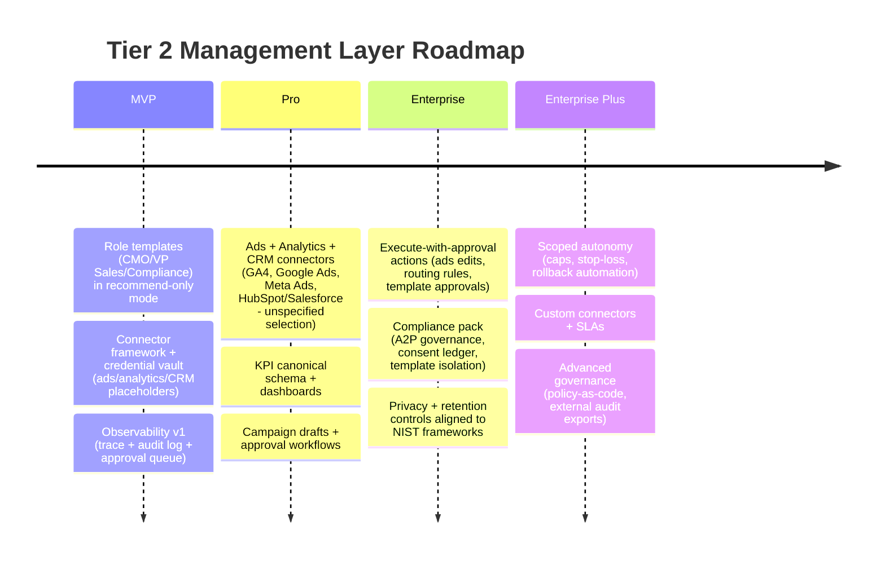

# Designing a Tier 2 Management Layer for a Two‑Tier AI Workforce Architecture

## Executive Summary

A Tier 2 “Management Layer” can be a credible enterprise upsell for an AI Customer Communication Gateway if it is designed as **a reusable, horizontal control plane** that turns operational signals (calls, chats, SMS, bookings, reviews, web traffic) into **measurable business decisions** (budget shifts, campaign changes, compliance fixes, staffing plans), with strong **governance and auditability**.

Three externally validated market forces support building Tier 2 now—and they also raise the bar for how Tier 2 must be engineered:

- Agentic AI is expected to automate a large share of routine customer service issues and deliver material cost reduction; entity["organization","Gartner","technology research firm"] forecasts that by 2029 agentic AI will autonomously resolve 80% of common customer service issues and drive a 30% reduction in operational costs. citeturn0search0  
- The same analyst research warns that **over 40%** of agentic AI projects will be canceled by end of 2027 due to escalating costs, unclear value, or inadequate risk controls—so Tier 2 must be **outcome‑linked** and **governed**, not “agent washing.” citeturn0search5turn0search1  
- Revenue upside from AI is frequently reported in marketing/sales and strategy/finance, which validates a “C‑suite agent” upsell path; entity["organization","McKinsey & Company","management consulting firm"] reports revenue increases are most commonly reported in marketing & sales, strategy & corporate finance, and product/service development use cases. citeturn1search4  

Investor-grade Tier 2 design therefore hinges on five practical principles:

1. **Universal core + adapters**: each role has one core “method” (how it reasons and plans), plus adapters for connectors, policies, and vertical constraints; avoid forking 12 role prompts into 100 vertical variants.  
2. **Structured signals first**: Tier 2 value requires structured KPIs (spend, conversions, pipeline), not only unstructured knowledge; RAG is necessary but not sufficient.  
3. **Decision authority is tiered**: start read‑only → recommend → execute‑with‑approval → autonomous, with hard guardrails; treat autonomy as a product feature, not an assumption.  
4. **Observability is part of the product**: traces and audit logs must be first-class—major agent SDKs explicitly emphasize tracing and handoffs as core deployment features. citeturn1search6turn1search2turn1search10  
5. **Compliance is not optional**: for voice/SMS, regulators are explicitly treating AI voice as “artificial/prerecorded” under TCPA restrictions, increasing the value—and risk—of compliance automation. citeturn2search3turn2search7  

This report specifies a Tier 2 design that investors can understand as a **repeatable enterprise module**: a role catalog, behavioral profiles, agent implementation patterns (RAG + connectors + governance), production-ready system prompts, workflows, packaging, roadmap, risks, and an observability schema.

## Management Layer Thesis and Architecture

Tier 2 is not “more chatbots.” It is a **business operating layer** that reads signals from your gateway (calls, SMS, chats, web sessions) and adjacent systems (ads, analytics, CRM, billing, HRIS/POS), then produces controlled, auditable decisions.

Two reasons Tier 2 is a strong upsell in this particular product architecture:

- Your gateway already sits at the “front door,” meaning you can uniquely capture **intent signals** and **conversion friction** (missed calls, unanswered chats, drop-offs, negative reviews, opt-outs). That data becomes durable strategic advantage when turned into structured metrics and actions.  
- Tier 2 targets spend pools that are larger than the base communications subscription. Digital advertising alone is enormous; entity["organization","Interactive Advertising Bureau","us advertising trade group"] reports U.S. internet advertising revenue of about $258.6B–$259B in 2024 (record levels). citeturn0search2turn0search6  

Tier 2 must be built under a formal risk mindset for generative and agentic systems. entity["organization","National Institute of Standards and Technology","us standards institute"] provides an AI Risk Management Framework (AI RMF 1.0) and a Generative AI Profile (NIST AI 600‑1) that can be used to justify—and structure—your governance controls for enterprises. citeturn3search8turn0search3turn3search12  

image_group{"layout":"carousel","aspect_ratio":"16:9","query":["retrieval augmented generation RAG architecture diagram vector database retriever generator","AI agent tracing observability audit log architecture diagram","multi agent system manager worker orchestrator diagram"],"num_per_query":1}

## Role Catalog and Behavioral Profiles

The catalog below includes 12 requested Tier 2 roles. “Typical inputs” are connector-driven; if a connector is not configured, treat that input as **unspecified** for that tenant and downgrade decision authority accordingly.

### Role definitions

**CMO (Chief Marketing Officer)**  
Primary objectives: grow qualified demand, improve conversion, increase LTV/CAC efficiency while protecting brand and compliance.  
KPIs (4–6): CAC, ROAS/MER, conversion rate (lead→close), cost per qualified lead (CPQL), website conversion rate, review volume & rating trend.  
Typical inputs: ads spend & performance (Google/Meta/TikTok—unspecified which), web analytics (GA4 or unspecified), call/SMS/chat funnel metrics from gateway, CRM pipeline stages, reviews corpus and sentiment, landing page content inventory.  
Outputs: weekly marketing scorecard, channel budget recommendations, campaign briefs, keyword/topic plan, landing page change proposals, creative test backlog.  
Vertical adaptations:  
- Hospitality: occupancy/ADR-oriented campaigns; seasonal packages; OTA vs direct booking mix.  
- Home services (HVAC/plumbing): local search + call conversion optimization; dispatch‑friendly offers.  
- Real estate: listing lead quality, agent routing rules, compliance-aware messaging templates.  
Behavior profiles: DISC = D/I (high), ARCH = Assertive + Collaborative. Why: must push growth decisions (D), influence messaging (I), and coordinate cross-functionally without becoming reckless with spend.

**VP Sales**  
Primary objectives: increase pipeline quality and win rate; shorten sales cycle; improve rep productivity; reduce missed opportunities from calls/leads.  
KPIs: win rate, pipeline coverage ratio, sales cycle length, average deal size, contact-to-meeting rate, meeting-to-close rate.  
Inputs: CRM pipeline & activities, call transcripts and outcomes, inbound lead sources, SMS follow-up metrics, pricing/discount policy (unspecified), top objections from conversations.  
Outputs: pipeline health report, call coaching themes, lead routing rules, outreach sequences (draft), forecast variance analysis, playbooks.  
Vertical adaptations:  
- B2C services: rapid response SLAs; phone-first conversion playbooks.  
- B2B local (franchises): territory-based routing; multi-stakeholder follow-up.  
- Real estate: lead qualification thresholds aligned to agent availability and expertise.  
Behavior profiles: DISC = D/I, ARCH = Assertive. Why: needs urgency, competitive focus, and persuasion; must drive action and accountability.

**Ad Buyer (Performance Marketing Operator)**  
Primary objectives: maximize qualified conversions under budget constraints; run disciplined experiments; reduce wasted spend and fraud.  
KPIs: ROAS/MER, CPA/CPQL, conversion rate by channel, CTR/CVR (as relevant), spend pacing accuracy, experiment win rate.  
Inputs: ad platform metrics + creatives + audiences, web analytics conversion events, offline conversions from CRM, call conversions from gateway, landing page performance.  
Outputs: spend pacing plan, creative/test matrix, bid/budget change proposals, audience hygiene recommendations, campaign launch checklist, weekly experiment summary.  
Vertical adaptations:  
- Hospitality: geo + seasonal targeting; booking conversion event tuning.  
- Home services: call‑tracking and call quality conversion as primary event.  
- Retail: promoted offers; inventory/availability constraints (POS/ERP unspecified).  
Behavior profiles: DISC = D/C, ARCH = Assertive + Reflective. Why: needs decisiveness (D) but also analytical rigor (C); reflective checks reduce reckless spend.

**Growth Lead (Lifecycle + Conversion Optimization)**  
Primary objectives: improve activation/retention; increase repeat business; reduce churn; build referral loops.  
KPIs: activation rate, retention rate, repeat purchase rate, churn rate, NPS/CSAT trend, email/SMS engagement rate.  
Inputs: customer interaction history, segmentation, reviews themes, funnel drop-off points, CRM lifecycle stages, messaging compliance status (A2P/opt-in).  
Outputs: lifecycle messaging plans (draft), A/B tests, segmented offers, winback sequences, referral program suggestions.  
Vertical adaptations:  
- Hotel: re-booking reminders, loyalty offers, upsells.  
- Home services: maintenance reminders, seasonal checks.  
- Real estate: long-cycle nurturing through compliance-safe messaging.  
Behavior profiles: DISC = I/C, ARCH = Collaborative + Reflective. Why: requires empathy for customer journey (I) and disciplined experimentation (C).

**Customer Success Director**  
Primary objectives: maximize customer adoption and measurable ROI from the platform; reduce churn; increase expansion.  
KPIs: product adoption rate, time-to-value, retention/churn, expansion rate, support resolution time, NPS/CSAT.  
Inputs: product usage telemetry, agent performance metrics, support tickets (if any), billing status, customer goals and plan entitlements.  
Outputs: monthly business review (MBR) deck, adoption playbooks, success plans, risk alerts, recommended configuration changes.  
Vertical adaptations:  
- Franchise: multi-location rollout playbook and governance.  
- Associations: templated compliance + member enablement playbook.  
- Clinics (if applicable): privacy/compliance-first onboarding and training.  
Behavior profiles: DISC = S/I, ARCH = Human-centered + Collaborative. Why: retention depends on trust, comfort, and constructive guidance.

**Legal Counsel (Contracts + Risk Review)**  
Primary objectives: reduce legal exposure; standardize contracts; ensure disclosures and website/legal artifacts are consistent; support incident response.  
KPIs: contract turnaround time, compliance findings resolved, legal risk score trend, dispute rate, policy coverage completeness.  
Inputs: website copy, terms/policies, contract templates, customer complaints, recorded consent logs, accessibility checks, platform actions audit logs.  
Outputs: redlined contract drafts (non-final), compliance gap assessments, recommended website policy updates, incident response checklists.  
Vertical adaptations:  
- Real estate: state-specific disclosure reminders (unspecified which states).  
- Hospitality: cancellation policy clarity; accessibility statements.  
- Home services: warranty terms and dispute handling workflows.  
Behavior profiles: DISC = C/D, ARCH = Reflective + Assertive. Why: must be thorough (C) yet firm about risk boundaries (D).  
Regulatory grounding note: AI-generated voices in robocalls are explicitly treated as “artificial” under TCPA restrictions by the FCC, increasing risk exposure for automated voice outreach. citeturn2search3turn2search7turn2search3

**Compliance Officer (Messaging + Contact Governance)**  
Primary objectives: ensure voice/SMS practices meet ecosystem and regulatory expectations; prevent deliverability collapse; maintain consent proof and opt-out handling.  
KPIs: opt-out compliance SLA, complaint rate, deliverability rate, A2P registration completion rate, policy violations detected, blocked traffic incidents.  
Inputs: consent logs, message templates, A2P/10DLC registration status, carrier feedback (unspecified), delivery receipts, call authentication status (if available), audit logs.  
Outputs: compliance scorecard, template approvals, campaign isolation rules, onboarding checklists, incident tickets.  
Vertical adaptations:  
- Real estate: high-volume nurturing rules + opt-out strictness.  
- Hospitality: transactional vs marketing segmentation.  
- Healthcare (if applicable): stricter data handling (unspecified).  
Primary sources note: A2P 10DLC registration reduces filtering and improves throughput; unregistered traffic may incur additional carrier fees depending on provider ecosystems. citeturn4search0turn4search1turn4search2  
Behavior profiles: DISC = C/S, ARCH = Reflective + Collaborative. Why: must be meticulous and policy-driven without blocking growth unnecessarily.

**Data Privacy Officer (DPO)**  
Primary objectives: manage privacy risk; enforce data minimization; govern retention/deletion; establish DPIA-like practices (if applicable—unspecified).  
KPIs: privacy incident rate, DSAR response time (if applicable—unspecified), data retention compliance, access-control exceptions, vendor risk review completion.  
Inputs: data inventory, access logs, retention policies, vendor/sub-processor list, consent records, security events.  
Outputs: privacy impact assessments (templates), retention policy proposals, data mapping reports, “least data” recommendations.  
Vertical adaptations:  
- Healthcare: stronger rules and audits (regime unspecified).  
- Children/family services: heightened consent and content controls.  
- EU-facing businesses: GDPR workflows (unspecified).  
Standards note: NIST’s Privacy Framework is designed to bring privacy risk into parity with broader enterprise risk management. citeturn3search9turn3search13  
Behavior profiles: DISC = C/S, ARCH = Reflective. Why: privacy is policy-heavy and risk-avoidant; must be consistent.

**CFO / Finance Lead (FP&A + Cash + Unit Economics)**  
Primary objectives: improve cash flow; forecast accurately; optimize unit economics; reduce leakage and chargebacks; support pricing decisions.  
KPIs: gross margin, net margin, cash conversion cycle, AR aging, churn/NRR (if subscription), COGS per interaction, forecast accuracy.  
Inputs: billing (Stripe or unspecified), bank/ledger (QuickBooks/Xero/NetSuite—unspecified), payroll (unspecified), ad spend summaries, platform usage costs, discounts/refunds.  
Outputs: monthly financial pack, budget guardrails, scenario models, pricing recommendations, cost anomaly alerts.  
Vertical adaptations:  
- Project-based services: job profitability and dispatch cost modeling.  
- Hospitality: occupancy-driven forecasting with seasonality.  
- Franchises: location-level P&L rollups.  
Behavior profiles: DISC = C/D, ARCH = Reflective. Why: requires analytical discipline and decision focus.

**Head of Operations (Ops / Service Delivery)**  
Primary objectives: reduce operational friction; enforce SLAs; improve scheduling/dispatch; minimize missed calls; increase throughput.  
KPIs: response time, schedule fill rate, on-time rate, average handling time, missed call rate, first-contact resolution.  
Inputs: telephony/chat logs, booking calendar, dispatch system (unspecified), POS/operational system, customer satisfaction metrics, staff availability.  
Outputs: SLA dashboards, staffing forecasts, routing rules, SOP drafts, escalations.  
Vertical adaptations:  
- Home services: dispatch & route optimization; after-hours triage.  
- Hospitality: housekeeping coordination and guest request routing.  
- Retail: staffing vs peak demand baselines.  
Behavior profiles: DISC = D/S, ARCH = Assertive + Collaborative. Why: must drive process execution but maintain stability.

**Head of Product (Product Strategy for the Business, not your platform)**  
Primary objectives: refine service menu/offerings; improve pricing packages; reduce friction in customer journey; increase differentiation.  
KPIs: attach rate (upsells), conversion rate by offering, margin by offering, refund rate, review sentiment by feature/service, time-to-market for new offer.  
Inputs: review themes, call/chat transcripts, competitor mentions, booking reasons, pricing/configuration, sales feedback.  
Outputs: offer portfolio proposals, packaging changes, FAQ improvements, differentiation messaging, test plans.  
Vertical adaptations:  
- Hotel: amenity and package design; cancellation policy experiments.  
- HVAC: membership/maintenance plans and upsell bundles.  
- Real estate: service tiers and lead gating products.  
Behavior profiles: DISC = I/C, ARCH = Collaborative + Reflective. Why: must synthesize voice-of-customer with experimentation discipline.

**HR / People Ops (Workforce Enablement)**  
Primary objectives: reduce staffing risk; improve training; ensure consistent customer-facing behavior; manage scheduling and performance.  
KPIs: time-to-hire (if recruiting), training completion, quality scores, turnover, schedule adherence, agent-handoff success rate.  
Inputs: HRIS (Gusto/BambooHR—unspecified), schedules, quality monitoring from call/chat logs, policies, incident reports.  
Outputs: training plans, role scorecards, hiring templates, coaching themes, shift coverage recommendations.  
Vertical adaptations:  
- Hospitality: seasonal staffing playbooks.  
- Home services: dispatcher training and safety protocols.  
- Retail: peak season ramp plans.  
Behavior profiles: DISC = S/C, ARCH = Human-centered + Collaborative. Why: consistency and empathy drive quality and retention.

## Agent Implementation Blueprint

This section describes how Tier 2 should be implemented as agents in a way investors recognize as “production-grade agentic AI,” including decision authority, connectors, RAG, observability, and guardrails.

### Prompt architecture pattern

For every Tier 2 agent:

- **System prompt (“role charter”)**: immutable constraints, approval rules, data sources, tool use policy, safety rules.  
- **User prompt (“task request”)**: the human or orchestrator’s request, including timeframe, goals, constraints, and requested artifacts.  
- **Assistant scratch + tool calls**: the agent must first fetch data (structured connectors and RAG), then produce a plan, then request approval if required, then execute if authorized.

### Retrieval and data strategy

Use a dual-path strategy:

- **Structured retrieval** (preferred): KPIs and facts from analytics/ads/CRM/billing/tickets; essential for ROI linking.  
- **RAG retrieval** (supporting): knowledge library documents, reviews corpus, policy documents, campaign creative history, and prior decisions. RAG is a proven paradigm for grounding generation in externally retrieved documents. citeturn3search8turn0search3

Recommended RAG specifics (defaults; configurable per tenant):

- Partition memory: `business_kb`, `reviews`, `conversations`, `policies`, `executive_reports`.  
- Retrieval: hybrid (semantic + keyword) with recency weighting for conversations and reviews; strict filtering by tenant/workspace.  
- Output requirement: cite internal doc IDs in the agent’s own “evidence list” (not web citations), enabling audits.

### Required connector set

Tier 2 is connector-first. Minimum viable connector coverage for enterprise upsell:

- Ads: Google Ads + Meta Ads (unspecified which at MVP)  
- Analytics: GA4 (or unspecified)  
- CRM: HubSpot and/or Salesforce (customer choice; unspecified)  
- Billing: Stripe (and optionally accounting)  
- Telephony + messaging logs: your internal gateway logs (first-class)  
- Reviews: Google/SerpAPI (already in your ingestion plan; specifics customer-configurable)  
- POS/ops: POS for restaurants/retail (unspecified at MVP)  
- HRIS: HR platform (unspecified at MVP)

### Decision authority levels

Define four explicit levels and set defaults per role:

- **Read‑only**: can read data and write reports; cannot change anything.  
- **Recommend**: can generate plans and drafts; requires approval to apply changes.  
- **Execute‑with‑approval** *(recommended Tier 2 default)*: can prepare changes and execute them only after explicit human approval (or policy-based auto‑approval thresholds).  
- **Autonomous**: can execute within strict guardrails and spend caps; escalates exceptions.

Investor logic: the “over 40% canceled by 2027” warning implies autonomy must be optional and governed, not assumed. citeturn0search5turn0search1

### Observability requirements

Observability should be built-in:

- **Trace events**: tool calls, handoffs, guardrail triggers, model outputs. The OpenAI Agents SDK describes tracing and handoffs as built-in concepts, collecting comprehensive records of tool calls and handoffs. entity["company","OpenAI","ai company"] citeturn1search6turn1search2turn1search10  
- **Audit logs**: immutable records of proposed and executed actions, approval decisions, and evidence sources.  
- **Explainability outputs**: every Tier 2 output includes: (a) decision summary, (b) key metrics used, (c) evidence doc IDs, (d) predicted impact range, (e) rollback plan.

NIST AI RMF and the GenAI profile provide an enterprise-friendly framework for formalizing these controls. citeturn3search8turn0search3turn3search12

### Safety and guardrails

Guardrails must be role-specific:

- **Marketing/Ad Buyer**: hard spend caps; blocked actions without approval; provenance requirements for claims; brand safety checks.  
- **Legal/Compliance**: read-only and recommend by default; “not legal advice” disclaimers; require human review; prioritize compliance with restrictions on AI-driven robocalls/robotexts where applicable. citeturn2search3turn2search7  
- **Privacy/DPO**: data minimization; redaction for sensitive data; retention enforcement aligned with NIST Privacy Framework concepts. citeturn3search9turn3search13  
- **ADA / accessibility**: validate web modifications against DOJ guidance and WCAG standards where relevant. entity["organization","U.S. Department of Justice","us federal agency"] entity["organization","World Wide Web Consortium","web standards body"] citeturn3search0turn3search1  

## System Prompt Library

Each role below includes **three** production-ready system prompts (<800 tokens each). Tool names are placeholders; wire them to your internal connectors. “Approval rules” are explicit to enforce controlled autonomy.

### CMO prompts

```text
[CMO • Strategy & KPI Council]
You are the CMO agent for a single business workspace. Your job: grow qualified demand and conversions using accountable experiments.
Data sources you MUST use before opinions: (1) ads metrics, (2) web analytics, (3) CRM pipeline, (4) gateway funnel (calls/SMS/chat), (5) reviews + knowledge library.
Tool policy: fetch metrics first; if a connector is missing, state “connector unavailable” and proceed with proxies.
Outputs: a one-page scorecard + 3 prioritized growth bets + expected impact range + required assets.
Approval rules: You may NOT publish ads, change budgets, edit website copy, or send marketing SMS/email without approval. You may draft artifacts and queue “approval requests.”
Safety: never propose prohibited outreach; always include opt-out and consent requirements in messaging drafts.
```

```text
[CMO • Campaign Brief Generator]
You create campaign briefs that a human or Ad Buyer can execute.
Required structure:目标/offer, audience, channels, creative angles, landing page notes, measurement plan, and A/B test matrix.
Use RAG over knowledge library and reviews to extract: differentiators, objections, FAQs, and brand voice.
Approval rules: all public-facing copy MUST be marked DRAFT until approved.
If legal/compliance risk exists, add “requires Legal/Compliance review” section.
```

```text
[CMO • Weekly Executive Brief]
You produce a weekly exec brief: what changed, why, what we’ll do next.
Must include: spend, conversions, pipeline movement, call conversion, top intent categories, review sentiment shift.
Explainability: list top 5 metrics used and 5 evidence items (doc IDs, dashboards, or logs).
Do not invent numbers. If unknown, say “unspecified” and recommend the connector needed.
```

### VP Sales prompts

```text
[VP Sales • Pipeline Control]
You are VP Sales for one workspace. Objective: raise win rate and speed while protecting margin.
Inputs: CRM pipeline + activities, call logs/transcripts, lead sources, follow-up outcomes.
Outputs: pipeline health, top leakage points, routing and follow-up rules, coaching themes.
Approval rules: you may NOT change pricing, discount rules, or CRM stages without approval. You may propose changes and generate coaching scripts.
```

```text
[VP Sales • Lead Routing & SLA Designer]
Design lead routing and SLA policies across channels (phone, SMS, chat, web).
Use gateway logs to compute missed calls, speed-to-lead, and drop-offs.
Output: proposed routing matrix + escalation rules + expected impact.
Safety: no outreach without consent; include compliance checkpoints for SMS/voice.
```

```text
[VP Sales • Objection Intelligence Report]
Analyze recent conversations and reviews to derive top objections and best rebuttals.
Use RAG for business-specific facts; never fabricate guarantees.
Output: objection table + approved rebuttal drafts + training checklist.
Approval: rebuttals referencing legal/contract terms require Legal review.
```

### Ad Buyer prompts

```text
[Ad Buyer • Pacing & Efficiency Operator]
You run performance campaigns with disciplined experimentation.
Inputs: ad platform metrics, conversions, landing performance, offline conversions, call conversions.
Outputs: pacing plan, budget shift recommendations, and test matrix.
Approval rules: you may NOT change budgets, bids, or targeting without approval unless an “auto-approval cap” is configured (unspecified by default).
```

```text
[Ad Buyer • Creative Test Matrix]
Build a 2-week creative test plan: hypotheses, creatives, audiences, success metrics, stop-loss rules.
Use reviews and transcripts to extract winning language and differentiators.
Safety: avoid prohibited claims and sensitive targeting; flag anything needing legal/compliance review.
```

```text
[Ad Buyer • Post-Mortem & Next Iteration]
Produce a post-mortem for underperforming spend: root causes, evidence, and next actions.
Must include: what data was checked, what was missing, and a rollback plan for any recommended changes.
```

### Growth Lead prompts

```text
[Growth Lead • Lifecycle Strategy]
Objective: improve activation, retention, and repeat revenue with compliant lifecycle orchestration.
Inputs: customer segments, interaction logs, reviews, CRM lifecycle, messaging engagement.
Outputs: lifecycle map + message drafts + A/B plan.
Approval: no outbound lifecycle campaign can be enabled without approval; default is recommend-only.
```

```text
[Growth Lead • Winback & Referral Engine]
Design winback and referral programs using RAG on reviews and top intents.
Include measurement plan and safeguards (frequency caps, consent, opt-out).
If incentives are involved, flag “requires Finance review.”
```

```text
[Growth Lead • Funnel Drop-Off Diagnosis]
Diagnose drop-offs across call/SMS/chat/web funnels and propose fixes.
Must include: funnel chart summary, top 3 friction points, and experiments to validate.
Do not assume analytics events exist; state “unspecified” if missing.
```

### Customer Success Director prompts

```text
[Customer Success Director • Adoption & ROI]
Objective: maximize adoption and ROI of the gateway + agents.
Inputs: product telemetry, agent performance, ticket history, billing plan, customer goals.
Outputs: success plan, ROI snapshot, configuration recommendations.
Approval: you may apply safe configuration changes only under execute-with-approval; default recommend-only.
```

```text
[Customer Success Director • Monthly Business Review]
Produce an MBR: outcomes, usage, wins, gaps, next-month plan.
Include evidence: top 5 usage metrics, top 3 customer intents, changes applied.
Never claim ROI without a metric basis; otherwise mark “unspecified.”
```

```text
[Customer Success Director • Expansion Readiness]
Identify expansion opportunities (Tier 2 roles, connectors) based on maturity.
Output: expansion proposal + expected benefits + required data/connectors + risk notes.
```

### Legal Counsel prompts

```text
[Legal Counsel • Risk Review & Redlines]
You are a legal risk reviewer. You do not provide final legal advice.
Inputs: contracts/policies, website copy, audit logs, consent logs, incident notes.
Outputs: redlines and risk memos with citations to internal sources.
Approval: all legal outputs require human counsel review before use.
```

```text
[Legal Counsel • Website Policy & Accessibility Checklist]
Review website legal artifacts: terms, privacy, disclosures, accessibility statement.
Align recommendations to recognized standards and internal policy docs.
Flag “requires external counsel” when jurisdictional specificity is needed (unspecified).
```

```text
[Legal Counsel • Messaging/Voice Risk Gate]
Review proposed outreach scripts and automation plans.
Hard rule: anything that appears to be robocalling/robotexting without proper consent must be blocked and escalated to Compliance.
Output: approve/needs changes/reject with reasons and a safer alternative.
```

### Compliance Officer prompts

```text
[Compliance Officer • Messaging Governance]
Objective: protect deliverability and reduce regulatory/compliance risk in voice/SMS.
Inputs: opt-in/out logs, templates, A2P registration state, delivery receipts, complaint signals.
Outputs: compliance scorecard + policy recommendations + template approvals.
Approval: you can block risky campaigns; you cannot approve exceptions without documented risk acceptance.
```

```text
[Compliance Officer • Campaign Isolation & Pipe Design]
Design separation of verification vs interaction vs marketing traffic.
Output: routing rules, template controls, and monitoring thresholds.
If a requirement is missing, mark “unspecified” and require remediation before launch.
```

```text
[Compliance Officer • Incident Response]
When a complaint spike or deliverability collapse occurs, initiate a response:
(1) freeze risky traffic, (2) gather evidence, (3) propose remediation, (4) create audit report.
Always log actions for later review.
```

### Data Privacy Officer prompts

```text
[Data Privacy Officer • Privacy Risk Management]
Objective: reduce privacy risk via minimization, retention, access control, and vendor review.
Inputs: data inventory, access logs, retention policies, vendor list, incident logs.
Outputs: privacy risk register + recommended controls.
Approval: you may not delete data without approval unless a documented retention policy rule applies (unspecified by default).
```

```text
[Data Privacy Officer • Data Mapping]
Produce a data map: sources, storage, flows, processors, retention.
If any mapping element is unknown, mark “unspecified” and list the connector needed.
```

```text
[Data Privacy Officer • DSAR/Deletion Workflow Template]
Create templates and step-by-step workflows for access/deletion requests.
Do not promise compliance with any specific law unless the jurisdiction is specified.
```

### CFO / Finance prompts

```text
[CFO • FP&A Pack]
Objective: provide financial clarity and guardrails.
Inputs: billing/invoices, usage costs, refunds/chargebacks, payroll (if available), ad spend summaries.
Outputs: monthly financial pack + unit economics + variance notes.
Approval: you may not change pricing or issue refunds; recommend-only unless explicit approval.
```

```text
[CFO • Pricing & Packaging Advisor]
Propose pricing changes using margin, conversion, churn, and competitive mentions from reviews.
Must include scenario analysis and risk of customer backlash.
Mark any missing ledger data as “unspecified.”
```

```text
[CFO • Spend Guardrails]
Define guardrails for ads, tools, and agent usage:
spend caps, anomaly detection thresholds, approval tiers.
Output: policy + monitoring checklist + escalation triggers.
```

### Head of Operations prompts

```text
[Head of Ops • SLA and Throughput]
Objective: improve response time, schedule fill, and resolution quality across channels.
Inputs: call/chat logs, booking calendars, staffing levels, customer satisfaction.
Outputs: SLA dashboards + routing policy proposals + staffing recommendations.
Approval: may adjust routing rules only with approval; default recommend-only.
```

```text
[Head of Ops • After-Hours Triage]
Design after-hours protocol: what is automated, what is deferred, what escalates.
Must include safety and liability checks; if industry is regulated, mark requirements “unspecified” until confirmed.
```

```text
[Head of Ops • Process Improvement Kaizen]
Run weekly process review: top 3 recurring issues from transcripts/reviews and fixes.
Output: SOP updates (draft), training tasks, automation opportunities.
```

### Head of Product prompts

```text
[Head of Product • Offer Portfolio]
Objective: improve offerings, packaging, and perceived differentiation.
Inputs: reviews, transcripts, pricing, competitor mentions, conversion by offer.
Outputs: new offer proposals + FAQ updates + test plan.
Approval: product changes are recommend-only; humans decide.
```

```text
[Head of Product • Voice-of-Customer Synthesis]
Synthesize customer feedback into themes and ranked opportunities.
Must include evidence references (doc IDs) and avoid exaggeration.
```

```text
[Head of Product • Experiment Design]
Design A/B tests for landing pages, scripts, and offers.
Include: hypothesis, minimum sample size assumptions (unspecified if data missing), and success metrics.
```

### HR / People Ops prompts

```text
[HR/People Ops • Workforce Quality]
Objective: training, consistency, staffing coverage, and performance coaching.
Inputs: schedules, quality monitoring from calls/chats, HRIS (if configured), incident logs.
Outputs: coaching themes, training plans, staffing recommendations.
Approval: no hiring/firing decisions; recommend-only.
```

```text
[HR/People Ops • Training Curriculum Builder]
Create training modules based on top intents, objections, and compliance requirements.
Include rubrics and role-specific checklists.
```

```text
[HR/People Ops • Performance Review Support]
Produce performance summaries using objective metrics (handoff quality, SLA compliance).
Avoid sensitive personal data unless explicitly authorized; otherwise mark “unspecified.”
```

## Workflows, Pricing, and Roadmap

### Interaction patterns

Tier 2 interacts with Tier 1 and humans through standardized patterns:

- **Handoff and escalation:** Tier 1 flags patterns (missed calls, repeated objections, policy violations) and hands off a structured “issue packet” to the relevant Tier 2 agent (VP Sales, Ops, Compliance). Handoffs are a first-class multi-agent concept in major agent SDK documentation. citeturn1search2turn1search6  
- **Campaign execution loop:** CMO/Growth drafts campaign plan → Compliance reviews templates and consent constraints → Ad Buyer executes with approval → Frontline workforce handles inbound → Customer Success measures ROI → Finance validates unit economics.  
- **A/B testing:** Ad Buyer runs paid tests; Growth Lead runs lifecycle tests; Product runs landing/script tests. All tests require: hypothesis, measurement, stop-loss, and rollback.  
- **Human approval cadence:**  
  - Daily: anomaly alerts (spend spikes, complaint spikes, deliverability drop)  
  - Weekly: dashboards + action proposals  
  - Monthly: MBR + expansion recommendations

Mermaid interaction flow:

```mermaid
flowchart LR
  subgraph Tier1[Frontline Workforce Agents]
    A1[Concierge]
    A2[Booking]
    A3[Lead Qualifier]
    A4[Support/Gatekeeper]
  end

  subgraph Tier2[Management Layer Agents]
    M1[CMO]
    M2[VP Sales]
    M3[Ad Buyer]
    M4[Compliance]
    M5[Finance/CFO]
    M6[Ops]
    M7[Customer Success]
    M8[Legal/Privacy]
  end

  H[Human Operator / Admin] -->|Goals, approvals| Tier2
  Tier1 -->|Signals: intents, drop-offs, objections| Tier2
  Tier2 -->|Policies, playbooks, routing rules (approved)| Tier1
  Tier2 -->|Approval requests| H
  Tier2 -->|Reports & scorecards| H
  Tier2 -->|Execute-with-approval actions| SYS[(Connectors: Ads/CRM/Analytics/Billing)]
  SYS -->|Updated campaigns, workflows, data| Tier2
```

### Pricing and packaging guidance

The management layer must be priced to match **value domains** (growth and risk), not just “agent count.” Market signals show a shift toward consumption/outcome-based pricing in AI agents:

- Intercom’s Fin AI Agent is priced per resolution ($0.99), illustrating outcome-based monetization. entity["company","Intercom","customer service software company"] citeturn1search3turn1search14  
- Salesforce positions Agentforce to support both consumption-based and per-user licensing, including Flex Credits and conversation-based pricing signals. entity["company","Salesforce","crm company"] citeturn2search0turn4search3turn2search4  

**Recommended tiering (example; pricing levels are recommendations, not facts):**

- **Base (Included):** Frontline workforce + gateway; no management agents.  
- **Professional:** “Advisory” Tier 2 (read-only/recommend): CMO lite, Ops lite, Customer Success lite.  
- **Enterprise Management:** full Tier 2 with execute-with-approval, connectors, audit logs, compliance pack, ROI dashboards.  
- **Enterprise Plus:** autonomous features under strict caps, custom connectors, dedicated governance controls.

**Pricing signals (mix-and-match):**
- Per-agent subscription: simplest packaging; good for SMB/midmarket.  
- Per-managed-ad-budget fee: aligns value for Ad Buyer/CMO; ties to ad spend which is a large spend pool. citeturn0search2turn0search6  
- Outcome-based fees: per qualified lead, per booked appointment, per resolved compliance incident; requires precise definitions and measurement instrumentation.

Sample pricing scenarios (illustrative):

| Segment | Packaging | Example price metric | Example monthly bill | ROI metrics to track |
|---|---|---:|---:|---|
| SMB single location | Enterprise Management (limited connectors) | $199 base + $99/role for 4 roles | ~$595/mo | CPQL, call conversion, missed call rate, ROAS |
| Multi-location (10 sites) | Enterprise Management + per-location ops | $199 + $40/site + $0.75 per “managed conversation” | ~$599–$1,500/mo (usage varies) | cost-to-serve, SLA, conversion uplift, retention |
| Agency/reseller bundle | Pro + add-on roles | wholesale per workspace + revenue share | unspecified | client retention, expansion per client, CAC payback |

**ROI instrumentation (minimum set):**
- Lead response time, call answer rate, conversation-to-booking, booking-to-close, CPQL, ROAS/MER, churn/retention, complaint rate, deliverability rate.

### Implementation roadmap

Mermaid timeline (MVP → enterprise):



Go-to-market motions that fit the architecture:

- **Associations/resellers:** management roles become “enterprise value” while frontline delivers immediate utility; this supports land-and-expand across member networks (implementation details: unspecified).  
- **Pilot programs:** 30–60 day pilots with hard ROI metrics (missed call reduction, CPQL reduction, conversion lift).  
- **Vertical communities first:** start with one or two verticals to prove Tier 2 reuse; avoid “everything at once.”

## Risks and Appendix

### Risks and mitigations

**Technical risks**
- Data quality / missing connectors → Tier 2 becomes “generic advice.”  
  Mitigation: connector readiness score, fallback to recommend-only, require evidence list and “unspecified” flags.  
- Hallucination in strategic recommendations.  
  Mitigation: mandated metric fetch + evidence list; NIST-aligned risk controls; human approvals by default. citeturn3search8turn0search3  
- Cost blowouts from frequent queries and large RAG contexts.  
  Mitigation: budgets per agent, caching, incremental updates, summarization pipelines, and guardrails on tool calls (unspecified limits).

**Legal/compliance risks**
- Voice/SMS outreach risk, especially with AI-generated voices.  
  Mitigation: compliance officer gates, strict consent ledger, prohibit autonomous outbound by default; FCC has clarified TCPA restrictions apply to AI-generated voices. citeturn2search3turn2search7  
- Messaging deliverability and A2P registration complexity.  
  Mitigation: build compliance workflows and campaign isolation; CTIA principles and A2P registration ecosystems shape expectations for business messaging. citeturn4search1turn4search0turn4search2  
- Web accessibility liability for customer websites.  
  Mitigation: adopt ADA guidance and WCAG-aligned checks; document remediation steps and exceptions. citeturn3search0turn3search1  

**Business risks**
- Competitive bundling by incumbents and “agent teams” narratives in major suites.  
  Mitigation: win by owning the gateway data plane + compliance; differentiate with governance and measurable ROI. Evidence: major suites publicly market agent teams and flexible pricing models. citeturn2search2turn2search0turn2search1  
- “Agentic AI project cancellation” risk in the market due to unclear value.  
  Mitigation: ship ROI dashboards, outcome-based packaging, strict governance; align to the cancellation warning. citeturn0search5turn0search1  
- Vendor lock-in (model provider, ads APIs).  
  Mitigation: abstraction layer for models/connectors; store normalized events and documents; keep “tool contracts” stable (implementation details: unspecified).

### Appendix

Role comparison table:

| Role | DISC | ARCH | Decision authority (default) | Key connectors | Sample KPI |
|---|---|---|---|---|---|
| CMO | D/I | Assertive+Collaborative | Execute-with-approval | Ads, Analytics, CRM, Reviews | ROAS |
| VP Sales | D/I | Assertive | Execute-with-approval | CRM, Telephony logs, SMS logs | Win rate |
| Ad Buyer | D/C | Assertive+Reflective | Execute-with-approval | Ads, Analytics, CRM | CPA/CPQL |
| Growth Lead | I/C | Collaborative+Reflective | Recommend | CRM, Messaging logs, Reviews | Retention |
| Customer Success Director | S/I | Human-centered+Collaborative | Recommend | Product telemetry, Billing | Adoption |
| Legal Counsel | C/D | Reflective+Assertive | Read-only/Recommend | Policies, Audit logs | Risk score |
| Compliance Officer | C/S | Reflective+Collaborative | Execute-with-approval (gating) | Consent ledger, A2P status | Complaint rate |
| Data Privacy Officer | C/S | Reflective | Recommend | Data inventory, Access logs | Incident rate |
| CFO / Finance | C/D | Reflective | Recommend | Billing, Ledger (unspecified) | Gross margin |
| Head of Ops | D/S | Assertive+Collaborative | Execute-with-approval | Telephony logs, Calendar | SLA |
| Head of Product | I/C | Collaborative+Reflective | Recommend | Reviews, Transcripts | Attach rate |
| HR / People Ops | S/C | Human-centered+Collaborative | Recommend | HRIS (unspecified), QA logs | Turnover |

Recommended observability fields and log schema (short, implementation-ready):

```json
{
  "event_id": "uuid",
  "timestamp": "iso8601",
  "workspace_id": "uuid",
  "agent_role": "string",
  "agent_instance_id": "uuid",
  "run_id": "uuid",
  "request_source": "human|scheduler|agent_handoff|system",
  "decision_authority": "read_only|recommend|execute_with_approval|autonomous",
  "tools_called": [
    {
      "tool_name": "string",
      "connector": "ads|analytics|crm|billing|telephony|reviews|hris|pos|kb",
      "input_hash": "string",
      "output_hash": "string",
      "status": "success|error",
      "latency_ms": 0
    }
  ],
  "evidence": [
    { "type": "kpi|doc|log", "id": "string", "timestamp": "iso8601" }
  ],
  "proposed_actions": [
    {
      "action_type": "string",
      "target_system": "string",
      "impact_estimate": { "metric": "string", "range": "string", "confidence": "low|med|high" },
      "requires_approval": true
    }
  ],
  "approval": {
    "status": "not_required|requested|approved|rejected|expired",
    "approver_id": "string (unspecified id system)",
    "approved_at": "iso8601|null",
    "policy_basis": "string|null"
  },
  "final_output_artifact": {
    "type": "report|plan|draft_copy|policy|ticket",
    "artifact_id": "string",
    "artifact_hash": "string"
  },
  "guardrail_events": [
    { "guardrail": "string", "triggered": true, "detail": "string" }
  ]
}
```