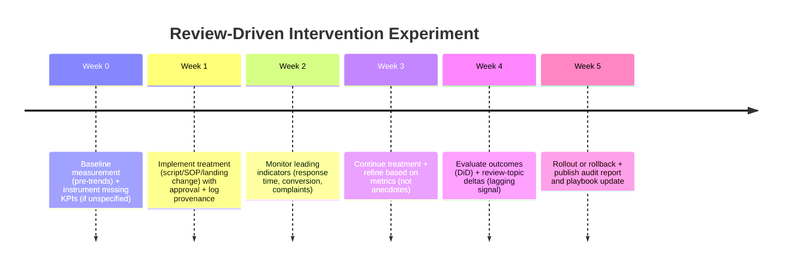

# Customer Reviews as the Primary Knowledge Source for a Tier 2 Management Layer

## Executive Summary

Customer reviews are a uniquely valuable “operational signal” for a Tier 2 Management Layer because they are **unsolicited, high‑density feedback** that encodes (a) customer intent, (b) service attribute performance, (c) operational breakdowns, (d) pricing/value perception, and (e) reputational momentum—often more candidly than surveys or internal reporting. Decades of research in marketing, hospitality, and NLP show that review signals correlate with measurable business outcomes (revenue, price power, demand) and can be mined into actionable attributes and playbooks. A well-known example: a one‑star increase in restaurant ratings on a major platform has been found to increase revenue for independent restaurants by **~5–9%**, using a regression discontinuity design. citeturn0search0turn0search12

For an AI Customer Communication Gateway, reviews have two strategic advantages compared with many other data sources:

- **They are immediately available at onboarding** (strong “time‑to‑value” lever), unlike CRM hygiene or clean conversion tracking. citeturn0search0turn4search1  
- **They are legible to management roles**: the same signal taxonomy (wait times, staff behaviors, cleanliness, pricing complaints, confusing policies) maps naturally to CMO, Ops, Product, Compliance, and Sales actions. citeturn1search0turn4search8  

However, investors will probe whether reviews alone can support Tier 2 decisions without becoming “generic advice.” The credible design is: **reviews as the primary unstructured backbone** (the “voice of customer”), augmented by **structured connectors** (ads, analytics, CRM, billing, gateway logs) to quantify ROI and causality. McKinsey’s survey work shows the largest reported revenue benefits from AI use cases appear in marketing & sales and in strategy/corporate finance, reinforcing the upsell logic for a Management Layer that can act on review‑derived insights and then validate outcomes via metrics. citeturn3search1turn3search9

Finally, the review signal is now a regulated and adversarial domain. The FTC issued a final rule banning fake reviews/testimonials that became effective October 21, 2024, and it authorizes civil penalties for knowing violations; this is central to any enterprise pitch and to your product’s governance story. citeturn2search5turn2search9turn2search29

## What Research Says: Reviews as Operational Signals

Reviews are not just “sentiment.” Classic NLP research treats reviews as a structured source of **features/aspects** (what customers talk about) plus **polarity** (how they feel about it). Early work on mining and summarizing reviews explicitly aims to extract product/service features and summarize opinions about those features—an architectural precursor to modern “review → playbook” pipelines. citeturn1search0turn1search21

Evidence that review signals relate to business performance shows up across industries:

- **Restaurants:** One-star rating changes have been causally linked to revenue changes for independents, indicating review scores shift demand, not only reflect it. citeturn0search0turn0search12  
- **Hotels/hospitality:** Cornell Center for Hospitality Research work linking online reputation indices to hotel performance estimates that a 1% improvement in online reputation can raise ADR, occupancy, and RevPAR (with reported effects up to ~0.89% ADR and ~1.42% RevPAR). citeturn4search1  
- **Manager response as a lever:** Studies of management responses to online reviews in hospitality find measurable impacts on ratings and review dynamics, supporting the premise that review‑driven playbooks (responding, fixing service failures) can be operationalized. citeturn4search8turn4search29  

Reviews also contain “hidden operational truth” that can correlate with external quality measures:

- Multiple lines of research use linguistic or topic features from restaurant reviews to predict health inspection outcomes, showing that review text can encode operational hygiene signals—even if predictive power varies by setting and assumptions (a useful investor caveat). citeturn6search0turn6search25turn6search9  
- More recent economics research combines inspection records and review text to study how reviews can inform consumers and potentially shape provider quality along regulator‑relevant dimensions. citeturn6search1  

From an investor narrative standpoint, this evidence supports a clear claim: reviews are a **measurable proxy for service quality and operational execution** and can be transformed into repeatable management actions—especially in local service categories where the “front door” is conversational and where quality is experienced (not merely transacted). citeturn6search6turn4search1

image_group{"layout":"carousel","aspect_ratio":"16:9","query":["customer review sentiment analysis dashboard example","topic modeling customer reviews visualization","online reputation management dashboard hotels"],"num_per_query":1}

## Review Signal Taxonomy and Role Mapping

A review-derived taxonomy should separate **what happened** (operational fact pattern) from **how the customer interpreted it** (sentiment/emotion) and **what it implies** (probable root cause, business risk, or growth lever). Aspect‑based sentiment analysis (ABSA) research frames this as extracting “aspects” (topics/features) and their sentiment polarity, enabling much finer operational action than binary positive/negative sentiment. citeturn1search30turn1search6

### Signal taxonomy (review-derived)

Below is a practical taxonomy designed for management roles:

- **Intent & job-to-be-done:** why the customer engaged (reservation, emergency repair, quote request, check‑in, refund).  
- **Friction & failure modes:** what broke (no answer, long wait, missed appointment, wrong order, billing disputes).  
- **Praise & differentiators:** what is consistently loved (clean rooms, friendly staff, fast response, craftsmanship).  
- **Staff behavior & culture signals:** rudeness/empathy, professionalism, policy enforcement, tone.  
- **Service quality attributes:** cleanliness, accuracy, speed, reliability, comfort, safety, outcomes.  
- **Pricing & value perception:** expensive/cheap, hidden fees, “worth it,” upsell pressure.  
- **Trust & integrity:** scams, bait‑and‑switch, misleading ads, poor disclosure.  
- **Policy & compliance triggers:** consent issues, harassment, discrimination claims, accessibility complaints, safety hazards.  
- **Competitive comparisons:** named competitors or “better than / worse than” references.  
- **Trend & trajectory:** velocity of review volume, rating drift, variance, seasonality, “incident spikes.”

### Mapping signals to management roles

This mapping should be explicit in your Tier 2 product so “reviews become actions,” not dashboards.

- **CMO:** differentiators, intent segments, pricing/value language, competitive comparisons → messaging, offers, landing page priorities, creative angles. citeturn0search0turn3search0  
- **VP Sales:** friction patterns (no quote follow-up, “never called back”), objections, trust signals → scripts, SLA rules, qualification changes. citeturn4search8turn1search0  
- **Ad Buyer:** intent terms, “praise language,” and negative triggers to exclude → target keywords/audiences and creative test matrices. citeturn1search0turn3search0  
- **Legal/Compliance:** policy complaints, consent language disputes, discrimination allegations, safety hazards → risk register, required disclaimers, escalation workflows. citeturn2search9turn2search29turn5search0  
- **CFO/Finance:** pricing sensitivity and refund disputes → package changes, discount policy, margin guardrails. citeturn0search0turn4search1  
- **Ops:** failure modes and service quality attributes → staffing, routing, SOP updates; hygiene and safety signals can be cross‑checked with operational inspection frameworks where applicable. citeturn6search25turn4search1  
- **Product:** repeated complaints/praise tied to features/services → offering changes, FAQ updates, packaging decisions. citeturn1search0turn6search24  
- **Customer Success:** trend/trajectory + friction patterns → “what to fix first” in onboarding and adoption. citeturn3search2turn3search3  
- **Compliance + DPO:** PII and sensitive data leakage risk; review fraud exposure; data retention policies. Note that platforms acknowledge users may share sensitive info in user-generated content. citeturn5search10turn2search9turn2search5  
- **HR:** staff behavior signals → training, coaching, hiring profiles. citeturn4search20turn4search8  
- **Growth:** lifecycle and sentiment trajectory → winback/referral programs and review-generation strategies (within policy constraints). citeturn4search8turn4search1  

## End-to-End Extraction Pipeline: Reviews → Structured Knowledge → Playbooks

A Tier 2 Management Layer needs a pipeline that is **repeatable, auditable, and cost‑controlled**. The pipeline below is designed for an enterprise upsell with clear provenance and governance aligned to NIST guidance on trustworthy AI risk management (AI RMF and the GenAI profile). citeturn0search3turn3search3

### Pipeline stages, candidate tools, scale/latency notes, and data quality checks

**Ingestion (connectors)**
- Sources: Google review surfaces (via permitted mechanisms), third‑party aggregators, review platforms, and controlled providers (e.g., APIs). (Exact platform mix: **unspecified**.)  
- Example ingestion via a third-party reviews endpoint supports paging tokens and sorting options; pagination and rate/cost controls must be explicit. citeturn9search0turn9search8  
- For paid enrichment, field masks can be used to control costs and latency in place details systems that require explicit field selection. citeturn9search1turn9search17  
- Terms/Policy constraint: official APIs have limits and licensing requirements; for example, some platforms’ APIs do not provide full review text by default and may provide only excerpt-level data unless under specific plans/licensing. citeturn9search14turn9search30turn9search2  
Data checks: source, timestamp, locale, rate limits, and ToS compliance flags (per connector). (ToS enforcement details: **unspecified**.)

**Deduplication**
- Duplicate detection: exact hash (normalized) + near-duplicate semantic similarity (embedding-based).  
- Open-source: sentence-transformers embeddings for semantic similarity; fast similarity search with FAISS when scale grows. citeturn10search3turn10search21turn10search16  
Scale: batch per business; for 1k–50k reviews, ANN indexing is optional; for millions across tenants, ANN becomes necessary. (Tenant scale: **unspecified**.)  
Checks: duplicate ratio; sudden spikes; repeated templates (potential spam).

**Language detection and normalization**
- Language ID: fastText/langid (unspecified implementation); translation optional.  
- Normalize: strip boilerplate, expand common abbreviations, standardize punctuation.  
Checks: language confidence; translation coverage; preserve original text for audit.

**Entity extraction**
- Extract entities: staff names, service types, locations, competitor mentions, pricing references, dates.  
- Open-source: spaCy NER (baseline), custom fine-tunes for vertical lexicons. citeturn10search1turn10search24  
Checks: entity precision/recall sampling; PII detection (names, phone numbers) for privacy controls.

**Topic/aspect modeling**
- Classical: LDA/STM (unspecified); modern: BERTopic for clustering with transformer embeddings and interpretable topic words. citeturn2search3turn2search7  
- Aspect-based sentiment analysis (ABSA): use pretrained ABSA models or fine-tuned transformers as data grows. citeturn1search30turn1search38  
Scale: BERTopic/ABSA can run nightly per tenant; incremental topic updates are recommended for fresh reviews.  
Checks: topic coherence, drift detection, “empty” topics, topic overlap.

**Sentiment + emotion**
- Sentiment baselines: polarity/subjectivity models; modern: transformer classifiers (Hugging Face pipelines). citeturn10search2turn10search28  
- Emotion: GoEmotions-style fine-grained emotion classification can separate “anger,” “disappointment,” “gratitude,” etc. citeturn2search2  
Checks: calibration against star ratings; contradiction detection (e.g., 5-star but negative text).

**Causal inference and attribution (management-grade)**
- Minimum viable approach: quasi-experiments and difference-in-differences around interventions (e.g., after staffing change / new script / new campaign).  
- Benchmark caution: studies show review signals can predict certain operational outcomes, but predictive power and causal interpretation vary by context; investor messaging should acknowledge this and position your system as “evidence‑seeking,” not “omniscient.” citeturn6search25turn6search9turn6search1  
Checks: pre-trend validity; seasonality controls; confounder notes.

**Summarization into knowledge artifacts**
- Artifact types:  
  - “Top 10 objections + rebuttals” (sales)  
  - “Service failure SOPs” (ops)  
  - “FAQ + policy clarifications” (product/legal)  
  - “Differentiator messaging blocks” (marketing)  
- Grounded generation: retrieval-augmented generation is a proven pattern for producing faithful, source-linked text by conditioning generation on retrieved documents. citeturn0search10turn0search6  
Checks: cite evidence IDs; hallucination tests; human spot-checks.

**Confidence scoring + provenance**
- For each artifact: store evidence set (review IDs, timestamps), model/version, extraction code path, and confidence.  
- Governance: align confidence, provenance, and monitoring to NIST AI RMF outcomes and GenAI profile guidance (risk identification, TEVV, transparency). citeturn0search3turn3search3  

## RAG and Grounding Patterns for Management Agents

To make reviews a primary knowledge source for Tier 2, you want **review-first retrieval** plus **structured signal retrieval**, with strict evidence citation.

### Recommended RAG indices

Maintain separate indices (logically separated per workspace/tenant):

- **Raw Reviews Index:** chunk at review-level plus sentence-level spans for precise citations.  
- **Review Signals Index:** structured extracted records (topic, aspect, sentiment, emotion, intent) to support fast analytical queries (“show top friction drivers last 30 days”).  
- **Artifacts Index:** curated playbooks, SOPs, FAQs, rebuttals; these are the “approved operational memory.”  
- **Gateway Interactions Index (optional but powerful):** call/chat/SMS transcripts and outcomes to cross-validate review issues (missed calls, hold time, follow-up failures). (Connector details: **unspecified**.)

RAG grounding research emphasizes combining parametric knowledge with non-parametric retrieved context to improve factuality and enable provenance—this supports your “investor-ready” claim that Tier 2 outputs are explainable and auditable. citeturn0search6turn0search10

### Chunking strategy

- **Raw reviews:**  
  - Primary chunk: one review (keep star rating + date + platform metadata).  
  - Secondary chunks: per-sentence or per-aspect spans (for pinpoint citation).  
- **Artifacts:** chunk by section (e.g., “Check-in SOP,” “Refund policy FAQ”).  
- **Signals:** store as structured JSON records; retrieval is filter-based (not long-text embedding).

### Recency and weighting

Use a composite scoring policy:

- Recency-weight for “fast changing” categories (staffing, wait time, seasonal issues).  
- Volume-weight (theme frequency) and severity-weight (safety, discrimination, hygiene keywords).  
- Downweight suspected spam or anomalous clusters (see risk section). citeturn2search0turn2search5turn2search9

### Evidence citation and hallucination mitigation

For every management agent output, require:

- **Evidence list**: 5–20 review IDs and extracted signals that support the conclusion.  
- **No numeric claims without metrics**: if a metric is not connected, mark it **unspecified** and recommend a connector.  
- **Two-pass generation**:  
  1) retrieve and summarize “evidence packet”  
  2) generate decision memo referencing that packet  
- **Conflict checks**: if reviews contradict each other, present distribution (variance) rather than single narrative.  
Governance rationale aligns with NIST guidance for trustworthy AI practices and risk management. citeturn0search3turn3search3

### Update cadence

- **Nightly batch** per business for topic modeling and artifact refresh.  
- **Near-real-time** for new reviews: light pipeline (dedup + sentiment + key entities + signal tags).  
- **Weekly** “executive packet” for Tier 2 roles (CMO/Ops/Product) that becomes the default RAG context.

## Review-Driven Playbooks, Measurement, and Experiments

This section provides concrete playbook templates for six priority management roles and a measurement design that investors will recognize as causality-seeking.

### Review-driven playbook templates

**CMO: Messaging & offer pivots**
- **Playbook: “Differentiator Amplification”**  
  Trigger signals: repeated praise themes (e.g., “fast response,” “spotless rooms”), high sentiment + high frequency.  
  Actions: update headline/ads to echo top phrases; build 3 creative variants; add proof points to landing page; exclude weak areas from claims.  
  Expected outcome: conversion rate lift and improved review mix (more mentions of differentiator). citeturn0search0turn4search1turn3search0  
- **Playbook: “Objection-Led Landing Page”**  
  Trigger signals: recurring negative themes (pricing surprise, hidden fees, poor communication).  
  Actions: add “pricing transparency” section; rewrite FAQ; deploy retargeting creative addressing the objection.  
  Measurement: reduce objection mentions in new reviews; improve qualified lead conversion. citeturn1search0turn1search21  

**VP Sales: SLA and script optimization**
- **Playbook: “Speed-to-Lead Enforcement”**  
  Trigger signals: “never called back,” “no answer,” “took days.”  
  Actions: tighten lead routing; auto SMS follow-up; escalation rules; coaching for objection handling.  
  Measurement: reduce missed calls and increase contact→appointment rate; look for review theme decline. citeturn4search8turn0search0  
- **Playbook: “Trust Rebuild Script”**  
  Trigger signals: “bait and switch,” “pressure,” “rude,” negative emotion.  
  Actions: rewrite first-call script; introduce transparency disclaimers; compliance review for outbound messaging.  
  Measurement: lower complaint rate; improved rating variance. citeturn2search9turn2search5turn1search13  

**Operations: SOP and staffing interventions**
- **Playbook: “Wait Time Compression”**  
  Trigger: “long wait,” “slow check-in,” “took forever,” time-based frustration.  
  Actions: staffing schedule change; pre-check-in flow; queue messaging; proactive updates.  
  Measurement: reduce wait-time mentions; improve operational KPIs (response time, abandoned calls). citeturn4search1turn4search15  
- **Playbook: “Cleanliness/Safety Escalation”**  
  Trigger: hygiene/cleanliness complaints or safety hazards.  
  Actions: immediate internal incident ticket + checklist; cross-check against compliance expectations; require human review.  
  Measurement: rapid decline in safety-related mentions; protect rating floor. Research supports that review text can reflect hygiene signals relevant to inspections, though predictive value varies. citeturn6search25turn6search1turn6search9  

**Customer Success: onboarding + configuration targeting**
- **Playbook: “Top 3 Fixes First”**  
  Trigger: top friction themes from reviews mapped to gateway configuration (missed calls, confusing policies, booking friction).  
  Actions: configure routing rules; set SLA alerts; deploy frontline scripts tuned to top issues; schedule weekly review trend reports.  
  Measurement: shorten time-to-value; reduction in top negative themes. citeturn3search2turn0search3  
- **Playbook: “Review Response Program”**  
  Trigger: low response rate to reviews + negative reputation drift.  
  Actions: draft response templates; assign approvals; track impact. Studies in hospitality show management responses can influence ratings and review behavior. citeturn4search8turn4search29  

**Compliance: review fraud + messaging governance**
- **Playbook: “Review Integrity Policy”**  
  Trigger: suspicious patterns (template repetition, burst activity); vendor offers to “remove bad reviews.”  
  Actions: prohibit review gating/incentivized manipulation; train staff; log compliance acceptance. FTC’s final rule prohibits sale/purchase of fake reviews and authorizes penalties for knowing violations, changing enterprise risk posture. citeturn2search5turn2search9turn2search29  
- **Playbook: “Outbound Messaging Gate”**  
  Trigger: intent to run outreach campaigns using review-driven messaging.  
  Actions: enforce consent checks; A2P routing segregation (implementation: **unspecified**); require approval for marketing sends.  
  Measurement: stable deliverability; low complaint rates. citeturn3search2turn9search2  

**Product: offering and FAQ refinement**
- **Playbook: “Aspect-Driven Product Changes”**  
  Trigger: ABSA/Topic results show repeated dissatisfaction on a specific service attribute (e.g., breakfast quality, scheduling).  
  Actions: change service SOP; adjust offering; update FAQ; update training. ABSA literature supports extracting fine-grained aspect sentiments to guide such changes. citeturn1search30turn1search38  
- **Playbook: “Policy Clarity Pack”**  
  Trigger: repeated confusion about cancellation/refunds/fees.  
  Actions: policy page rewrite; visible disclosures; frontline scripts aligned.  
  Measurement: decline in “surprise fees” themes, improved conversion and reduced refund disputes. citeturn1search0turn4search1  

### Metrics and ROI validation

A review-driven Tier 2 should measure both **reputation movement** and **economic outcomes**:

- Reputation KPIs: rating mean, rating variance, topic-sentiment index, volume velocity, “severe negative theme rate.” citeturn4search1turn4search15  
- Business KPIs: conversion rate (call/chat→booking), response time, revenue per booking, refunds/chargebacks, repeat booking. (Exact metrics depend on connectors; may be **unspecified** initially.)  
- Value framing: advertising budgets are large; connecting review-derived improvements to marketing efficiency speaks investor language. citeturn3search0turn3search4  

**Simple A/B design to prove causality**
- Unit: location or weekday blocks (if multi-location) OR randomized traffic split by channel.  
- Treatment: apply a review-driven intervention (new script, new landing page FAQ, new routing SLA).  
- Control: keep baseline behavior.  
- Outcomes: conversion and operational metrics; plus review-topic deltas after a lag (reviews are delayed signals).  
- Analysis: difference-in-differences with pre-trend checks to reduce confounding. (Implementation specifics: **unspecified**.)  
This positioning helps defend against “agentic projects canceled due to unclear ROI” (a current market concern). citeturn3search2turn3search6  

## Risks, Governance, and Implementation Roadmap

### Risks and mitigations (technical, legal, business)

**Bias and representativeness**
- Risk: reviews skew toward extreme experiences; silent majority is underrepresented.  
  Mitigation: blend reviews with gateway interaction logs and structured conversion signals; track rating variance and sample size thresholds. citeturn0search0turn4search15  

**Fake reviews / opinion spam**
- Risk: large-scale fake review generation and manipulation, now explicitly regulated and adversarial.  
  Mitigation: spam detection pipeline (burst detection, near-duplicate detection, reviewer network signals) plus policy enforcement. Classic “opinion spam” research frames multiple types of spam and detection approaches. citeturn2search0turn2search5turn2search9  

**Regulatory exposure when using reviews operationally**
- Risk: enterprises that operationalize review manipulation or incentivized reviews can violate policy and FTC rules.  
  Mitigation: “review integrity” compliance module; approved incentives only if lawful; audit logs of review-request flows. citeturn2search29turn2search13  

**Privacy and sensitive information in UGC**
- Risk: reviewers may include sensitive personal information; storing and processing at scale raises privacy obligations and customer trust questions. Yelp explicitly notes users may choose to share sensitive personal information through content they share, including reviews. citeturn5search10turn5search15  
  Mitigation: PII scrubbing at ingestion; retention policies; aggregate analytics outputs; align to privacy risk management frameworks. citeturn5search27turn0search3  

**Hallucination / overfitting to reviews**
- Risk: management agents mistake anecdote for truth; fabricate metrics; recommend risky actions.  
  Mitigation: evidence-required RAG; “no numbers without connectors”; confidence scoring + provenance; human approvals for external actions; align governance to NIST AI RMF and GenAI profile. citeturn0search3turn3search3turn0search10  

**Platform ToS and data licensing constraints**
- Risk: how reviews are sourced matters; official APIs have terms and limitations; some APIs limit review text access.  
  Mitigation: connector policy layer; enterprise-tier licenses where required; provenance recording per source. citeturn9search2turn9search14turn9search3  

### Implementation checklist and roadmap (MVP → production)

**MVP (4–8 weeks; exact timeline unspecified)**
- Connector: one review source ingestion path + pagination. citeturn9search0  
- Pipeline: dedup + language normalize + sentiment + topic clustering (BERTopic or simpler). citeturn2search7turn1search0  
- Artifacts: generate 5–10 “approved” playbook snippets: top objections, SOP fixes, FAQ drafts. citeturn1search0turn0search10  
- Governance: store provenance (review IDs), model version, and “evidence list” output requirement. citeturn0search3  

**Production (8–20 weeks; unspecified)**
- Multi-source ingestion (Google + other platforms) with licensing options and compliance module. citeturn9search2turn2search9  
- Structured signal store + dashboards for Tier 2 roles; integrate gateway logs. (Exact schema: **unspecified**.)  
- Fraud detection and FTC-compliant review integrity workflow. citeturn2search29turn2search5  
- Privacy layer: PII detection, retention rules, access controls aligned with privacy frameworks. citeturn5search15turn5search27  

**Enterprise (20+ weeks; unspecified)**
- Causal measurement framework (DiD templates, experiment orchestration). citeturn3search2turn3search1  
- Full Tier 2 connectors (ads, analytics, CRM, billing) to quantify ROI beyond reviews. citeturn3search1turn3search0  
- Audit exports and governance reports aligned to NIST best practices. citeturn3search3turn0search3  

### Go-to-market experiments (reviews-first wedge)

- **Pilot design:** choose 1–2 verticals where reviews are dense and operational levers are immediate (hospitality, home services). Use a 30–60 day “review-driven turnaround” program with pre-registered KPIs and clear measurement plan. citeturn4search1turn3search2  
- **Association/reseller channel:** sell Tier 2 as “management intelligence overlay” that scales across members; reviews provide fast onboarding because they are public and plentiful. (Channel details: **unspecified**.)

### Appendix

**Signal → role action → KPI table (condensed)**

| Review signal | Typical role action | Sample KPI |
|---|---|---|
| “Never answered phone / took days” (friction) | VP Sales + Ops tighten SLA + routing | missed-call rate; contact→appointment |
| “Hidden fees / overpriced” (pricing sensitivity) | CFO + Product redesign package + disclosures | refund rate; conversion rate |
| “Staff rude / disrespectful” (culture) | HR coaching + Ops SOP | negative theme rate; CSAT |
| “Cleanliness / safety concerns” (risk) | Ops incident workflow + Compliance gate | safety-mentions rate; rating floor |
| “Loved speed / craftsmanship” (differentiator) | CMO + Ad Buyer amplify messaging | ROAS; conversion lift |
| Competitive comparisons | CMO reposition + Product differentiation | share of review mentions; win rate |

**Recommended tools (open-source + commercial) by pipeline stage**  
(Selection is illustrative; final stack depends on your infra and compliance constraints—**unspecified**.)

| Stage | Open-source options | Commercial options |
|---|---|---|
| Ingestion | custom crawlers (unspecified) | SerpAPI reviews endpoints citeturn9search0turn9search8 |
| NER / entity extraction | spaCy NER citeturn10search1turn10search24 | managed NLP services (unspecified) |
| Sentiment / emotion | Hugging Face Transformers pipelines citeturn10search2turn10search28 | managed sentiment APIs (unspecified) |
| Topic modeling | BERTopic citeturn2search7turn2search3 | VoC platforms (unspecified) |
| Embeddings | sentence-transformers citeturn10search3turn10search32 | managed embedding APIs (unspecified) |
| Vector search | FAISS citeturn10search21turn10search16 | vector DBs (unspecified) |
| Governance | NIST AI RMF/GenAI profile alignment citeturn0search3turn3search3 | audit tooling (unspecified) |

**Mermaid diagram: reviews → knowledge → Tier 2 management agents**

```mermaid
flowchart LR
  R[Raw Reviews<br/>(multi-source)] --> D[Dedup + Normalize]
  D --> E[Entity Extraction<br/>+ PII Scrub]
  E --> T[Topics/Aspects<br/>+ ABSA]
  T --> S[Signals Store<br/>structured JSON]
  T --> K[Knowledge Artifacts<br/>FAQ / SOP / Playbooks]
  S --> RAG[RAG Index<br/>Review-first retrieval]
  K --> RAG
  RAG --> M[Tier 2 Management Agents<br/>CMO/Ops/Sales/Compliance/Product/CS]
  M --> A[Approved Actions<br/>Policies, Campaign Briefs, SOP Updates]
  A --> O[Observed Outcomes<br/>Conversion + SLA + Review Drift]
  O --> S
```

**Mermaid diagram: experiment timeline (intervention causality)**



**Recommended observability fields (short schema)**  
(IDs, storage choice, and retention windows are **unspecified**.)

- `workspace_id` (UUID), `source_platform`, `review_id`, `review_timestamp`, `rating`, `language`, `raw_text_hash`  
- `extraction_version`, `model_version`, `signals` (intent/topic/aspect/sentiment/emotion)  
- `artifact_id`, `artifact_type`, `evidence_review_ids[]`, `confidence_score`  
- `agent_role`, `decision_type`, `approval_state`, `actions_proposed`, `actions_executed`  
- `audit_log_link`, `retention_policy_applied`, `pii_redaction_applied`