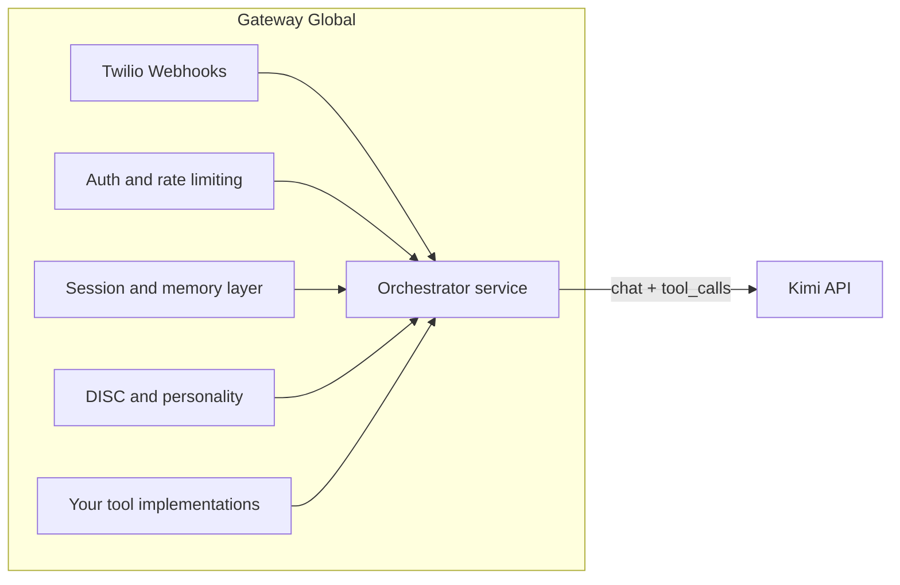

# Kimi 2.5 Integration Review for Gateway Global AI

## 1. Summary: Kimi 2.5's Relevance to Gateway Global

**Capability-to-goal mapping**

| Gateway Global goal                              | Kimi 2.5 capability                                                                                                                                     | Kimi doc reference                                                                                                                                                                                                               |
| ------------------------------------------------ | ------------------------------------------------------------------------------------------------------------------------------------------------------- | -------------------------------------------------------------------------------------------------------------------------------------------------------------------------------------------------------------------------------- |
| **Conversational memory / cognitive continuity** | 256K context (`kimi-k2.5`, `kimi-k2-0905-preview`, etc.), automatic context caching (cache-hit pricing)                                                 | [chat.md](_user_uploads/models/kimi/docs/chat.md), [chat_pricing.md](_user_uploads/models/kimi/docs/chat_pricing.md), [kimi_k25_multi_model.md](_user_uploads/models/kimi/getting_started/kimi_k25_multi_model.md)               |
| **Task completion / agentic behavior**           | Native tool use (function calling), multi-step tool calls, optional agent swarm (self-directed sub-agents, many parallel tool calls)                    | [tool_use.md](_user_uploads/models/kimi/docs/tool_use.md), [tool_calls_api.md](_user_uploads/models/kimi/getting_started/tool_calls_api.md), [kimi-k25-visual-agent.md](_user_uploads/models/kimi/docs/kimi-k25-visual-agent.md) |
| **SMS/voice (Twilio)**                           | Text-in/text-out API; you keep Twilio webhooks and convert speech-to-text/text-to-speech in your stack; long context supports long conversation history | Your backend remains the single integration point                                                                                                                                                                                |
| **Dashboards / onboarding**                      | Vision (image/video) for future media; strong coding/front-end from K2.5 for potential UI-generation or analysis                                        | [kimi-k25-visual-agent.md](_user_uploads/models/kimi/docs/kimi-k25-visual-agent.md), [kimi_k25_multi_model.md](_user_uploads/models/kimi/getting_started/kimi_k25_multi_model.md)                                                |
| **DISC / personality**                           | System and user messages; you inject DISC prompts and memory in your orchestration layer                                                                | Your code owns personality logic                                                                                                                                                                                                 |
| **Cost-efficient, sovereign control**            | OpenAI-compatible API; you control which tools are exposed, auth, and rate limiting                                                                     | [switch_from_openai.md](_user_uploads/models/kimi/getting_started/switch_from_openai.md), [kimi_api_quick_start.md](_user_uploads/models/kimi/getting_started/kimi_api_quick_start.md)                                           |

**API fit for TypeScript/Node**

- **Base URL:** `https://api.moonshot.ai/v1` ([chat.md](_user_uploads/models/kimi/docs/chat.md)).
- **Compatibility:** OpenAI SDK (Node.js) works with `base_url` + `api_key`; same message shape (`system`/`user`/`assistant`), same chat completion and tool-call flow.
- **Models relevant to Gateway:** `kimi-k2.5` (multimodal, thinking/default), `kimi-k2-thinking`, `kimi-k2-0905-preview`, `kimi-k2-turbo-preview` (faster, 256K). Use `kimi-k2.5` for best reasoning/agent/vision; use `kimi-k2-turbo-preview` for lower latency when appropriate.

---

## 2. Recommended Integration Architecture

**Preferred: Direct Kimi API from your backend**

- **Why:** You keep full control over sessions, memory, DISC, Twilio webhooks, and tool exposure. No dependency on OpenClaw’s gateway, pairing, plugins, or shell access, which have been assessed as a significant security risk.
- **Pattern:** Node/TypeScript service(s) call Kimi’s `POST https://api.moonshot.ai/v1/chat/completions` (and optionally tokenizer/estimate-token-count). Use the official OpenAI Node SDK with `base_url: "https://api.moonshot.ai/v1"` and `api_key: process.env.MOONSHOT_API_KEY`.

**Where Kimi sits in the stack**

- **Orchestrator:** Builds the `messages` array (system prompt with DISC + memory summary, user/assistant history), passes `tools` (JSON Schema) for your platform (search, telephony, memory read/write, DISC, etc.). On `finish_reason === "tool_calls"`, execute tools in your process and append `role: "tool"` messages, then call Kimi again until `finish_reason === "stop"`.
- **Thinking vs non-thinking:** For `kimi-k2.5`, thinking is default (`thinking: {"type": "enabled"}`). Use `thinking: {"type": "disabled"}` for faster, cheaper, simpler turns. For multi-step tool use with thinking, keep `reasoning_content` in context ([thinking_models.md](_user_uploads/models/kimi/getting_started/thinking_models.md)); use `max_tokens >= 16000` and streaming where responses are large.
- **Vision:** When you add image/voice/media, send multimodal `content` (e.g. `[{ "type": "image_url", "image_url": { "url": "data:image/..." } }, { "type": "text", "text": "..." }]`) per [chat.md](_user_uploads/models/kimi/docs/chat.md) and [kimi_k25_multi_model.md](_user_uploads/models/kimi/getting_started/kimi_k25_multi_model.md). K2.5 supports image and video natively.

**OpenClaw: optional comparison only — do not use as core**

- The doc [kimi_open_claw.md](_user_uploads/models/kimi/getting_started/kimi_open_claw.md) describes using Kimi as a model inside OpenClaw. OpenClaw is one possible integration path, not the source of Kimi’s intelligence.
- **Do not recommend** building the platform around OpenClaw: it introduces a large surface (gateway, channels, pairing, plugins, shell access) and has been assessed as a significant security risk. Prefer your own backend + Kimi API so that auth, channels, and tools stay under your control.

---

## 3. Migration Path from Gemini / ChatGPT to Kimi

**High-level steps**

1. **Client:** Create a Kimi client module that uses the OpenAI-compatible endpoint (e.g. `openai` SDK with `base_url` and `api_key`). Centralize model IDs (`kimi-k2.5`, `kimi-k2-turbo-preview`, etc.) and optional `thinking` in one place.
2. **Message format:** Keep existing `messages` shape (system, user, assistant). Gemini/ChatGPT-style histories are compatible; ensure no provider-specific payloads leak (e.g. Gemini-only roles). Reference: [switch_from_openai.md](_user_uploads/models/kimi/getting_started/switch_from_openai.md).
3. **Tools:** You already use a tool registry ([TOOL_REGISTRY_SCHEMA.json](_user_uploads/github_gateway_global_main/readme_needs_rework.md)). Map each tool to Kimi’s `tools` array: `{ type: "function", function: { name, description, parameters } }` with JSON Schema. Max 128 functions ([tool_use.md](_user_uploads/models/kimi/docs/tool_use.md)). Execute tool calls in your backend and append `role: "tool"` with `tool_call_id` and `name`.
4. **Sampling:** For `kimi-k2.5`, temperature/top_p/n/presence_penalty/frequency_penalty are fixed (e.g. temperature 1.0, top_p 0.95); sending other values can error ([chat.md](_user_uploads/models/kimi/docs/chat.md), [kimi_k25_multi_model.md](_user_uploads/models/kimi/getting_started/kimi_k25_multi_model.md)). For `kimi-k2-turbo-preview`, use e.g. `temperature: 0.6`. Do not set `temperature=0` with `n>1` (Kimi returns invalid_request_error) ([switch_from_openai.md](_user_uploads/models/kimi/getting_started/switch_from_openai.md)).
5. **Streaming:** Keep `stream: true` where you use it today. Kimi returns SSE; usage can be in the last chunk or with `stream_options: { include_usage: true }`. For thinking models, streaming improves UX and avoids timeouts ([thinking_models.md](_user_uploads/models/kimi/getting_started/thinking_models.md)).
6. **Deprecated `functions`:** If any code uses OpenAI’s legacy `functions`/`function_call`, migrate to `tools`/`tool_calls` ([switch_from_openai.md](_user_uploads/models/kimi/getting_started/switch_from_openai.md)).
7. **tool_choice:** Kimi supports `"auto"` and `"none"`, not `"required"`. Use prompt design to encourage tool use when needed ([switch_from_openai.md](_user_uploads/models/kimi/getting_started/switch_from_openai.md)).

**Pricing and tokens**

- **kimi-k2.5:** Input cache hit $0.10/1M, cache miss $0.60/1M, output $3.00/1M, 256K context ([chat_pricing.md](_user_uploads/models/kimi/docs/chat_pricing.md)).
- **kimi-k2-turbo-preview:** Input cache hit $0.15/1M, cache miss $1.15/1M, output $8.00/1M.
- Use the token estimation API (`POST /v1/tokenizers/estimate-token-count`) when you need to check size before calling ([tokens.md](_user_uploads/models/kimi/docs/tokens.md)). Tool definitions count toward context.

---

## 4. Concrete Next Steps (Ordered)

1. **Env and config:** Add `MOONSHOT_API_KEY` (and optionally `MOONSHOT_BASE_URL` defaulting to `https://api.moonshot.ai/v1`). Do not commit the key; use secrets per environment.
2. **Kimi client module (TypeScript):** Create a thin wrapper (e.g. `createKimiClient()`) that instantiates the OpenAI SDK with Kimi’s `base_url` and `api_key`, and exposes `chat.completions.create` with your default model and options (e.g. `kimi-k2.5` or `kimi-k2-turbo-preview`, `thinking` when needed).
3. **Tool schemas:** Define Kimi `tools[]` for your platform: e.g. search, telephony (Twilio actions), memory read/write, DISC-related actions. Align with [TOOL_REGISTRY_SCHEMA](_user_uploads/github_gateway_global_main/readme_needs_rework.md) and implement handlers in your backend so only your code executes them.
4. **Replace one flow:** Pick a single Gemini or ChatGPT flow (e.g. one agent or one API route), swap it to the Kimi client with the same `messages` and tools contract. Validate responses and tool-call loops (including keeping `reasoning_content` when using thinking + tools).
5. **Streaming and thinking:** If using thinking models, enable streaming and retain `reasoning_content` in assistant messages for multi-step tool calls; set `max_tokens` high enough (e.g. ≥16k) per [thinking_models.md](_user_uploads/models/kimi/getting_started/thinking_models.md).
6. **Capacity planning:** Review [recharge_rate_limits.md](_user_uploads/models/kimi/docs/recharge_rate_limits.md): Tier0 ($1) gives concurrency 1, 3 RPM, 500K TPM; Tier2 ($20) gives 100 concurrency, 500 RPM, 3M TPM. Plan recharge tier and error handling for 429 (rate limit) and quota.
7. **Expand:** Roll out Kimi to more services while keeping DISC, memory, and Twilio handling in your code.

---

## 5. Risks and Mitigations

| Risk                                    | Mitigation                                                                                                                                                                                                          |
| --------------------------------------- | ------------------------------------------------------------------------------------------------------------------------------------------------------------------------------------------------------------------- |
| **API dependency / availability**       | Use retries with backoff; consider fallback to existing Gemini path if Kimi is down; monitor errors and latency.                                                                                                    |
| **Cost**                                | Use cache-friendly patterns (stable system + history prefix); choose non-thinking or turbo for high-volume paths; track usage via `usage` in responses and estimate-token-count; set budgets and alerts.            |
| **Rate limits (429)**                   | Respect Kimi tiers (RPM/TPM/TPD/concurrency); implement client-side throttling and queueing; surface retry-after to callers where applicable.                                                                       |
| **Prompt injection / tool-call safety** | Validate and sanitize user input; restrict tool parameters (e.g. allowlists for actions); never pass unsanitized user content to privileged operations; keep tool implementations in your backend with auth checks. |
| **DISC and memory logic**               | Implement DISC and memory entirely in your orchestration (system prompt, memory retrieval, tool results). Do not delegate identity or memory storage to third-party agent frameworks.                               |
| **Kimi API changes**                    | Pin SDK version; abstract model IDs and options behind your client module; watch Moonshot changelog/status.                                                                                                         |

---

## References (Kimi docs used)

- [readme.md](_user_uploads/models/kimi/readme.md) — Moonshot/Kimi overview  
- [docs/chat.md](_user_uploads/models/kimi/docs/chat.md) — Chat completion API, content types, errors  
- [docs/chat_pricing.md](_user_uploads/models/kimi/docs/chat_pricing.md) — Pricing per model  
- [docs/tool_use.md](_user_uploads/models/kimi/docs/tool_use.md) — Tool/function calling  
- [docs/tokens.md](_user_uploads/models/kimi/docs/tokens.md) — Token estimation  
- [docs/kimi-k25-visual-agent.md](_user_uploads/models/kimi/docs/kimi-k25-visual-agent.md) — K2.5 vision, coding, agent swarm  
- [docs/kimi-researcher.md](_user_uploads/models/kimi/docs/kimi-researcher.md) — Agentic RL (context only)  
- [getting_started/kimi_k25_multi_model.md](_user_uploads/models/kimi/getting_started/kimi_k25_multi_model.md) — K2.5 usage, vision, thinking toggle  
- [getting_started/kimi_api_quick_start.md](_user_uploads/models/kimi/getting_started/kimi_api_quick_start.md) — Quick start  
- [getting_started/switch_from_openai.md](_user_uploads/models/kimi/getting_started/switch_from_openai.md) — OpenAI migration, tool_choice, temperature/n  
- [getting_started/thinking_models.md](_user_uploads/models/kimi/getting_started/thinking_models.md) — Thinking mode, reasoning_content, multi-step tools  
- [getting_started/tool_calls_api.md](_user_uploads/models/kimi/getting_started/tool_calls_api.md) — Tool call flow, streaming  
- [getting_started/websearch.md](_user_uploads/models/kimi/getting_started/websearch.md) — Built-in $web_search (optional)  
- [getting_started/kimi_open_claw.md](_user_uploads/models/kimi/getting_started/kimi_open_claw.md) — OpenClaw as optional path only; not recommended as core  
- [docs/recharge_rate_limits.md](_user_uploads/models/kimi/docs/recharge_rate_limits.md) — Tiers, RPM, TPM, TPD

