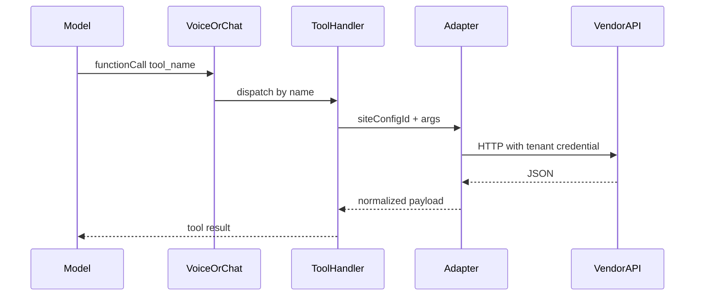

# Integration Runtime Pattern (reference implementation)

## End-to-end binding

One **capability** → one **Gemini tool name** → one **handler path** → **site-scoped credentials**.

| Layer | Cloudbeds hospitality example |
|-------|-----------------------------|
| Capability row | `cb_inventory_quote` in [`registry-yaml/integration-capabilities/cloudbeds.v1.yaml`](../../registry-yaml/integration-capabilities/cloudbeds.v1.yaml) |
| Tool declaration | `get_hotel_inventory` in [`server/config/geminiToolDeclarations.ts`](../../server/config/geminiToolDeclarations.ts) |
| Mode allowlist | `RECEPTIONIST`, `SALES`, `MANAGER` in [`server/config/operationalModes.ts`](../../server/config/operationalModes.ts) |
| Handler | [`server/tools/hotelInventoryHandler.ts`](../../server/tools/hotelInventoryHandler.ts) (`fetchCloudbedsAvailability`) |
| PMS call | Cloudbeds `getAvailableRoomTypes` via integration in [`server/tools/cloudbedsSwarmTools.ts`](../../server/tools/cloudbedsSwarmTools.ts) |
| Credential anchor | `site_pms_integrations` (`schema_anchor` in legacy [`registry-yaml/cloudbeds-tool-registry.yaml`](../../registry-yaml/cloudbeds-tool-registry.yaml)) |

## Flow (concise)

## Legacy registry

[`registry-yaml/cloudbeds-tool-registry.yaml`](../../registry-yaml/cloudbeds-tool-registry.yaml) remains a **human-oriented** contract and Boardwalk constants. New governance rows are split into:

- `integration-entities/`
- `integration-endpoints/`
- `integration-capabilities/`
- `integration-adapters/`
- `integration-capability-sets.yaml`

CI validates alignment across these and `TOOL_DECLARATIONS`.

## Related

- [`INTEGRATION_CAPABILITY_GRAPH_SPEC_V1.md`](./INTEGRATION_CAPABILITY_GRAPH_SPEC_V1.md)
- [`ADAPTER_GENERATION_POLICY.md`](./ADAPTER_GENERATION_POLICY.md)
