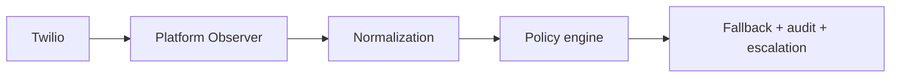

# Twilio Reliability & Fallback — Control-Plane Architecture

## Purpose

Twilio integration **without** governed error handling is a demo. Twilio integration **with** capture → interpretation → policy → fallback is **infrastructure**.

At scale, voice transits the platform like a carrier: reliability is **non-optional**, **platform-owned**, and **not** delegated to tenants as DIY Debugger configuration or ad hoc low-code branches.

**Canonical insight (peer-reviewed):**

> **Twilio provides telemetry. The OS must provide policy.**

## Relation to other control planes

| Plane | Role |
|-------|------|
| **Agent control plane** | Capabilities, boundaries, orchestration (`AGENT_CAPABILITY_SPEC_V0.md`, agent capability YAML). |
| **System reliability plane (Twilio)** | Ingest Twilio signals, normalize to platform semantics, execute fallback policy, audit and escalate. |

Both are **governed subsystems**, not product features or one-off tickets.

## Systematic vendor telemetry discovery (skills & integrations)

Teams under pressure often ship “happy path” integrations and skip surfaces that are not obviously “critical.” For **telecom-grade** platforms, that is a structural mistake.

**Rule:** When expanding **skills** or integrating any **critical service provider** (telephony, SMS, payments, identity), explicitly complete a **telemetry & failure-surface inventory**:

1. Does the vendor expose **real-time error webhooks** (e.g. Twilio [Debugging Events](https://www.twilio.com/docs/usage/troubleshooting/debugging-event-webhooks))?
2. Is there a **Monitor / Alerts API** with forensic request/response on single-resource fetch ([Alerts](https://www.twilio.com/docs/usage/monitor-alert))?
3. Is there a **broad audit / event log** suitable for SIEM export ([Events](https://www.twilio.com/docs/usage/monitor-events))?
4. Are there **threshold / alarm** channels ([Alarms](https://www.twilio.com/docs/usage/monitor-alarms))?

Document findings in the integration’s governance note or skill reference; do not rely on console-only triage.

## Why application logs are insufficient (voice)

If DNS fails, the app is down, or TwiML is never fetched successfully, **your Node process may log nothing** — Twilio still records the failure. The [Debugging Events webhook](https://www.twilio.com/docs/usage/troubleshooting/debugging-event-webhooks) is often the **only** off-host signal for classes such as HTTP retrieval failures (e.g. 11200-class scenarios) or document parse failures. That ingestion path is **Phase 10a** in `GOVERNANCE_EXECUTION_PLAN_V1.md`.

### Production inbound (10a — implemented)

- **URL:** `POST https://{APP_URL}/api/twilio/monitor/debug-event` — same system as Console Debugger / Monitor ([Debugging Events webhook](https://www.twilio.com/docs/usage/troubleshooting/debugging-event-webhooks)).
- **Handler:** `server/routes/twilioMonitorRoutes.ts` — **fail closed** on bad signature ([webhook security](https://www.twilio.com/docs/usage/webhooks/webhooks-security)); **ingestion only** (fast `200`, no policy engine).
- **Signature URL:** Must match the **exact** URL Twilio POSTed to. Behind reverse proxies set **`TWILIO_WEBHOOK_SIGNATURE_BASE_URL`** (public HTTPS origin, no trailing slash). Middleware: `server/middleware/twilioWebhookSignature.ts` (uses Twilio SDK `validateRequest`).
- **Log shape:** One JSON line `[TwilioDebugger]` with `twilioWebhookFullUrl`, **sanitized** header snapshot (signature shown as `[present]` only), **`rawForm`**, and **`normalized`** (correlation: `callSid`, `errorCode`, `failureClassId`, `eventSid`, `severity`, `payloadWebhookUrl`, …). **DB persistence** = follow-up (10c+). **10b:** `failureClassId` from `twilio-debugger-error-code-hints.v0.yaml` when `error_code` is known.

## Pipeline (minimum viable architecture)

### 1. Capture (Observer)

Ingest:

- **Debugging Events** webhook (real-time ERROR / WARNING).
- **Alarm** webhooks (threshold / spike notifications).
- **Status callbacks** already used in voice/SMS flows (where applicable).
- Optional **poll** [Monitor Alerts](https://www.twilio.com/docs/usage/monitor-alert) / [Events](https://www.twilio.com/docs/usage/monitor-events) for reconciliation and historical analysis.

Every inbound POST **must** validate **`X-Twilio-Signature`** (same discipline as voice webhooks). See [webhook security](https://www.twilio.com/docs/usage/webhooks/webhooks-security).

### 2. Interpret (Normalization)

Map Twilio-native codes and payloads to **platform failure classes** and **severity** — not raw vendor strings in operator UI. Single-alert fetch on the Alerts API returns detailed HTTP context for RCA.

See `TWILIO_ERROR_NORMALIZATION_SPEC.md` and `registry-yaml/twilio-platform-failure-classes.v0.yaml`.

**Anti-pattern:** stopping at “we log it.” Ingestion without classification is passive logging, not reliability.

### 3. Respond (Policy + fallback)

The policy engine decides: retry, fail closed, degrade (e.g. voice → text), suppress duplicate side effects, notify ops, open a governed incident, or hold outbound actions until health recovers.

See `TWILIO_FALLBACK_POLICY_REGISTRY.md`.

## Visibility split (non-negotiable)

| Audience | Sees |
|----------|------|
| **Customer / tenant** | Plain outcomes only (“call did not connect,” “agent unavailable”) — not raw `error_code`, `streamSid`, or Debugger internals. |
| **Platform / operator** | Full correlation: `CallSid`, `streamSid`, `error_code`, `failureClassId`, `resource_sid`, raw payload retention for postmortem. |

**Caller-facing** TwiML fallback (e.g. `<Say>` / `<Play>` / `<Hangup>`) and **operator-facing** Monitor/Debugger/Alarm signals are **both** required; neither replaces the other.

## Non-optional infrastructure

Twilio reliability handling is:

- **Global platform service** — not per-customer workflow, not per-agent prompt branching, not low-code “if error” trees.

Optional **later:** narrow, **explicit** policy overlays where charter allows (e.g. branded hold message text) — never raw Twilio configuration in tenant hands for Debugger or Alert ownership.

## Implementation sequencing

Aligned with `GOVERNANCE_EXECUTION_PLAN_V1.md` **Phase 10** (10a–10d) plus normalization/policy artifacts in this doc set.

Future: automated tests / validators for retryable vs non-retryable, fail-open vs fail-closed, escalation required, and alarm-threshold mapping (see fallback registry).

## Related

- `GOVERNANCE_EXECUTION_PLAN_V1.md` — Phase 10 steps.
- `TWILIO_ERROR_NORMALIZATION_SPEC.md` — interpret layer.
- `TWILIO_FALLBACK_POLICY_REGISTRY.md` — policy dimensions and registry shape.
- `registry-yaml/twilio-platform-failure-classes.v0.yaml` — v0 platform failure class IDs.
- `registry-yaml/twilio-debugger-error-code-hints.v0.yaml` — Debugger `error_code` → `failureClassId` (10b partial).
- `docs/deployment/TWILIO_DEBUGGER_WEBHOOK_CHECKLIST.md` — Console URL + `TWILIO_WEBHOOK_SIGNATURE_BASE_URL`.
- `.cursor/rules/sovereign-twilio-lockdown.mdc` — protected webhook files; **new** modular routes only for Monitor/Debugger ingestion.
