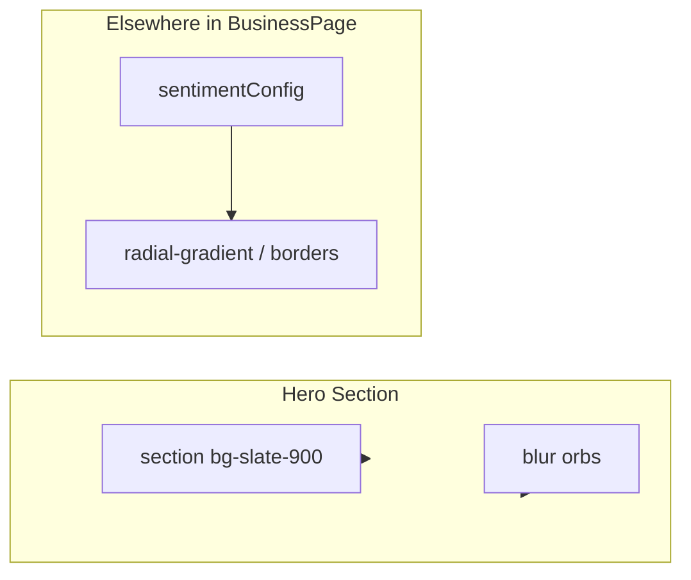
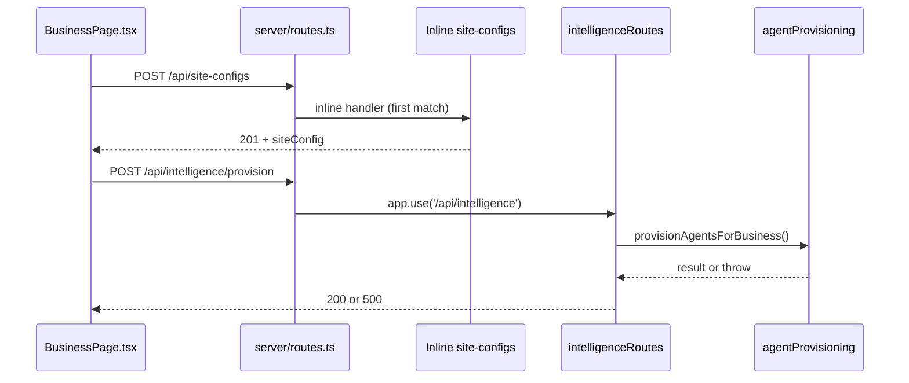
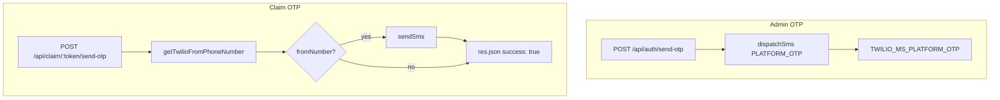

# Diagnostic Report: Core Systems Failure (2026-03-03)

**Scope:** Hero background, Agent Team generation, Voice PTT connection, OTP send/claim.  
**Constraint:** No code was modified during this diagnosis. This document is for handoff to your engineer.

---

## Executive Summary

Four core systems are failing. The hypothesis that a "Production/Vite lockdown" severed wiring to core API routes is partially supported: route registration order and duplicate route definitions can cause payload/routing confusion; static asset resolution and env-dependent paths are fragile. Below is a trace of each system with file names, code snippets, and recommended checks.

---

## 1. Hero Section Background Not Loading

### Current State

- **File:** [client/src/pages/customer/BusinessPage.tsx](client/src/pages/customer/BusinessPage.tsx)
- **Hero section (around lines 1089–1092):**

```tsx
<section className="relative min-h-[100vh] min-h-[100svh] flex flex-col px-6 overflow-hidden bg-slate-900">
  <div className="absolute top-0 right-0 w-[600px] h-[600px] bg-blue-600/10 rounded-full blur-[100px] pointer-events-none" />
  <div className="absolute bottom-0 left-0 w-[400px] h-[400px] bg-violet-600/10 rounded-full blur-[80px] pointer-events-none" />
```

- The hero uses a **flat** `bg-slate-900` and two blur orbs. There is **no** image (`/hero-bg.png` was removed in a prior change) and **no** dynamic CSS variables or gradient tied to theme/sentiment on this section.

### Where Dynamic Styling *Does* Exist (Not Hero)

- **Same file:** `sentimentConfig` from `SENTIMENT_COLORS[sentiment]` is used for:
  - Line 94: `background: radial-gradient(circle, ${sentimentConfig.primary} 0%, ${sentimentConfig.glow} 30%, transparent 70%)` (another component, not the main hero).
  - Lines 102–103, 119: border, boxShadow, label styles.

So dynamic CSS variables / sentiment-driven styling exist elsewhere in the page but were **never applied to the main hero** in the current code. If “hero background not loading” means:

- **A)** A background image is missing → the previous `` was removed; the hero no longer references any image.
- **B)** A gradient/variable-based hero background is missing → that would require **adding** sentiment- or theme-driven styles to the hero `<section>` (e.g. a radial gradient using `sentimentConfig.primary` / `sentimentConfig.glow`), not restoring something that is still in the codebase.

### Diagram: Hero Data Flow (Current)



**Recommendation for engineer:** Decide whether the hero should use (1) a static image (restore or add an image and ensure it is under `client/public/` and served from `dist/public/`), or (2) a dynamic gradient/variables (derive hero background from `sentimentConfig` and apply to the hero `<section>`). Then implement only that contract; avoid mixing both unless specified.

---

## 2. Agent Team Generation Fails

### Flow

1. **Client:** [client/src/pages/customer/BusinessPage.tsx](client/src/pages/customer/BusinessPage.tsx) — `handleCreateAiTeamConfirm` (lines 565–630).
2. **Step 1:** `POST /api/site-configs` with `{ name, placeId, placeData }`.
3. **Step 2:** `POST /api/intelligence/provision` with `{ siteConfigId, placeTypes, businessName }`.

### Route Registration (Critical)

- **File:** [server/routes.ts](server/routes.ts)
  - Line 134: `app.use('/api/intelligence', intelligenceRoutes);` — **provision** lives here.
  - Lines 1357–1387: **Inline** `app.get("/api/site-configs", ...)` and `app.post("/api/site-configs", ...)`.
  - Line 2134: `app.use("/api/site-configs", siteConfigRoutes);` — **modular** router for the same path.

Express matches routes in registration order. So:

- `GET /api/site-configs` and `POST /api/site-configs` are handled by the **inline** handlers in `routes.ts` (registered first).
- The **modular** [server/routes/siteConfigRoutes.ts](server/routes/siteConfigRoutes.ts) (POST `/`, etc.) is mounted later; its `POST /` would be equivalent to `POST /api/site-configs`, but it is **never reached** for that path because the inline POST already matched.

So for “Create AI team”:

- **POST /api/site-configs** → inline handler in `routes.ts` (lines 1366–1387). Schema there does **not** include all fields that [siteConfigRoutes.ts](server/routes/siteConfigRoutes.ts) allows (e.g. `botTemplateId`, `modelName`, `plan`, granular resource ledger). Payload stripping or validation differences can occur if the client or another caller sends those.
- **POST /api/intelligence/provision** → [server/routes/intelligenceRoutes.ts](server/routes/intelligenceRoutes.ts) (lines 89–119). It calls `provisionAgentsForBusiness` from [server/services/agentProvisioning.ts](server/services/agentProvisioning.ts). If this fails, the client shows “Failed to provision agents” (from line 619 in BusinessPage).

### Possible Failure Points

1. **Intelligence route not hit:** If something (e.g. middleware, Vite proxy, or a typo) causes `/api/intelligence` to 404 or not reach the server, the second request fails.
2. **Payload validation:** Inline `POST /api/site-configs` uses a narrower Zod schema; extra fields are stripped. Unlikely to break creation unless required fields are missing.
3. **provisionAgentsForBusiness** throws (DB, template lookup, SerpAPI/env): Error is logged and returned as 500; client shows “Could not create AI team” / “Failed to provision agents”.

### Diagram: Agent Team Request Flow



**Recommendation for engineer:** (1) Confirm in network tab that both `POST /api/site-configs` and `POST /api/intelligence/provision` are sent and return 200/201 or a clear 4xx/5xx. (2) Check server logs for errors from `[IntelligenceRoutes] provision` or from `provisionAgentsForBusiness`. (3) If “routing scrambled” is suspected, consider removing the **inline** site-configs handlers from `routes.ts` and relying solely on `siteConfigRoutes` so there is a single source of truth (see [server/routes/siteConfigRoutes.ts](server/routes/siteConfigRoutes.ts) comment: “do NOT add site-config routes anywhere else”).

---

## 3. Voice AI PTT Does Not Connect (clear-voice-processor.js)

### Client Side

- **Primary client:** [client/src/services/voice/GeminiStreamingClient.ts](client/src/services/voice/GeminiStreamingClient.ts)
  - Line 452: `const workletUrl = resolvePlatformUrl('/clear-voice-processor.js');`
  - Line 456: `await this.inputAudioContext.audioWorklet.addModule(workletUrl);`
- **Platform URL:** [client/src/sdk/platformConfig.ts](client/src/sdk/platformConfig.ts)
  - In the **main app**, `_platformUrl` is `''`, so `resolvePlatformUrl('/clear-voice-processor.js')` → `'/clear-voice-processor.js'` (relative to current origin).
  - In an **embedded SDK**, it becomes `${platformUrl}/clear-voice-processor.js` (e.g. `https://aibizbot.gatewayglobal.ai/clear-voice-processor.js`).

So in the main app, the browser requests `GET /clear-voice-processor.js` against the same host that serves the SPA.

### Build and Static Serving

- **Vite:** [vite.config.ts](vite.config.ts) — `root: client`, `build.outDir: dist/public`, and Vite’s default `publicDir` is `public` under root, i.e. **client/public/**.
- **Vite** copies contents of `client/public/` to the **root** of `outDir` → **dist/public/**.
- So **client/public/clear-voice-processor.js** must end up as **dist/public/clear-voice-processor.js** after `npm run build`.

- **Server (production):** [server/index.ts](server/index.ts) (lines 567–584):
  - `runtimeDirname` = `path.dirname(fileURLToPath(import.meta.url))` when running from the built bundle. For **dist/index.mjs**, that is **dist**.
  - `publicDir = path.resolve(runtimeDirname, "public")` → **dist/public**.
  - `app.use(express.static(publicDir));` — serves files from **dist/public**.
  - Catch-all: `app.get("/{*path}", ...)` only sends `index.html` when `req.path` does **not** start with `/api`, `/ws`, or **contain a dot**. So `req.path === "/clear-voice-processor.js"` **contains "."** → `next()` is called and the request is **not** turned into index.html. The static middleware (registered first) should already have served the file.

So in theory, **GET /clear-voice-processor.js** is served by `express.static(dist/public)` and never hits the SPA fallback.

### Why It Might Still Fail

1. **File missing from dist:** Build doesn’t copy `client/public/clear-voice-processor.js` (e.g. wrong `publicDir`, or file not in `client/public/`). **Check:** After `npm run build`, confirm `dist/public/clear-voice-processor.js` exists.
2. **Wrong working directory at runtime:** If the server is started with a different cwd (e.g. from `dist/`), `import.meta.url` still points to the bundle file, so `runtimeDirname` should still be the directory containing the bundle. If the bundle is run from project root as `node dist/index.mjs`, `runtimeDirname` is `dist`, so `dist/public` is correct. If run as `node index.mjs` from inside `dist/`, same result. Only if the path to the bundle were different would `publicDir` point elsewhere.
3. **Content-Type / MIME:** Express typically serves `.js` with `application/javascript`. If a proxy or middleware overwrites headers, playback could fail. Less likely for “does not connect” than for “loads but fails to run.”
4. **Embedded SDK:** If the widget runs on a third-party domain and `resolvePlatformUrl` points to the platform host, then `/clear-voice-processor.js` is requested from that host. CORS must allow it; static middleware does not set CORS by default, so if the SDK is on another origin, the browser may block the script. Then add CORS for `GET /clear-voice-processor.js` or ensure the widget is same-origin.

### Diagram: PTT Worklet Load

```mermaid
flowchart LR
  subgraph client [Browser]
    A[GeminiStreamingClient]
    B[addModule]
    C[resolvePlatformUrl]
  end
  subgraph server [Server]
    D[express.static]
    E[dist/public]
    F[Catch-all]
  end
  A --> C
  C -->|"/clear-voice-processor.js" or full URL| B
  B -->|GET| D
  D --> E
  E -->|file| D
  D -->|if no file| F
  F -->|path has "."| next
```

**Recommendation for engineer:** (1) Verify `dist/public/clear-voice-processor.js` exists after build. (2) In browser DevTools → Network, confirm `GET /clear-voice-processor.js` returns 200 and body is the worklet script. (3) Check Console for `[GeminiStreamingClient] AudioWorklet addModule failed:` (and the URL logged there). (4) If the app is embedded on another origin, ensure CORS allows that origin to fetch `/clear-voice-processor.js`.

---

## 4. OTP Says It Sends But Fails

There are **two** OTP flows: admin/platform OTP and claim OTP.

### 4a. Admin / Platform OTP (Login)

- **Route:** `POST /api/auth/send-otp` — registered in [server/routes.ts](server/routes.ts) line 167.
- **Handler:** [server/auth.ts](server/auth.ts) — `sendOtp` (lines 25–76).
- **Flow:** Normalize phone → get admin user → create OTP in DB → **dispatchSms** with `SmsIntent.PLATFORM_OTP`.
- **SMS:** [server/services/smsRouter.ts](server/services/smsRouter.ts) — `dispatchSms` uses `resolveMessagingServiceSid(SmsIntent.PLATFORM_OTP)` which reads **process.env.TWILIO_MS_PLATFORM_OTP**. If that is **unset**, it **throws** (lines 48–54). So the route would return 500 and the client would not get “success” unless the error is swallowed elsewhere.

So for **admin OTP**, “says it sends but fails” could mean: (1) Client shows success but the backend actually returned 500 (check network response). (2) Backend returns 200 but Twilio never sends (e.g. wrong Messaging Service SID, or number not in trial). (3) **TWILIO_MS_PLATFORM_OTP** (and optionally other Twilio env vars) are missing or wrong in the environment that runs the server — then `dispatchSms` throws and the handler returns 500.

### 4b. Claim OTP (Site Claim Flow)

- **Route:** `POST /api/claim/:token/send-otp` — in [server/routes/claimRoutes.ts](server/routes/claimRoutes.ts) (lines 244–301). Mounted via `app.use(claimRoutes)` in [server/routes.ts](server/routes.ts) line 2138.
- **Handler:** Gets site by token → creates OTP in DB → gets **fromNumber** via `getTwilioFromPhoneNumber()` → **if (fromNumber)** calls `sendSms(..., fromNumber)` → then **always** `res.json({ success: true, phone: '***-***-XXXX' })`.

**Critical snippet** ([server/routes/claimRoutes.ts](server/routes/claimRoutes.ts) lines 283–296):

```ts
const fromNumber = await getTwilioFromPhoneNumber();
if (fromNumber) {
  await sendSms(
    site.assignedToPhone,
    `Your verification code for claiming "${site.name}" is: ${code}\n\nExpires in 10 minutes.`,
    fromNumber
  );
}

res.json({
  success: true,
  phone: `***-***-${site.assignedToPhone.slice(-4)}`,
});
```

If **getTwilioFromPhoneNumber()** returns **null** (no telephony config in DB and no `TWILIO_ACCOUNT_PHONE_NUMBER` / `TWILIO_PHONE_NUMBER_BOT` / `TWILIO_PHONE_NUMBER` in env), then **no SMS is sent** but the handler still returns **200 with success: true**. So the UI “says it sends” while no message is delivered. This matches “OTP says it sends but it fails.”

- **Twilio env used for claim OTP:** [server/twilio.ts](server/twilio.ts) — `getTwilioFromPhoneNumber()` uses storage telephony config first, then falls back to `TWILIO_ACCOUNT_PHONE_NUMBER`, `TWILIO_PHONE_NUMBER_BOT`, or `TWILIO_PHONE_NUMBER`. `sendSms` uses the Twilio client from `getCredentials()` which requires **TWILIO_ACCOUNT_SID** and **TWILIO_AUTH_TOKEN**.

### Env Vars Summary

| Purpose              | Env Var(s)                                                                 | Used By                          |
|----------------------|----------------------------------------------------------------------------|----------------------------------|
| Admin OTP SMS        | TWILIO_MS_PLATFORM_OTP (Messaging Service SID)                             | smsRouter.dispatchSms (auth.ts)  |
| Claim OTP SMS        | TWILIO_ACCOUNT_SID, TWILIO_AUTH_TOKEN, and one of TWILIO_ACCOUNT_PHONE_NUMBER / TWILIO_PHONE_NUMBER_BOT / TWILIO_PHONE_NUMBER (or DB telephony config) | claimRoutes send-otp, twilio.ts  |
| Twilio client (general) | TWILIO_ACCOUNT_SID, TWILIO_AUTH_TOKEN                                    | getTwilioClient, getCredentials |

### Diagram: OTP Flows



**Recommendation for engineer:** (1) For **claim** OTP: If “says it sends but fails,” add a check: when `getTwilioFromPhoneNumber()` is null, return 503 or 500 with a clear message (e.g. “SMS not configured”) and do **not** return `success: true`. (2) Ensure in the runtime environment (Doppler/production) that **TWILIO_MS_PLATFORM_OTP** is set for admin OTP and that **TWILIO_ACCOUNT_SID**, **TWILIO_AUTH_TOKEN**, and a from-number (env or DB) are set for claim OTP. (3) Confirm no middleware or proxy is stripping or overriding env vars for the Node process.

---

## 5. Static Serving vs. server/static.ts

- **Production static serving** is done **only** in [server/index.ts](server/index.ts) (dist/public). The function in [server/static.ts](server/static.ts) (which also uses `dist/public`) is **not** imported or called from index.ts. So any “lockdown” that might have switched to `serveStatic()` from static.ts would only matter if something else called it; currently it is dead code for the main app. No evidence that switching to it happened; the active path is index.ts’s inline block.

---

## 6. Checklist for Engineer

- [ ] **Hero:** Choose contract (image vs. dynamic gradient/variables) and implement only that; ensure any image is under `client/public/` and present in `dist/public/`.
- [ ] **Agent team:** Confirm both `POST /api/site-configs` and `POST /api/intelligence/provision` are called and succeed (network + server logs); consider removing duplicate inline site-configs in routes.ts and using only siteConfigRoutes.
- [ ] **PTT:** Verify `dist/public/clear-voice-processor.js` exists after build; confirm 200 for `GET /clear-voice-processor.js` in Network tab; check console for addModule error; if embedded, check CORS.
- [ ] **OTP (claim):** Do not return success when `getTwilioFromPhoneNumber()` is null; set Twilio env (and/or DB telephony config) for the runtime that serves claim flow.
- [ ] **OTP (admin):** Ensure TWILIO_MS_PLATFORM_OTP (and Twilio credentials) are set in the same runtime environment.

End of report.
