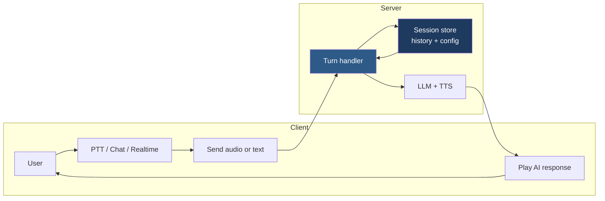
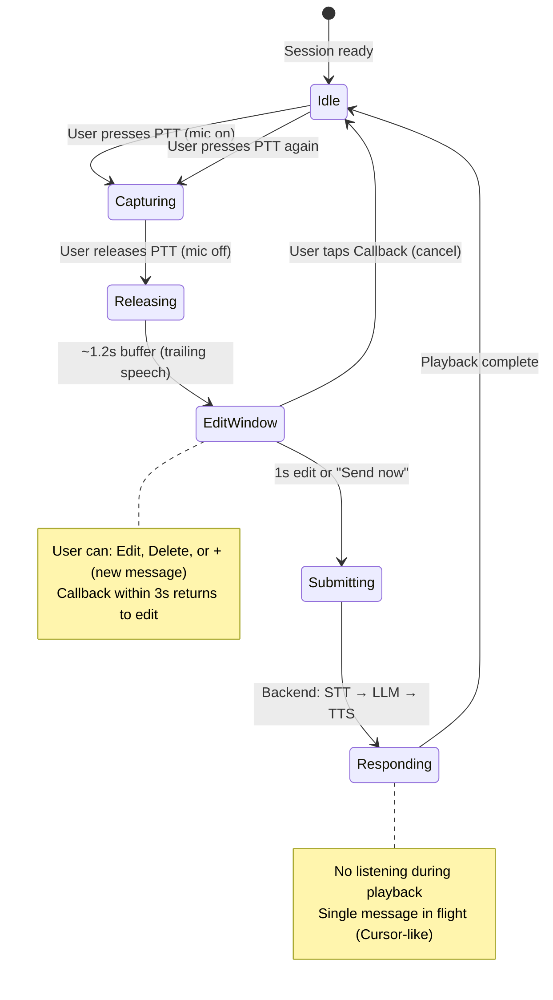
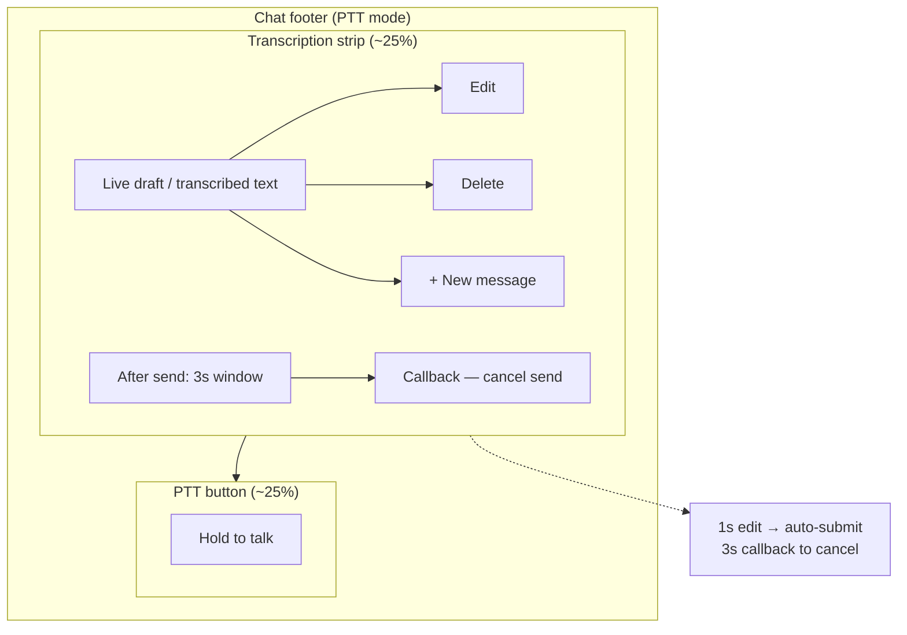
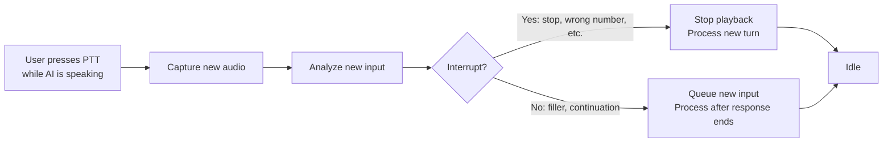

# Gateway Global PTT Protocol — Diagrams

This document explains how the **Gateway Global PTT (Push-To-Talk) protocol** and **chat/voice interface** work, using Mermaid diagrams. Use these to explain the system to stakeholders, developers, or customers.

**Related:** [GATEWAY_PTT_PROTOCOL.md](./GATEWAY_PTT_PROTOCOL.md) (full protocol specification).

---

## 1. High-level: Session without constant connection

The protocol keeps a **conversation session** (history, context) on the server while using **media/transport only when needed** — not a constant WebRTC or websocket.



**Takeaway:** Session lives on the server; connection is used for “user speaking” and “AI speaking,” not 24/7.

---

## 2. Conversation modes (one at a time, shared history)

The chat interface has **three views**; the user switches with a single control. All three share the **same conversation history**.

```mermaid
flowchart TB
  subgraph Header["Top 15% — Header"]
    Biz[Business name]
    Switcher[Mode: Chat | PTT | Realtime]
    Biz --> Switcher
  end

  subgraph Views["Rest — One view at a time"]
    direction TB
    Chat[Chat: Text history + input\nFull transcript visible]
    PTT[PTT: Visualizer + Hold to talk\nVoice only, no transcript in view]
    Realtime[Realtime: Visualizer + VAD\nContinuous listen, voice only]
  end

  History[(Shared conversation history)]
  Chat --> History
  PTT --> History
  Realtime --> History

  Switcher --> Chat
  Switcher --> PTT
  Switcher --> Realtime

  style History fill:#1e3a5f,color:#fff
  style Header fill:#0f172a,color:#e2e8f0
```

**Takeaway:** One mode active at a time; switching only changes the **view**. History is shared so switching to Chat shows everything said in PTT or Realtime.

---

## 3. PTT turn flow (from press to idle)

This is the **per-turn** flow when the user uses Push-To-Talk.



**Takeaway:** Idle → hold PTT (capture) → release → short buffer → edit (1s) → submit → AI responds → back to idle. One message in flight; no new send until response is done.

---

## 4. Chat footer (transcription strip + PTT button)

The **bottom of the chat** in PTT mode: transcription strip (top) and PTT button (bottom). Timing is configurable (e.g. 1s edit, 3s callback).



**Takeaway:** User sees draft, has 1 second to edit (or “Send now”), then submit. Within 3 seconds they can hit “Callback” to cancel and return to editing. Edit / Delete / + control the draft.

---

## 5. Interrupt vs wait (PTT during AI response)

When the user **presses PTT again while the AI is still speaking**, the system does **not** always interrupt. It analyzes the new input and either interrupts or queues.



**Examples:**
- **Interrupt:** “Stop,” “Wait,” “No,” “Wrong number,” “I have to go.”
- **Wait (queue):** “Uh,” “Mm,” or a follow-up that can wait.

**Takeaway:** Reduces accidental cut-offs and avoids ignoring clear stop/correction signals.

---

## 6. End-to-end: from config to response

How **owner config** and **client** connect to the **backend** and back.

```mermaid
sequenceDiagram
  participant Owner
  participant Identity as Identity / Config
  participant Client as Chat / Visualizer
  participant Backend as Session + LLM + TTS

  Owner->>Identity: Set business name, default mode, hero image
  Identity->>Client: Load config (e.g. PTT default, edit 1s, callback 3s)

  Note over Client: User in PTT mode
  Client->>Client: PTT down → mic on, stream audio
  Client->>Client: PTT up → mic off, 1.2s buffer
  Client->>Client: Show draft, 1s edit window
  Client->>Backend: Submit final text (single in-flight)
  Backend->>Backend: Append to session, LLM, TTS
  Backend->>Client: Stream/return audio
  Client->>Client: Play response (no listening)
  Client->>Client: Back to idle; history updated
```

**Takeaway:** Config drives default mode and timing; client follows the PTT turn flow and single in-flight rule; backend keeps session and does STT/LLM/TTS.

---

## 7. Visual summary: what lives where

```mermaid
flowchart TB
  subgraph Client_UI["Client UI"]
    H[Header: business name + Chat|PTT|Realtime]
    V[View: Chat list OR Visualizer + footer]
    BG[Background: hero image @ 25% opacity]
    H --> V
    BG -.-> V
  end

  subgraph Server["Server"]
    Session[Session: history + system prompt]
    STT[STT]
    LLM[LLM]
    TTS[TTS]
    Session --> STT
    STT --> LLM
    LLM --> TTS
  end

  V -->|Submit text / audio| Session
  TTS -->|Audio stream| V
```

---

## Quick reference

| Concept | Description |
|--------|-------------|
| **Session** | Server-side conversation (history + config). No constant connection. |
| **PTT** | Push-to-talk: hold to speak, release → buffer → edit → submit. |
| **Edit window** | ~1 s to edit transcript before auto-submit (configurable). |
| **Callback** | ~3 s after send to cancel and return to edit. |
| **Single in-flight** | No new message sent until current AI response is done. |
| **Interrupt vs wait** | When user PTTs during AI reply: analyze → interrupt or queue. |
| **Shared history** | Chat, PTT, and Realtime all use the same conversation log. |
| **Branded background** | Optional hero image (e.g. Google Places) at ~25% opacity in visualizer/chat. |

These diagrams can be exported to PNG/SVG using Mermaid Live Editor or your docs pipeline and used in presentations or docs.
