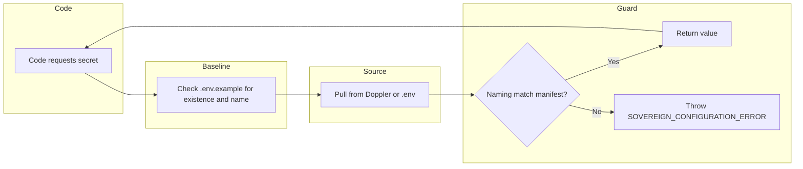

# Sovereign Environment Naming Constitution

This document is the **single source of truth** for environment variable naming. No agent or PR may modify `.env.example` without a Signature Check against this manifest. See [SOVEREIGN_ENV_DISCREPANCY_REPORT.md](SOVEREIGN_ENV_DISCREPANCY_REPORT.md) for the audit that produced it. For the Doppler–GitHub bridge and Gate 0 (no agent writes to GitHub Secrets), see [GITHUB_SECRET_MANIFEST.md](GITHUB_SECRET_MANIFEST.md).

---

## 1. Naming rules

### Server / Node

- All server and script secrets MUST be **UPPERCASE_SNAKE_CASE**.
- No hyphens in variable names (e.g. `GOOGLE_API_KEY` not `GOOGLE-API-KEY`).
- Canonical names are the single source of truth; aliases MUST be documented in `.env.example` and [API_KEYS_DOPPLER.md](API_KEYS_DOPPLER.md).

### Doppler

- **Canonical token vars:** `DOPPLER_TOKEN` (CLI), `DOPPLER_TOKEN_DEV`, `DOPPLER_TOKEN_STG`, `DOPPLER_TOKEN_PRD`.
- Do **not** use `DOPPLER_SERVICE_TOKEN` or `DOPPLER_TOKEN_STAGE` in new docs or scripts.

**Common mistake (“glitch in the matrix”):** The product name is **Doppler** with **two P’s**. The CLI only reads `DOPPLER_TOKEN` (two P’s). If you set `DOPLER_TOKEN` or `DOPLER_DEV_TOKEN` (one P, or wrong order), nothing will see it. In `.env` use exactly: `DOPPLER_TOKEN` or `DOPPLER_TOKEN_DEV` (not `DOPPLER_DEV_TOKEN`).

**Do not store token vars in Doppler.** Keep `DOPPLER_TOKEN` and `DOPPLER_TOKEN_DEV` / `DOPPLER_TOKEN_STG` / `DOPPLER_TOKEN_PRD` only in each server's `.env`. Our copy script (`npm run doppler:copy-config`) excludes them so the dev token is never copied to stg/prd. **If you use the Doppler web UI** to duplicate or copy config (e.g. dev → stg/prd), do not add these keys to Doppler, or explicitly exclude them when copying — otherwise the web copy will overwrite stg/prd with the dev token. Best practice: never add `DOPPLER_TOKEN*` to any Doppler config; they live only in each server's `.env`. Source of truth per env: `DOPPLER_TOKEN_DEV` on dev, `DOPPLER_TOKEN_STG` on stg, `DOPPLER_TOKEN_PRD` on prd.

**Health check:** Set `DOPPLER_EXPECT_ENV=dev|stg|prod` so `GET /api/health` can verify the token in use matches this environment (tokens contain "dev"/"stg"/"prod"); detects wrong-token copy. No token value is logged.

### Vite / client

- Any key exposed to the client MUST be prefixed with **`VITE_`** and listed in `.env.example` under a "Client (Vite)" section.
- No server-only secrets may use a `VITE_` name.

### NOVA Sovereign

- **`NOVA_RSA_PUBLIC_KEY`** is the only env var for Nova signature verification (RSA-4096).
- MUST be in `.env.example` (with placeholder) and in Doppler for dev/stg/prd when Nova is used.

### Gemini vs Google

- **AI Studio / Generative Language API** key MUST be named **`GEMINI_API_KEY`** in code and `.env.example`.
- General Google API key(s) for Maps/Places/OAuth remain **`GOOGLE_API_KEY`**, **`GOOGLE_MAPS_API_KEY`**, etc.

---

## 2. Canonical names and allowed aliases

| Purpose | Canonical name(s) | Allowed aliases (code may read) | Section |
|--------|--------------------|----------------------------------|--------|
| Doppler CLI | `DOPPLER_TOKEN` | — | Doppler |
| Doppler per-env | `DOPPLER_TOKEN_DEV`, `DOPPLER_TOKEN_STG`, `DOPPLER_TOKEN_PRD` | — | Doppler |
| Gemini (AI Studio) | `GEMINI_API_KEY` | — | Server |
| Google general / fallback | `GOOGLE_API_KEY` | — | Server |
| Google Cloud (Maps/Places server) | `GOOGLE_MAPS_API_KEY`, `GOOGLE_CLOUD_API_KEY` | `GOOGLE_PLACES_API_KEY` | Server |
| Google Grounding Lite | `GOOGLE_MAPS_GROUNDING_LITE_API_KEY` | `MAPS_GROUNDING_LITE_API_KEY` | Server |
| Client Maps JS key | `GOOGLE_MAPS_JS_API` or `GOOGLE_MAPS_JS_KEY` | — | Server (served to client) |
| SerpAPI | `SERP_API_KEY` | `SERPAPI_API_KEY`, `SERPAPI_KEY` | Server |
| Kimi / Moonshot | `KIMI_API_KEY` | `MOONSHOT_API_KEY` | Server |
| HuggingFace | `HUGGINGFACE_TOKEN` | `HF_TOKEN` | Server |
| Nova signature | `NOVA_RSA_PUBLIC_KEY` | — | Nova |
| App base URL | `APP_URL` | `SERVER_URL`, `CLIENT_URL` for different contexts | Server |
| Twilio phone | `TWILIO_PHONE_NUMBER` | `TWILIO_ACCOUNT_PHONE_NUMBER`, `TWILIO_PHONE_NUMBER_BOT` | Server |
| Platform email (Gmail DWD) | `GOOGLE_SERVICE_ACCOUNT_JSON` | — | Server |
| Platform sender (DWD subject) | `PLATFORM_SENDER_EMAIL` | — | Server |
| Client (Vite) | `VITE_TELEPHONY_API_URL`, `VITE_GOOGLE_MAP_ID`, `VITE_GOOGLE_MAP_ID_MIDNIGHT`, `VITE_GOOGLE_MAPS_KEY` | — | Client |

**Maps/Places rule:** Maps Grounding Lite and Places API (New) must use the **same** server key; different keys cause pull failures. Client keys can differ. Code uses `getServerMapsApiKey()` everywhere. See `server/config/mapsApiKey.ts`, `docs/API_KEYS_DOPPLER.md`.

---

## 2b. Declared keys allow-list (.env.example)

Every key declared in `.env.example` (uncommented `KEY=value` lines) MUST appear in this list or in the canonical/aliases table above. When adding a new variable to `.env.example`, add it here and to the table if it is a secret or has aliases.

`APP_URL` `DATABASE_URL` `DEBUG` `ENABLE_A2P_COMPLIANCE` `ENABLE_CHAT_EXPAND_MODE` `ENABLE_CHAT_FLOAT_MODE` `ENABLE_GOOGLE_WORKSPACE` `ENABLE_VOICE_AI` `ENABLE_VOICE_LEAD_MACHINE` `ENCRYPTION_KEY` `GEMINI_API_KEY` `GOOGLE_API_KEY` `GOOGLE_CLIENT_ID` `GOOGLE_CLIENT_SECRET` `GOOGLE_CLOUD_PROJECT_ID` `GOOGLE_MAPS_API_KEY` `GOOGLE_PLACES_API_KEY` `GOOGLE_REDIRECT_URI` `GOOGLE_SERVICE_ACCOUNT_JSON` `PLATFORM_SENDER_EMAIL` `HOST` `HUGGINGFACE_TOKEN` `KIMI_API_KEY` `LOG_LEVEL` `MOCK_TWILIO_SMS` `NODE_ENV` `NOVA_RSA_PUBLIC_KEY` `PORT` `RATE_LIMIT_MAX_REQUESTS` `RATE_LIMIT_WINDOW_MS` `REPLICATE_API_TOKEN` `SERVER_URL` `SESSION_SECRET` `STRIPE_PUBLISHABLE_KEY` `STRIPE_SECRET_KEY` `STRIPE_WEBHOOK_SECRET` `TWILIO_ACCOUNT_SID` `TWILIO_AUTH_TOKEN` `TWILIO_PHONE_NUMBER` `CLIENT_URL` `API_URL` `WS_PORT`

---

## 3. Secret Truth Loop

When code requests a secret, the system MUST:

1. Check `.env.example` for existence and canonical name.
2. Pull from Doppler or `.env`.
3. If the name does not match the manifest → throw **SOVEREIGN_CONFIGURATION_ERROR**.

**Rule:** If a variable is used in code but not listed in the sanitized `.env.example` (or uses a non-canonical name per this manifest), the runtime or a pre-start check MUST throw **SOVEREIGN_CONFIGURATION_ERROR** (or equivalent).

### Gate 3: Sovereign Runtime Guard (Final Boss)

The **Sovereign Runtime Guard** is the final boss of the system. Even if an agent or process tampers with local env or naming, the server **hard-fails at startup** when required canonical keys are missing or the guard is run in strict mode. Do not bypass or disable it in production.

- **Bootstrap:** Set `SOVEREIGN_ENV_STRICT=true` to validate required canonical keys (e.g. `SESSION_SECRET`, `ENCRYPTION_KEY`) at server startup; missing keys cause exit with `SOVEREIGN_CONFIGURATION_ERROR`.
- **Health:** `GET /api/health` includes a `sovereign_env` check; when required keys are missing, it reports `status: "error"` and `missing: [...]`.

Implementation: `server/config/sovereignEnvGuard.ts` (`validateSovereignEnv()`, `checkSovereignEnv()`).

---

## 4. Signature check (Rule 1)

- No agent and no PR may modify `.env.example` without a **Signature Check** against this manifest.
- Every new or renamed variable MUST appear in this document with a canonical name and section (Server / Doppler / Vite / Nova).
- Cursor rule / PR checklist: *"Any change to .env.example must be listed in docs/SOVEREIGN_ENV_MANIFEST.md and follow the naming rules."*

---

## 5. Doppler force-sync (Rule 2)

- After every **feature merge** that touches env or secrets, Doppler MUST be **force-synced** to match the sanitized `.env.example`.
- Process: Ensure all keys from `.env.example` exist in Doppler dev; add any missing keys; then run `npm run doppler:copy-config` (or equivalent) so stg/prd receive them.
- See [.cursor/rules/doppler-cli.mdc](../.cursor/rules/doppler-cli.mdc) and [API_KEYS_DOPPLER.md](API_KEYS_DOPPLER.md).
