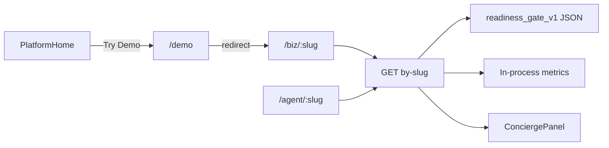

# Public demo + readiness flow (governed diagram)

**Skill:** [`sovereign-flow-diagramming`](../../.cursor/skills/sovereign-flow-diagramming/SKILL.md).  
**Contracts:** [`LOGICAL_ROUTE_REGISTRY.md`](../../docs-governance/canonical/LOGICAL_ROUTE_REGISTRY.md), [`SHARED_CANVAS_V1.md`](../sdk/SHARED_CANVAS_V1.md), [`CUSTOMER_READY_V1.md`](../product/CUSTOMER_READY_V1.md).

## Route map (Mermaid)

## Node parameters

| Node | Required |
|------|-----------|
| `/biz/:slug`, `/agent/:slug` | `slug` route param |
| `GET by-slug` | slug; optional `?from=qr` |
| `readiness_gate_v1` | Server attaches; client strips from state |
| `ConciergePanel` | `business` from `buildConciergeBusinessFromSite` |

## public_url_live (product)

Soft signal today: `readiness_gate_v1.customer_ready` on by-slug response. Strict blocking is **out of scope** until telemetry proves the signal. See [`ONBOARDING_GO_LIVE_TRANSITIONS_V1.md`](../product/ONBOARDING_GO_LIVE_TRANSITIONS_V1.md).
