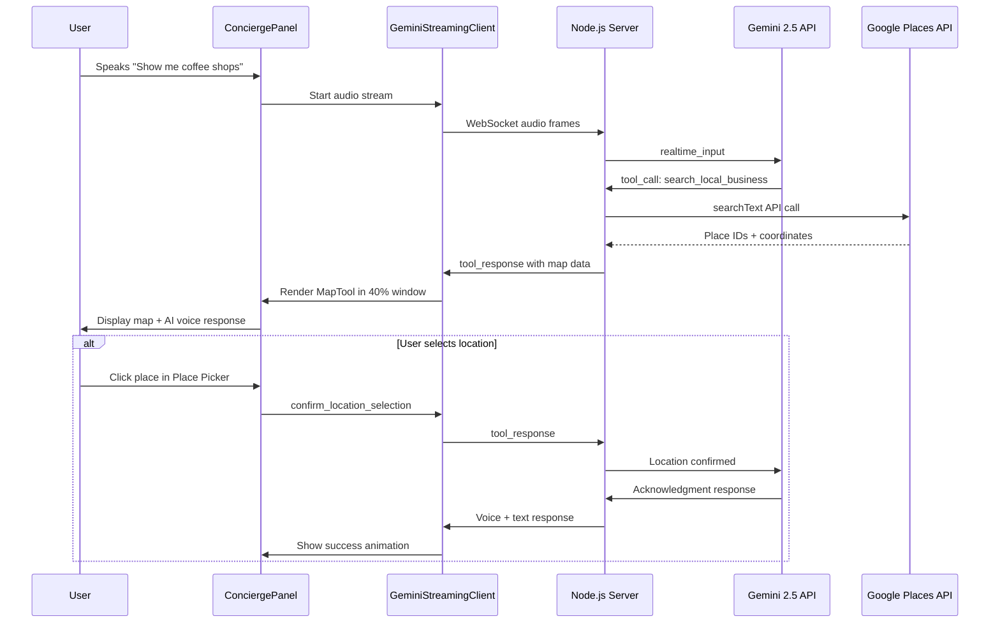
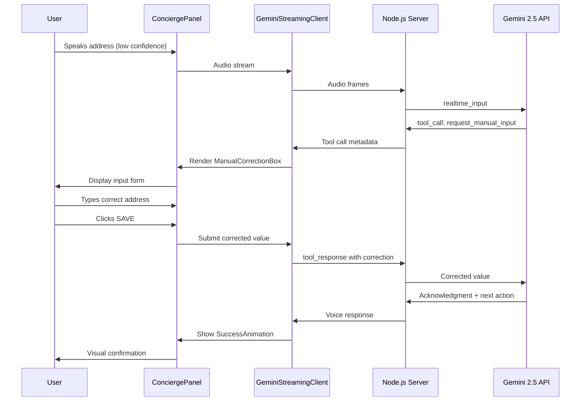
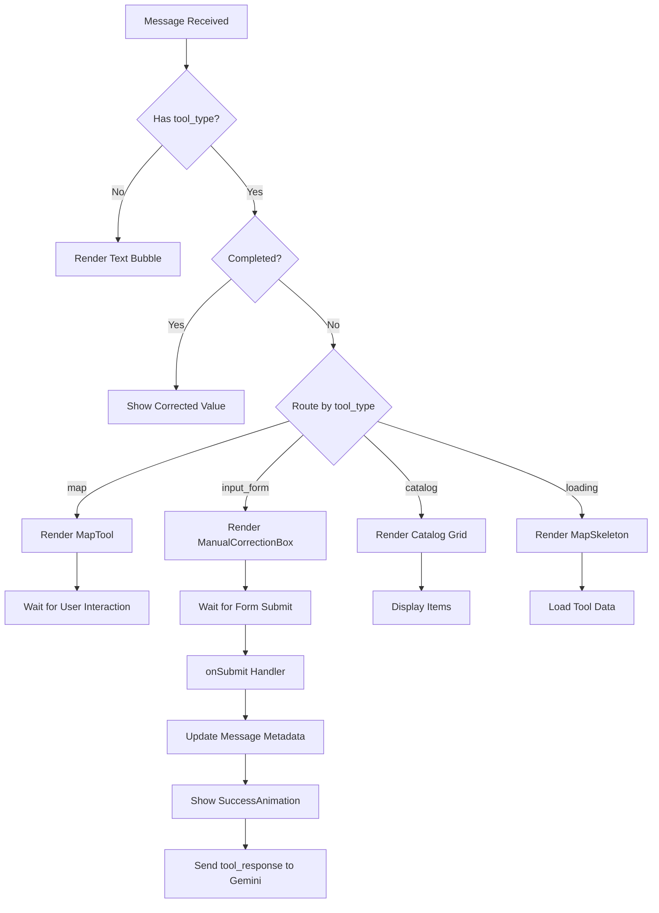
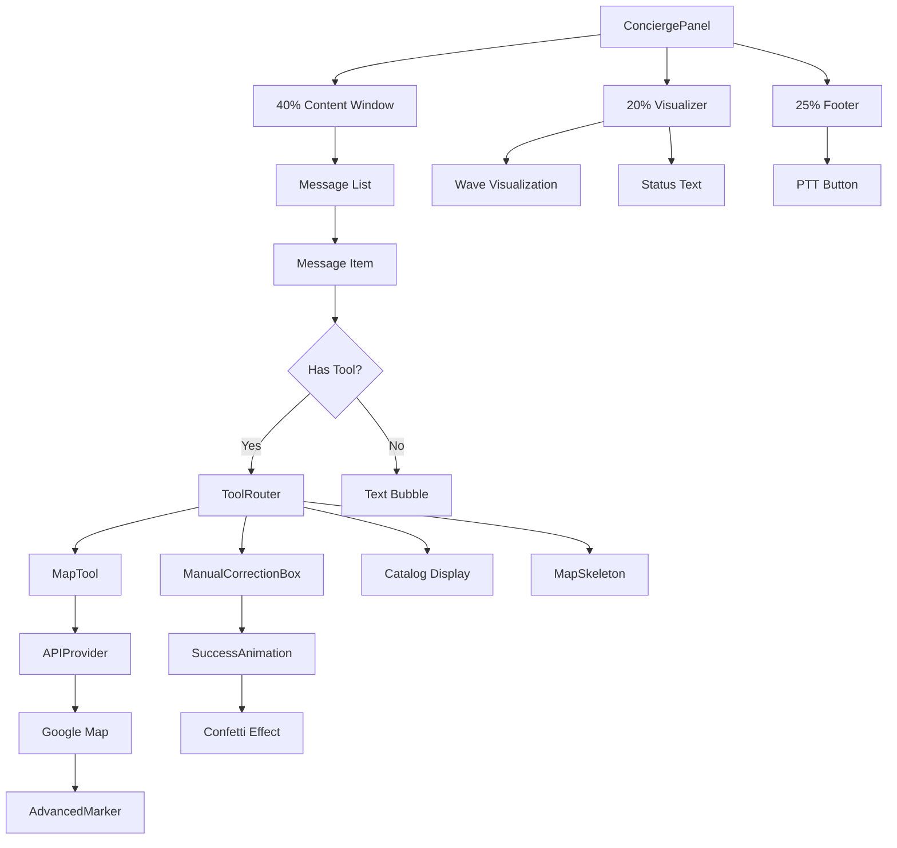
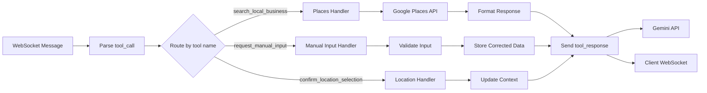
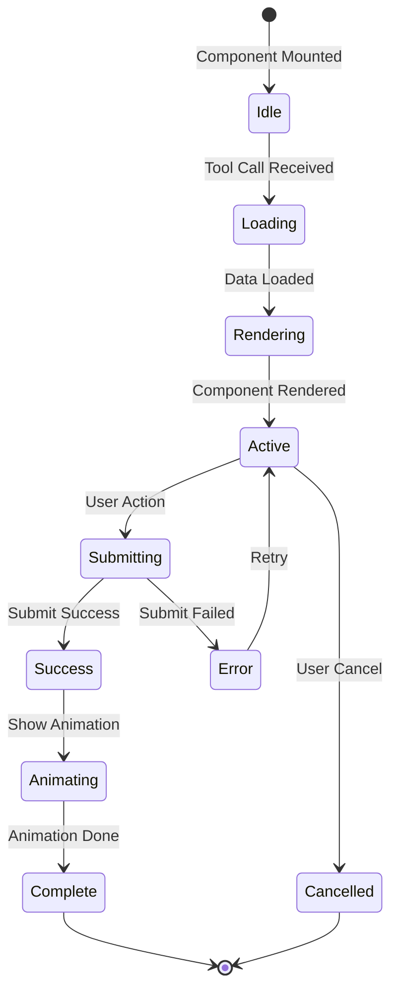
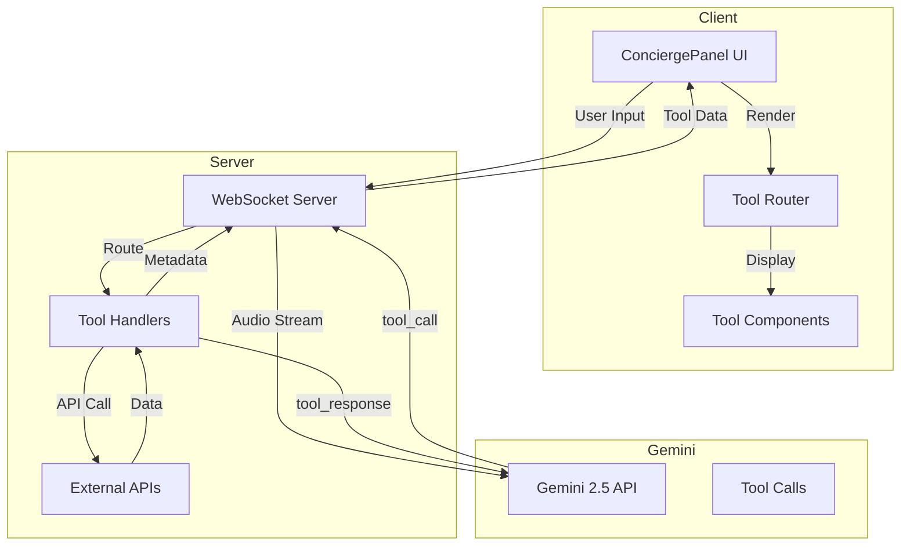

# Tool Integration Flow Diagram

## Complete Voice-to-Tool Flow

## Manual Input Correction Flow

## Tool Router Decision Tree

## Component Hierarchy

## Server-Side Tool Execution Flow

## Animation State Machine

## Data Flow Architecture

