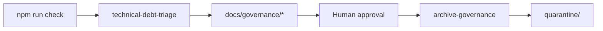

# Technical debt reduction process (Sovereign OS)

**Principle:** We do not delete code in a panic — we **classify**, **review**, then **graduate** non-core code out of the active surface.

## Canonical vs operational

- **Canonical policy:** [`docs-governance/`](../../docs-governance/canonical/)
- **This folder (`docs/governance/`):** generated and maintained **operational** backlog — safe to overwrite on each triage run (except keep git history for audit).

## Roles (two agents, one human gate)

| Role | Skill | Allowed actions |
|------|--------|-----------------|
| **Triage** | `technical-debt-triage` | Classify errors/files, write MD + YAML reports |
| **Human** | — | Approve which rows may graduate |
| **Archive** | `archive-governance` | Unmount, move to `quarantine/`, update docs, verify invariants |

**Rule:** The same autonomous run must not **both** classify broadly **and** aggressively archive without an explicit human checkpoint.

## Phase 1 — Inventory

1. Run `npm run check` (`tsc`).
2. Bucket each file by surface: core v1, secondary active, R&D/showcase (see triage skill).
3. Record mounts: Express (`app.use`, routers), React (`<Route`, lazy `import()`), with `mounts[].type` in YAML.

## Phase 2 — Freeze the active surface rule

A file **stays active** only if **at least one** is true:

- It is **mounted** on the current v1 product surface (server or client), or
- It is **required** by a module that is so mounted (transitive dependency on the hot path), or
- It implements a **canonical workflow** documented as v1 (onboarding, readiness, provisioning, etc.), or
- It is **explicitly preserved** as internal admin or tooling with written justification.

Everything else is an **archive candidate** or **quarantine candidate** — but only **after** triage and dependency checks, not by assumption.

## Phase 3 — Quarantine before delete

1. Do not delete large trees in one step without review.
2. **Unmount** routes and lazy entries first.
3. Move code to [`quarantine/`](../../quarantine/README.md) with a `DEPRECATION.md` (reason, last purpose, dependencies, route status, date, owner).
4. Enforce **quarantine invariant:** `client/src/**` and `server/**` (excluding `quarantine/`) have **no** imports into `quarantine/**`.

## Phase 4 — Fix core errors first

After non-core surface is reduced or clearly queued:

1. Work through [`CORE_FIX_QUEUE_V1.md](./CORE_FIX_QUEUE_V1.md) in order.
2. Prefer fixes on: onboarding, public business, readiness, provisioning, agent orchestration, billing (if v1), telephony (if v1), QR, storage contracts.

## Artifact flow

## Optional future tightening

Maintain a **hard list** of v1 core paths or logical route ids in this folder (or link from canonical docs) so triage defaults stay aligned with product — add when the org wants a single signed boundary.
