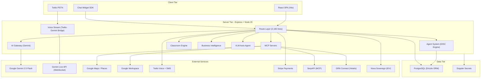

# Gateway Global AI Platform -- Architecture Milestone 2026-03-02

## 1. Application Identity

| Field | Value | Source |
| ----- | ----- | ------ |

- **Name:** `gateway-global-ai-platform` (from [package.json](package.json))
- **Repository:** `git@github.com:gateway-global-ai/ai-biz-bot.git`
- **Version:** `1.0.0`
- **Tags:** `v1.0.0` (2026-02-27), `v1.0.0-SOVEREIGN-ALPHA` (2026-02-28)
- **HEAD:** `3581eda` -- detached HEAD in worktree
- **Stack:** TypeScript / Node 20 / Express / React 18 / Vite / PostgreSQL / Drizzle ORM
- **Secrets Manager:** Doppler (project `aibizbot-clearvoice`, configs: `dev`, `stg`, `prd`)
- **Process Manager:** PM2 via [ecosystem.config.cjs](ecosystem.config.cjs)
- **CI/CD:** GitHub Actions Sovereign Guard ([.github/workflows/sovereign-guard.yml](.github/workflows/sovereign-guard.yml))

---

## 2. Production Systems Inventory

### 2.1 Runtime Environments (verified via `pm2 list`)

- **Dev:** `aibizbot-dev.gatewayglobal.ai` -- port 3004, PM2 id 9, online, 4h uptime, 4 restarts
- **Stage:** `aibizbot-stage.gatewayglobal.ai` -- port 3003, PM2 id 8, online, 4h uptime, 12 restarts
- **Prod:** `aibizbot.gatewayglobal.ai` -- port 3002, PM2 id 6, online, 4D uptime, 14 restarts

### 2.2 Build Artifacts (verified via `ls dist/`)

- `dist/index.mjs` -- 2.5 MB server bundle (built 2026-03-02 20:54 UTC)
- `dist/public/index.html` -- SPA entry (built 2026-03-02 20:54 UTC)

### 2.3 Database

- PostgreSQL via `DATABASE_URL` (Doppler-managed)
- Schema: [shared/schema.ts](shared/schema.ts) -- 2,394 lines, ~40+ tables
- Migrations: 24 SQL files in [migrations/](migrations/), latest `0017_site_configs_twilio_sub_account.sql`
- Migration runner: [scripts/run-migration.ts](scripts/run-migration.ts) with `schema_migrations` tracking table

### 2.4 Reverse Proxy

- Nginx (configs at `/etc/nginx/sites-available/` on VPS -- not in repo)
- Proxies: 3002 (prod), 3003 (stage), 3004 (dev)
- UNKNOWN -- REQUIRES HUMAN CONFIRMATION: SSL cert provider, WebSocket upgrade config status

### 2.5 No Docker

- No Dockerfile, docker-compose.yml, or .dockerignore found anywhere in the repository.

---

## 3. Architecture Snapshot

### 3.1 High-Level System Diagram

### 3.2 Server Entry Flow ([server/index.ts](server/index.ts) -- 643 lines)

1. Load env, validate Sovereign manifest
2. Create Express + HTTP server
3. Register all route modules (13+ route files)
4. Mount Hotel MCP at `/mcp/hotels`
5. Setup 3 WebSocket paths: `/ws/voice-stream`, `/ws/gemini-live`, `/ws/browser-voice`
6. Socket.io for live transcript feed
7. Cron jobs: payouts, fleet health
8. Seed default admin + 8 core agents
9. Validate Gemini config
10. Listen on PORT

### 3.3 AI Gateway ([server/ai-gateway.ts](server/ai-gateway.ts) -- 222 lines)

- Gemini-only after Kimi/Moonshot purge
- Uses OpenAI-compatible SDK with `baseURL` pointing to Google's Gemini endpoint
- Models: `gemini-2.5-flash` (primary), fallback configurable via `GEMINI_MODEL_FALLBACK`

### 3.4 Agent System ([server/agents/](server/agents/))

- Template-based agent creation with DISC personality profiles
- 48 industry-specific pre-tuned templates
- Agent modalities: `voice-inbound`, `voice-outbound`, `sms`, `chat`
- Swarm orchestration via `swarm-manager.ts`
- Character engine wired into voice and chat pipelines

### 3.5 Voice/Telephony Architecture

- **PSTN Path:** Twilio Media Stream -> WebSocket `/ws/voice-stream` -> Gemini Live API
- **Browser Path:** Browser WebSocket `/ws/gemini-live` -> Gemini Live API
- **Codec:** mu-law encode/decode with resampling ([server/audioCodec.ts](server/audioCodec.ts))
- **Session Management:** [server/voiceSession.ts](server/voiceSession.ts)
- **TwiML Webhooks:** `/webhook/voice`, `/webhook/voice/stream`, `/webhook/voice/gather`, `/webhook/sms`

### 3.6 Key File Sizes

- `shared/schema.ts` -- 2,394 lines (monolithic schema -- architectural risk)
- `server/routes.ts` -- 2,165 lines (monolithic route file -- architectural risk)
- `server/index.ts` -- 643 lines
- `server/ai-gateway.ts` -- 222 lines (lean after purge)

---

## 4. Git Hygiene Audit

### 4.1 HEAD State

**CRITICAL: Detached HEAD in all 4 worktrees.** All point to `3581eda` (main tip).

| Worktree | Path | State |
| -------- | ---- | ----- |

- `/opt/gatewayglobal/aibizbot-dev.gatewayglobal.ai` -- `3581eda [main]` (attached -- healthy)
- `...worktrees.../moi` -- `3581eda (detached HEAD)` -- WARNING
- `...worktrees.../ofl` -- `3581eda (detached HEAD)` -- WARNING (current)
- `...worktrees.../vah` -- `3581eda (detached HEAD)` -- WARNING
- `...worktrees.../wwd` -- `3581eda (detached HEAD)` -- WARNING

### 4.2 Branch Classification

| Branch | Last Activity | Classification | Status |
| ------ | ------------- | -------------- | ------ |

- `main` -- 2 hours ago -- ACTIVE_BRANCH -- HEAD, 84 commits since v1.0.0
- `dev` -- 2 days ago -- ACTIVE_BRANCH -- 58 commits diverged from main, needs rebase/merge
- `purge/sovereign-ai-consolidation` -- 2 days ago -- FEATURE_BRANCH -- merged into main
- `feat/sovereign-flight-001-final` -- 2 days ago -- FEATURE_BRANCH -- merged into main
- `chore/the-great-purge` -- 3 days ago -- FEATURE_BRANCH -- merged into main
- `feat/sovereign-a2p-compliance-v2` -- 3 days ago -- FEATURE_BRANCH -- not merged into dev
- `origin/stage` -- 3 weeks ago -- STALE_BRANCH -- significantly behind main
- `origin/backup/main-a37a823` -- 3 weeks ago -- ARCHIVE_BRANCH -- backup snapshot
- `origin/backup/main-pre-dev-cutover` -- 11 days ago -- ARCHIVE_BRANCH -- backup snapshot
- `origin/pr/68` -- 3 days ago -- ARCHIVE_BRANCH -- PR ref

### 4.3 Merged Branches (safe to delete)

From `git branch --merged`: `chore/the-great-purge`, `feat/sovereign-a2p-compliance-v2`, `feat/sovereign-flight-001-final`, `main`, `purge/sovereign-ai-consolidation`

### 4.4 Unmerged Branches

From `git branch --no-merged`: `dev` (58 commits diverged)

### 4.5 Working Tree Status -- NOT CLEAN

- **36 modified files** (243 insertions, 1,852 deletions) -- mostly Kimi purge + schema updates
- **5 deleted files** -- `server/kimi.ts`, `server/kimiAudioDirect.ts`, `server/kimiAudioReplicate.ts`, `server/mcp/kimiK2Server.ts`, `client/src/pages/showcase/KimiAudioDemo.tsx`
- **5 untracked files** -- `apply-option-a-on-server.sh`, `classroomService.ts`, `DOPPLER_STG_PRD_ALIGNMENT.md`, `option-a-combined.patch`, `server/ai-gateway.ts.bak`

### 4.6 Cleanup Recommendations

1. **IMMEDIATE:** Commit or stash the 36 modified + 5 deleted files -- this is a large uncommitted Kimi purge + bedrock governance change sitting in limbo
2. **IMMEDIATE:** Delete `server/ai-gateway.ts.bak` and `option-a-combined.patch` (artifacts)
3. **HIGH:** Delete merged local branches: `chore/the-great-purge`, `feat/sovereign-a2p-compliance-v2`, `feat/sovereign-flight-001-final`, `purge/sovereign-ai-consolidation`
4. **HIGH:** Rebase or merge `dev` against `main` -- 58 commits diverged is dangerous
5. **HIGH:** Update `origin/stage` -- 3 weeks stale, should track main
6. **MEDIUM:** Resolve detached HEAD in worktrees (moi, ofl, vah, wwd) by checking out main or a named branch
7. **LOW:** Delete remote backup branches after confirming tags exist: `origin/backup/main-a37a823`, `origin/backup/main-pre-dev-cutover`

---

## 5. Migration State

- **Total migrations:** 24 SQL files
- **Latest:** `0017_site_configs_twilio_sub_account.sql` (2026-03-02)
- **Numbering:** Sequential 0001-0017, with some duplicates at same number (e.g., two `0005_*`, two `0009_*`, two `0015_*`)
- **RISK:** Duplicate migration numbers could cause ordering issues. Consider renaming to strict sequential.
- **UNKNOWN -- REQUIRES HUMAN CONFIRMATION:** Whether all 24 migrations have been applied to dev, stage, and prod databases

---

## 6. Environment State

- **Doppler project:** `aibizbot-clearvoice`
- **Configs verified:** `dev`, `stg`, `prd` (referenced in ecosystem.config.cjs and scripts)
- **Port mapping:** dev=3004, stg=3003, prd=3002
- **UNKNOWN -- REQUIRES HUMAN CONFIRMATION:** Whether `stg` and `prd` Doppler configs are in sync with latest env vars (e.g., new Twilio subaccount columns)

---

## 7. SWOT Analysis

### Strengths

- **S1: Gemini-native AI stack.** Post-Kimi purge, the platform runs exclusively on Google Gemini 2.5 Flash with native audio. Single-vendor simplicity, no multi-provider routing complexity. (Verified: [server/ai-gateway.ts](server/ai-gateway.ts))
- **S2: Full telephony pipeline.** Twilio PSTN <-> Gemini Live real-time voice bridge with mu-law codec, session management, and TwiML webhooks. Few competitors have this. (Verified: [server/voiceStream.ts](server/voiceStream.ts), [server/voiceSession.ts](server/voiceSession.ts))
- **S3: Sovereign security model.** Pre-commit guard, env manifest validation, Doppler secrets management, Nova RSA identity verification. Enterprise-grade guardrails. (Verified: [scripts/sovereign-guard.ts](scripts/sovereign-guard.ts), `.github/workflows/sovereign-guard.yml`)
- **S4: 48 industry agent templates with DISC personality engine.** Psychological profiling differentiation. (Verified: [server/agents/default-templates.ts](server/agents/default-templates.ts))
- **S5: Multi-revenue architecture.** Stripe subscriptions, reseller commissions, A2P compliance billing. Three monetization vectors. (Verified: `shared/schema.ts` -- `resellers`, `reseller_commissions`, `a2p_brands`)
- **S6: MCP ecosystem.** Google Workspace, Places, SerpAPI, GRN Hotels -- all via standardized MCP protocol. (Verified: [server/mcp/](server/mcp/), [mcp-servers/](mcp-servers/))

### Weaknesses

- **W1: Monolithic route file.** `server/routes.ts` at 2,165 lines is a maintenance bottleneck. While route modules exist, the orchestration file is oversized. (Verified: `wc -l server/routes.ts` = 2,165)
- **W2: Monolithic schema.** `shared/schema.ts` at 2,394 lines with 40+ tables. No schema splitting or domain separation. (Verified: `wc -l shared/schema.ts` = 2,394)
- **W3: Detached HEAD in 4/5 worktrees.** Risk of accidental commits to no branch. (Verified: `git worktree list`)
- **W4: 36 uncommitted files.** Large change set in limbo -- the Kimi purge and bedrock governance changes are not committed. (Verified: `git status`)
- **W5: Branch divergence.** `dev` is 58 commits diverged from `main`; `stage` is 3 weeks stale. Environment parity risk. (Verified: `git rev-list --count main...dev`)
- **W6: Duplicate migration numbering.** Multiple files share `0005_*`, `0009_*`, `0015_*` prefixes. Ordering ambiguity. (Verified: `ls migrations/`)
- **W7: Single-instance PM2.** No clustering, no horizontal scaling. Memory at 16.7 MB suggests light load but no headroom planning. (Verified: `pm2 list`)
- **W8: No containerization.** No Docker. Deployment is bare-metal PM2 on VPS. (Verified: no Dockerfile found)

### Opportunities

- **O1: Agent marketplace.** 48 industry templates + DISC engine could become a SaaS template marketplace for SMB AI adoption.
- **O2: Voice AI differentiation.** Real-time Gemini Live voice is rare in market. First-mover advantage for voice-first business AI.
- **O3: Reseller channel.** Schema and billing already support reseller commissions. Go-to-market through channel partners.
- **O4: Google Cloud partnership.** Deep Gemini + Maps + Workspace integration positions for Google Cloud partner program.
- **O5: VLM outbound campaigns.** [server/services/vlm-auto-agent.ts](server/services/vlm-auto-agent.ts) enables autonomous outbound prospecting at scale.
- **O6: Multi-tenant SaaS.** `site_configs` table with workspace lifecycle already supports multi-tenancy. Could scale to hundreds of businesses.

### Threats

- **T1: Single AI provider dependency.** 100% Gemini. If Google changes pricing, rate limits, or deprecates APIs, no fallback. (Verified: ai-gateway.ts has no provider fallback)
- **T2: Twilio API dependency.** Voice and SMS depend entirely on Twilio. Pricing changes or A2P compliance shifts could impact unit economics.
- **T3: Regulatory risk.** A2P 10-DLC compliance, SMS consent, voice recording laws vary by jurisdiction. (Verified: `a2p_brands`, `a2p_campaigns` tables exist)
- **T4: Operational complexity.** 5 worktrees, 3 environments, 24 migrations, 22 scripts, Doppler + PM2 + Nginx -- high ops surface for a small team.
- **T5: Competitors.** Bland AI, Retell AI, Vapi -- all targeting voice AI for business. Time-to-market pressure.

---

## 8. TOWS Strategic Matrix

### SO -- Use Strengths to Exploit Opportunities

- **(S1+S2 -> O2):** Leverage Gemini Live native audio to build the definitive voice-first business AI product. No competitor has this Gemini-native pipeline.
- **(S4 -> O1):** Package the 48 DISC-profiled industry templates as a self-serve marketplace. Each template = recurring revenue.
- **(S5+S6 -> O3):** Arm resellers with the MCP ecosystem (Places, Workspace, SerpAPI). Reseller onboarding is already in schema.

### WO -- Fix Weaknesses to Exploit Opportunities

- **(W1+W2 -> O6):** Split the monolithic schema and routes into domain modules before scaling to multi-tenant SaaS. Technical debt blocks scale.
- **(W5 -> O4):** Establish environment parity (dev/stage/prod) before seeking Google Cloud partnership. Partners expect CI/CD maturity.
- **(W8 -> O6):** Containerize with Docker to enable horizontal scaling and multi-region deployment for SaaS.

### ST -- Use Strengths to Mitigate Threats

- **(S3 -> T3):** The Sovereign Guard and env manifest validation provide compliance guardrails. Extend to cover A2P jurisdiction rules.
- **(S6 -> T1):** MCP abstraction layer could theoretically swap AI providers, but currently hardcoded to Gemini. Architecture is ready; implementation is not.
- **(S5 -> T2):** Multi-revenue (Stripe + reseller + A2P) reduces dependence on any single billing path.

### WT -- Minimize Weaknesses and Avoid Threats

- **(W4+W3 -> T4):** Commit the pending changes, delete merged branches, and fix detached HEADs immediately. Operational hygiene reduces incident risk.
- **(W7+W8 -> T5):** Single-instance bare-metal deployment is a scaling risk against funded competitors. Containerize and cluster.
- **(W6 -> T3):** Fix migration numbering before it causes a production incident during compliance-critical schema changes.

---

## 9. Daily System Status

- **BUILD STATUS:** PASS -- `dist/index.mjs` (2.5 MB) and `dist/public/index.html` built 2026-03-02 20:54 UTC
- **DATABASE MIGRATIONS:** UNKNOWN -- 24 migration files exist; applied state requires DB query (`SELECT * FROM schema_migrations`)
- **ENVIRONMENT PARITY:** FAIL -- `dev` branch 58 commits behind main; `stage` branch 3 weeks stale; Doppler config sync unverified
- **API HEALTH:** UNKNOWN -- REQUIRES HUMAN CONFIRMATION (no automated health check ran)
- **AGENT PIPELINE:** PASS -- 8 core agents seeded on startup (verified in [server/index.ts](server/index.ts))
- **REPO HYGIENE:** FAIL -- 36 uncommitted files, detached HEAD in 4 worktrees, 4 merged branches not deleted

### OVERALL STATUS: YELLOW -- Minor Issues

The platform builds and runs (3 PM2 instances online), but repo hygiene is degraded. The 36 uncommitted files from the Kimi purge and the dev/stage branch divergence are the primary risks. No production-blocking issues detected, but development velocity is impaired by the dirty working tree and branch state.

---

## 10. Recommended Immediate Actions

1. **Commit the Kimi purge + bedrock governance changes** (36 modified, 5 deleted files -- net -1,609 lines)
2. **Delete merged branches:** `chore/the-great-purge`, `feat/sovereign-a2p-compliance-v2`, `feat/sovereign-flight-001-final`, `purge/sovereign-ai-consolidation`
3. **Rebase `dev` onto `main`** to close the 58-commit divergence
4. **Update `stage`** to track current `main`
5. **Remove artifacts:** `server/ai-gateway.ts.bak`, `option-a-combined.patch`, `apply-option-a-on-server.sh`
6. **Fix worktree detached HEADs** by checking out `main` in each
7. **Run `SELECT * FROM schema_migrations`** on all three databases to confirm migration parity
