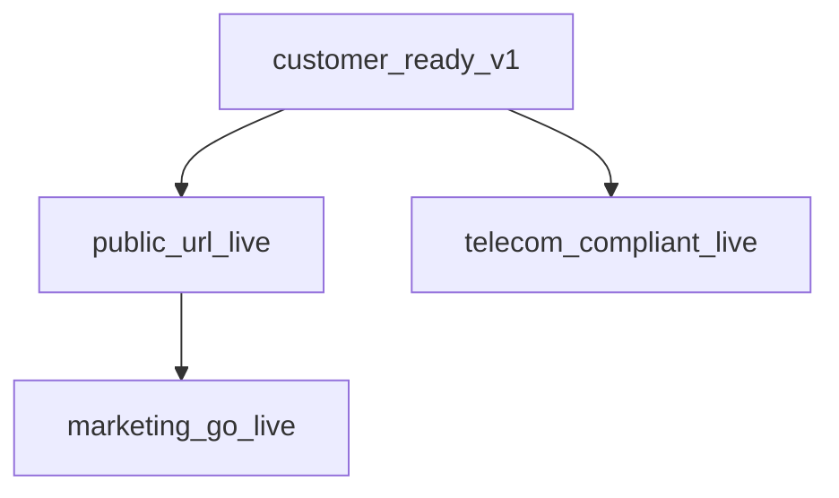

# Go-live transitions — v1 (LOCKED exposure model)

**Status:** **LOCKED v1** (2026-03-25) — system contract for **controlled exposure**, not implementation.  
**Principle:** *We don’t expose the system — we graduate it.*

**First principles:**

- **`customer_ready`** = can **respond** without breaking trust ([`CUSTOMER_READY_V1.md`](./CUSTOMER_READY_V1.md)).
- **`go_live` (axes)** = can be **exposed** at a given **risk level** without creating undue risk.

**Related:** [`ONBOARDING_PIPELINE_MAP_V1.md`](./ONBOARDING_PIPELINE_MAP_V1.md), [`ONBOARDING_PIPELINE_TARGET_V1.md`](./ONBOARDING_PIPELINE_TARGET_V1.md), [`CUSTOMER_READY_V1.md`](./CUSTOMER_READY_V1.md).

---

## Transition model (gated responsibility)

**Nominal graduation order (not always strict in wall-clock time — strict in who may do what):**

```text
customer_ready_v1
       ↓
public_url_live
       ↓
marketing_go_live

customer_ready_v1 ─────────────→ telecom_compliant_live   (parallel axis)
```

- **`public_url_live` → `marketing_go_live`:** sequential for **amplification** responsibility.
- **`telecom_compliant_live`:** **parallel** to `marketing_go_live` — branches from **`customer_ready_v1`** when compliance is met; **does not** require marketing state.



---

## 1. `customer_ready_v1` (reference)

Already **LOCKED** in [`CUSTOMER_READY_V1.md`](./CUSTOMER_READY_V1.md).

**Summary:** System **responds**; fallback allowed; async enrichment may be incomplete; **not** a completeness gate.

---

## 2. `public_url_live`

### Definition

```text
public_url_live =
  customer_ready_v1
  AND no_critical_identity_gaps
  AND coherent_public_experience
```

**Unpack:**

| Requirement | Meaning |
|-------------|---------|
| `customer_ready_v1` | All clauses in keystone doc satisfied. |
| `no_critical_identity_gaps` | Business identity is **coherent** on `/biz/:slug` — not placeholder, not empty shell, not internally inconsistent with what a visitor would expect. |
| `coherent_public_experience` | `/biz/:slug` resolves; `GET /api/site-configs/by-slug/:slug` supports Concierge; **fallback or agent** path works per `customer_ready_v1`. |

### Allows

- Sharing link **manually**
- **Internal** / soft testing
- **Controlled** low–medium risk exposure

### Does not require

- Compliance (**OnboardingGateway**) complete
- Telephony / SMS
- Marketing campaigns
- Reviews / preload complete

### Risk

**LOW–MEDIUM** — controlled exposure.

### Transition rule

**`customer_ready_v1` → `public_url_live`**  
**IF** identity is present **and** the **public** experience is coherent (no critical gaps).

---

## 3. `marketing_go_live`

### Definition

```text
marketing_go_live =
  public_url_live
  AND experience_quality_threshold_met
```

**Unpack:**

| Requirement | Meaning |
|-------------|---------|
| `public_url_live` | Prior row satisfied. |
| `experience_quality_threshold_met` | First interaction is **high-quality**: concierge/agent gives a **strong** first response; business context is **clear** (not generic); **no** degraded/confusing interaction for the **amplified** audience; **preload OR sufficient manual info** exists so the experience does not collapse under real traffic. |

**OPEN (product):** Operationalize **`experience_quality_threshold_met`** (checklist, score, or human gate).

### Allows

- **QR distribution** (campaign / scale)
- **Ads**, **SEO** pages, **outbound** campaigns

### Does not require (v1)

- **Telecom** compliance (regulated channels still separate)
- Full automation of all channels

### Risk

**MEDIUM–HIGH** — public amplification.

### Transition rule

**`public_url_live` → `marketing_go_live`**  
**IF** first interaction = **high-quality** experience (**wow moment** lives here).

### Design rule

**Do not** auto-enable `marketing_go_live` without explicit graduation criteria met.

---

## 4. `telecom_compliant_live`

### Definition

```text
telecom_compliant_live =
  customer_ready_v1
  AND compliance_requirements_met
```

**Unpack:**

| Requirement | Meaning |
|-------------|---------|
| `customer_ready_v1` | Base response/trust bar (web can still work without telecom). |
| `compliance_requirements_met` | A2P / telephony (and related) compliance **complete** for the account; approved messaging flows; valid number routing; regulatory requirements **satisfied** per legal/ops. |

**OPEN (legal):** Exact checklist for **`compliance_requirements_met`**.

### Allows

- Live **call** handling (as product defines)
- **SMS** flows
- **Automated outbound** on regulated channels

### Risk

**HIGH** — legal + financial.

### Transition rule

**`customer_ready_v1` → `telecom_compliant_live`**  
**IF** compliance is **complete** (parallel to `public_url_live` / `marketing_go_live` timeline).

**Important:** **Does not** depend on `marketing_go_live`.

---

## Critical design rules

| Rule | Statement |
|------|-----------|
| **1 — No silent exposure** | System **MUST NOT** auto-enable `marketing_go_live`, auto-distribute QR at scale, or expose **half-ready** experiences as if fully graduated. |
| **2 — Parallel compliance** | Compliance **does not** block `public_url_live` (web concierge). Compliance **does** block **telecom** features until `telecom_compliant_live`. |
| **3 — Experience > completeness** | Full data / perfect setup **not** required for early axes; **coherent interaction** **is** required. |
| **4 — Explicit transitions** | Each state **should** be **observable**, **explainable**, and **controllable** (implementation future). |

---

## Failure handling (normative behavior targets)

| Situation | Target behavior |
|-----------|-----------------|
| `customer_ready_v1` but **not** `public_url_live` | **Hide** or **do not promote** public access until identity/experience gaps closed (operator-controlled). |
| `public_url_live` but **not** `marketing_go_live` | Allow **manual** sharing; **block** mass amplification (QR campaigns, ads, outbound) until graduated. |
| `marketing_go_live` but **degraded** | **Should not occur** — **block** transition into `marketing_go_live` if quality threshold not met. |
| **Not** `telecom_compliant_live` | **Disable** phone/SMS (regulated) only; web may still operate per prior axes. |

---

## Required system flags (future implementation)

Shape for dashboards, APIs, and enforcement (not mandatory to ship in v1 doc):

```json
{
  "customer_ready": true,
  "public_url_live": true,
  "marketing_go_live": false,
  "telecom_compliant_live": false,
  "mode": "fallback_concierge",
  "degraded_mode": true
}
```

---

## One-line axis summary

| Axis | Enables |
|------|---------|
| `customer_ready_v1` | **Interaction** |
| `public_url_live` | **Access** (controlled) |
| `marketing_go_live` | **Scale** (amplification) |
| `telecom_compliant_live` | **Communication infrastructure** (regulated) |

**Lock-in line:** *customer_ready enables interaction. public_url_live enables access. marketing_go_live enables scale. telecom_compliant_live enables communication infrastructure.*

---

## Next steps (contract → engineering)

1. **Map as-built → implicit states** (what does the code allow today without flags?).
2. **Soft enforcement (shipped):** **[`READINESS_GATE_V1_SLICE.md`](./READINESS_GATE_V1_SLICE.md)** — `readiness_gate_v1` on public `by-slug` (metadata only; no hard block).
3. **Strict `public_url_live` / ops UI / persisted flags** — when product approves.
4. Resolve **OPEN** items: quality threshold for `marketing_go_live`, legal checklist for `telecom_compliant_live`.

---

## Document history

| Version | Date | Notes |
|---------|------|--------|
| v1 LOCKED | 2026-03-25 | Exposure graduation model; aligns with CUSTOMER_READY_V1 |
